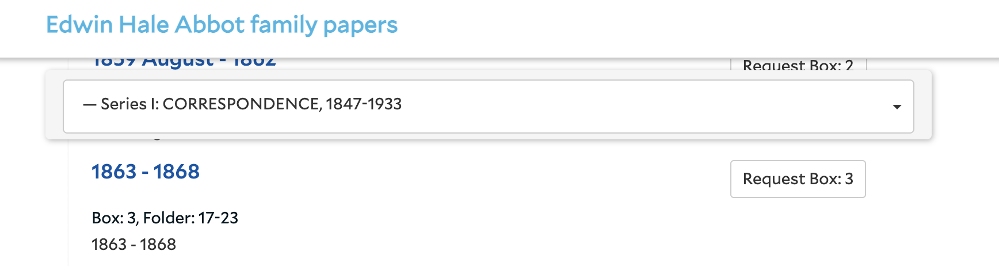

# Yale ArchivesSpace Development Stories 2017

Compiled by Mike Rush for the Yale Archival Management Systems Committee

February 2017. Updated April 2017.

## Plugin Revision Stories**

The following stories relate to the payments_module plugin ([https://github.com/hudmol/payments_module](https://github.com/hudmol/payments_module)) 

* As a staff user, I would like the Invoice Number and Amount fields to appear before the Payment Date field in a Payment subrecord

When entering data into a payment subrecord, the invoice number and payment amount come~~s~~ from the invoice itself, and the rest of the data comes from a separate authorization. Moving the Invoice Number and Amount ahead of the Payment Date will mitigate the need to switch back and forth between those documents when entering or reviewing data. This change should be made for both the edit and the read-only views of accession records. The preferred display order in both edit and view mode is as follows: Invoice number, Amount, Payment Date, Fund Code, ~~Amount, ~~USD Equivalent Amount, Authorizer, and Note.

* As a staff user, I would like the full name of a fund to appear in the read-only view of an accession record.

Currently, when viewing an accession record in read-only mode, the Fund Code appears, but not the name of the fund (i.e. the translation from the YAML file). In order to facilitate easier human comprehension of the fund code, we would prefer to display the full fund code translation.

* As a staff user, I would like to be able to see more of each fund code name when in accession edit view.

Currently, in the accession record edit view, the full name of a fund code is often not visible. There is a limit to the horizontal width of the Fund Code field such that when a fund code is selected, the name will be cut off. We would like the width of the field to be widened to occupy as much horizontal space as the Amount and USD Equivalent Amount fields. Here is a screenshot of the current display, showing a cut off name field:

* As a staff user, I would like to be able to automate the conversion of payments made in non-USD currency to USD and to populate the USD equivalent field.

When we created the payments module, we anticipated calculating a total number of US dollars spent on a given fund during a specific period of time. In order to account for payments made in non-USD currency, we included the USD Equivalent Amount field. Experience using the Payments Module has shown that we are unlikely to complete the USD Equivalent Amount manually. We would like to explore creating a way to calculate a USD equivalent amount and populate that field. The conversion should start with the currency noted in the Payment Summary, then convert the amount in the specific payment subrecord to USD. If possible, the conversion should happen at the applicable conversion rate for the date specified in the payment subrecord. If historical records of conversion rates are not accessible, the conversion may be made at the current rate at the time of the calculation. This request presupposes that a free, open currency conversion API is available online. Possibilities include [https://openexchangerates.org/](https://openexchangerates.org/) and [http://fixer.io/](http://fixer.io/). The conversion should be triggered by a user action, e.g. clicking on a “Convert to USD” button, not automatically upon save.

* As a system administrator, I noticed that the Payment Summary > Total Price, Payment > Amount, and Payment > USD Equivalent Amount fields are defined as text fields and wonder if they would be better defined as numeric fields.

The Total Price, Amount, and USD Equivalent Amount fields should always be numeric data and never contain non-numeric characters. We have noticed that they are all defined as text fields. Would it make more sense for those fields to be defined as numeric? We could go as far as defining them as numbers that go to two decimal points, e.g. 100.00 or 5000.50. Defining them as text fields keeps them consistent with similar fields in particular Extent > Number, but as we prepare for additional reporting based on payments data, would it be easier to work with the data if it were defined as numeric? Also, would defining the fields as numeric prevent data entry problems? We’d like guidance from HM on this and if your recommendation would be to treat those fields as numbers we’d appreciate including that update to the plugin in your quote.

* As a system administrator, I would like the aspace_yale_accessions plugin to be updated so that it is compatible with ArchivesSpace 2.0.

When Lyrasis updated our DEV instance after the 2.0 code was merged into the master branch of the ASpace repo, the aspace_yale_accessions plugin - which generates accession identifiers -  prevented the application from properly starting. Before we can upgrade to ASpace 2.0 we will need to update this critical plugin. We’d like you to investigate the incompatibility and update as necessary to ensure compatibility with 2.0.

## New Development Stories

* As a staff user, I would like to be able to calculate the inclusive date range for a given resource or archival object from the minimum and maximum dates present in all descendant archival objects.

When writing archival description, it is labor intensive to determine the inclusive dates of any resource or archival object that contains even a few descendant archival objects. Given that ArchivesSpace supports normalized beginning and ending date values, it should be possible to automatically calculate an inclusive date range for a resource or archival object. We imagine a “Calculate Dates” button like the “Calculate Extent” button currently available when editing resources or archival objects.

The Calculate Dates function should find the lowest and highest values among the normalized dates present for all descendent archival objects. Note that the highest date value may be a single date, which in the application is described as a begin date. A new date subrecord should be created, with Label = Creation, no expression value, Type = Inclusive Dates, the correct begin and end dates, and empty certainty, era, and calendar fields. If the calculator finds identical begin and end dates, the new date subrecord should only populate the begin date and should have Type = single date. The date calculator should not overwrite any existing date subrecords. Any necessary date subrecord deletions should be done manually.

* As a system administrator for Yale’s Preservica instance, I would like to be able to run a background job in ArchivesSpace to delete certain references to Preservica from our TEST ArchivesSpace instance.