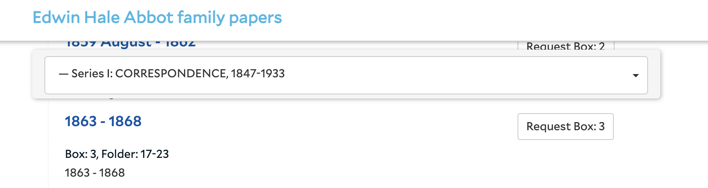

# ArchivesSpace Development FY 2020

## Document Generation

This document is intended to summarize various working papers generated during FY19 and FY20 to help prioritize our goals for FY20 external software development. It covers two distinct development projects, the first to prepare us for an upgrade to ArchivesSpace 2.7.1, and the second for new work related to improving search and some other high-priority improvements.

## Note about Priorities

Documents linked in the “Quote 2” section below were developed by YAMS and prioritized. YAMS chairs then removed prioritized items which were either complete, or likely to be completed with internal resources, or on the official roadmap and soon to be released. A preliminary meeting was then held with HM and various items were consolidated in the interest of technical pragmatism. An earlier version of this document was then generated by LIT and was the basis for the hour estimates presented below. As a result, there may be some slight inconsistencies between this document and its progenitors as lines were collapsed and priorities rebalanced based on where external resources would be required. In many cases the originating documents include comments explaining why a particular item did or did not make the final list.

## Note about Identifiers

Enhancements moved through various documents without a consistent identifier scheme. Rather than using the full text to differentiate them, they were tagged with identifiers based on provenance and their location in the original document. They were then prefixed with the FY of origination and a sequential number indicating the unit-of-work to be billed.

E.g.: **FY20.3.Search.1.C **is [FY].[3rd billable story in quote].[Search enhancements doc].[Item 1].[Third part of first item]

# Quote 1 – Preparing ArchivesSpace for and Upgrade

Upgrade work has been deemed our top priority and the quote has been accepted. Work is ongoing.

## Refactoring for Upgrade

### Updates to Plugins/Custom Development

#### **FY20.0.**Upgrade.1.A:** Upgrade**

##### Hour Estimate: 25

##### Updates

* After internal discussion we would like to target **2.7.1** for the upgrade.
* PO-7419351 processed on Feb 28, 2020.

# Quote 2 – New Development

New development for FY20 focuses on search improvements with several smaller changes in addition to this larger set.

* Search Improvement Document: [https://docs.google.com/document/d/16v3cEvNmiY2mbebSZB1MpWyPut2ZALBXZkFvGwB1u4g](https://docs.google.com/document/d/16v3cEvNmiY2mbebSZB1MpWyPut2ZALBXZkFvGwB1u4g)
* Other New Development Document: [https://docs.google.com/spreadsheets/d/1jkCDO78sIzNLhC_CBrUaZdN1k3ZMjYZ_nLMos4uuC-w/edit#gid=1230856964](https://docs.google.com/spreadsheets/d/1jkCDO78sIzNLhC_CBrUaZdN1k3ZMjYZ_nLMos4uuC-w/edit#gid=1230856964)

## Scope of FY20 Work

Of the full set below, the following have been identified to be pursued in the FY20 development cycle. In order of descending priority these are:

* [FY20.5](#bookmark=id.a3vnhw3nujuw) – Increase Scope of “Search Collection” (Collection-scoped search should be everything in a collection, including the resource itself, rather than just AOs)
* [FY20.12](#bookmark=id.uiuu4ntjdyq1) – Unpublished notes affecting search results
* [FY20.11 ](#bookmark=id.5y6mknlc2d16)– Date limiting (limits not being displayed even though they are in effect)
* [FY20.3](#bookmark=id.f4ntlif66ww) – Stemming apostrophes
* [FY20.9](#bookmark=id.xshqnrxdzw4c) and [20.13](#bookmark=id.hsccw63ec7m2) – (Considered together) Additional location filters and Showing material location
* [20.14](#bookmark=id.dduk88fu9reu) – Improving the repository model and display page

Other enhancements will be pursued in the future. Due to availability issues, not all of the above six lines may be completed during the FY20 cycle, we will aim to finish the top three and address others as time permits.

## Search Improvements

### **Improvements to Existing Search**

#### **FY20.1**.Search.1.A: **Page Load Time**

##### Hour Estimate

* 40 hours

##### Notes from Development Meeting

* There is significant back-end work involved in parsing and preparing data before the browser gets the result payload - this could easily lead to a major reworking of the PUI.

##### HM’s Comments

* We think we could profitably spend up to 40 hours on this. There are some significant inefficiencies baked into the current approach that will take quite a bit of reworking to fix. Some appreciable gains could be made in less time.
* The loading indicator approach would just be a couple of hours.

##### Story

As a researcher who uses Archives@Yale I would like to see search results more quickly so that I am more confident the system is working correctly and can perform my research more easily.

##### Background

Searching in the PUI feels “laggy” by arbitrary standards. E.g., [this search](https://archives.yale.edu/search?utf8=%E2%9C%93&op%5B%5D=&q%5B%5D=Civil+war+women&limit=&field%5B%5D=&from_year%5B%5D=&to_year%5B%5D=&commit=Search) for “civil war women” takes 6 seconds to complete. Using the “search within results” yields similar outcomes. A breakdown in the browser performance profiler of a handful of instances suggests 3-4 seconds for the back-end load with the balance coming from drawing/rendering/onload events. A load test directly to the search endpoints (absent the front-end steps) yields similar results with response times between 2 to 6 seconds but hovering around 3 (inching down below 2 as the search terms are recycled, suggesting caching may be at play).

The concern, as noted above, is that some users seem to think the system is malfunctioning or “didn’t register” and click again leading to a sub-optimal user experience.

##### Possible Solutions

We would obviously prefer that search and drawing of search results be faster – around** **2 seconds for an arbitrary query.

If this is not feasible, we would accept the search result page being drawn right away with a loading indicator added to allow users to see that their search is in process – similar to the FAV solution.

##### Possible Solution Screenshot:

>>>>>  gd2md-html alert: inline image link here (to images/image1.png). Store image on your image server and adjust path/filename/extension if necessary.  (<a href="#">Back to top</a>)(<a href="#gdcalert2">Next alert</a>) >>>>> 

##### Ideal Approach

Plug in, with intent of integration to core code.

#### **FY20.3**.Search.1.C: **Stemming Apostrophes**

##### Hour Estimate

* 2 hours

##### Notes from Development Meeting

* Change seems straightforward.

##### HM’s Comments

* No comments.

##### Story

As a researcher I would like searches for a proper noun to include possessive forms of that noun in the results so that I can view all relevant results in a single search.

##### Background

Testers found that when searching for works related to some individuals, a result could be omitted if the object text used the possessive form of the name. E.g., for the base-name “Coyle” a search for “[Coyle postwar](https://archives.yale.edu/search?q%5b%5d=Coyle+postwar&op%5b%5d=&field%5b%5d=keyword&from_year%5b%5d=&to_year%5b%5d=&reset=true)” yields no results, but a search for “[Coyle’s postwar](https://archives.yale.edu/search?utf8=%E2%9C%93&op%5B%5D=&q%5B%5D=coyle%27s+postwar&limit=&field%5B%5D=&from_year%5B%5D=&to_year%5B%5D=&commit=Search)” returns a relevant object.

##### Possible Solutions

Update stemming logic to include possessives and/or other relevant punctuation. A possible approach tokenizer to use is [here](https://cwiki.apache.org/confluence/display/solr/AnalyzersTokenizersTokenFilters#AnalyzersTokenizersTokenFilters-solr.ApostropheFilterFactory).

##### Ideal Approach

Plug in, with intent of integration to core code.

#### **FY20.5**.Search.1.E: **Increase scope of “Search Collection”**

##### Hour Estimate

* 5 hours

##### Notes from Development Meeting

* The immediate fix, making sure that people get more meaningful “search inside” results seems reasonable to implement.

##### HM’s Comments

* No comment.

##### Story

As a researcher I would like to clearly see matches from everywhere in a collection when I use the “search collection” box so that I can determine whether a collection is relevant to me or not.

##### Background

The “Search Collection” search box which appears above the context tree in the main resource page searches archival objects but not information contained only on the resource page. For example, the [A. Nees and Co. collection](https://archives.yale.edu/repositories/11/resources/10783) description includes a reference to “Cambricpapier” – a type of paper developed by the company, but because term is not in an archival object searching for it within collection yields a “No Results” banner.

##### Possible Solutions

Expand the scope of the “search collection” box to include other types of record relevant to research in a given collection, resource records in particular, including all associated notes.

##### Ideal Approach

Plug in, with intent of integration to core code.

### **Search Interface Enhancements**

#### **FY20.6**.Search.2.A: **Improve Display of Search Results**

##### Hour Estimate

* 25 hours - **Research Only, **includes research for FY20.7.Search.2.B

##### Notes from Development Meeting

* There are many possible approaches, and HM notes that there are dramatically different complexity levels associated with each - e.g., highlighting is a feature built into SOLR while getting a true result count is new functionality which is deceptively complex.
* Text snippets showing sections that led to a match might be the best that could be done with moderate investment, but could also be more complex than it seems.

##### HM’s Comments

* We think we could profitably spend up to 40 hours on this. There are some significant inefficiencies baked into the current approach that will take quite a bit of reworking to fix. Some appreciable gains could be made in less time.
* We think this will require research in the first instance. Up to 25 hours to investigate all of the possible solutions and provide a plan to implement, where feasible.

##### Story

As a researcher I would like to understand search result relevance at a glance so that I can improve the efficiency of my research.

##### Background

Search results can be complicated, and we would like to increase the amount of information shown in-line to help users understand the results they received. A [simple search for “France”](https://archives.yale.edu/search?utf8=%E2%9C%93&op%5B%5D=&q%5B%5D=France&limit=&field%5B%5D=&from_year%5B%5D=&to_year%5B%5D=&commit=Search) yields many results, but the second is related to the Jews of Italy and doesn’t include France in the snippet at all (there are two archival objects related to France discovered in a nested search). This information should be more readily accessible to users and users should be able to understand why a search result is being pulled up.

##### Possible Solutions

We imagine a few improvements, of mixed difficulty, could dramatically improve usability:

* Highlighting of terms in result list / after following link to object page
* Adding a snippet of relevant text
* Give a count of the number of times search terms appear in each result
* Provide contextual search results (i.e., the path “address” of archival objects that include the search term – see photo below).

The samples given assume that collection grouping (addressed next in FY20.Search.2.B) is also implemented but at least the first and second bullet can be implemented without this function should it prove to be prohibitively complex to implement.

##### Sample Image

Smithsonian has implemented all three of these suggestions – [sample search result](https://sova.si.edu/search?q=France) follows. The suggestion was also in [the original UX design](http://cherryhill.github.io/aspace_pui/02searchresultstree.html) by Cherry Hill.

>>>>>  gd2md-html alert: inline image link here (to images/image2.png). Store image on your image server and adjust path/filename/extension if necessary.  (<a href="#">Back to top</a>)(<a href="#gdcalert3">Next alert</a>) >>>>> 

##### Ideal Approach

Plug in, with intent of integration to core code - many ASpace Member institutions have mentioned the opacity of search relevancy as an issue. 

#### **FY20.7**.Search.2.B: **Allow Grouping by Collection**

##### Hour Estimate

* Not estimated - would have to be combined with 20.6.Search.2.B

##### Notes from Development Meeting

* Like the previous story, this one may be more complex than it seems
* Knowing all matches would require retrieving **all** result pages, which can be computationally intensive, grouping is then also a more difficult operation than it seems.
* SOLR does have a grouping functionality available, but performance may be poor
* How to implement compromise solutions, e.g., toggling the feature on and off or enabling collection exclusion, would require investigation

##### HM’s Comments

* This is closely related to FY20.6.Search.2.A. Research for this is included in the estimate for that item.

##### Story

As a researcher I would like the option to see my search results grouped or nested under collections wherein the search results appear so that I can see how many collections are relevant to my search at a glance _and _scan for search results that may be new to me.  This will help me quickly identify useful resources while seeing a greater diversity of results in a single search.

##### Background

There are many scenarios where result lists can be swamped by a particular collection. For example, if I am looking for “[Gertrude Stein](https://archives.yale.edu/search?utf8=%E2%9C%93&op%5B%5D=&q%5B%5D=%22Gertrude+Stein%22&limit=&field%5B%5D=&from_year%5B%5D=&to_year%5B%5D=&commit=Search)” which returns 4,400 results but I want to see only results that are _not_ in the Gertrude Stein and Alice B. Toklas Collection, I have to do a lot of digging to find what I am looking for. It would be good to be able to quickly skip past the Stein/Toklas Collection results at a glance.

Also, since a global search can return results including Archival Objects, it can be easy to be buried in these results while missing their context. This can be a problem for popular subjects or agents, e.g., [Ralph Nader](https://archives.yale.edu/search?utf8=%E2%9C%93&op%5B%5D=&q%5B%5D=Ralph+Nader&limit=&field%5B%5D=&from_year%5B%5D=&to_year%5B%5D=&commit=Search).

Finally, since it is also likely that multiple results come from a single collection, which would be more intuitively obvious if they were grouped, e.g., a search for [napalm](https://archives.yale.edu/search?utf8=%E2%9C%93&op%5B%5D=&q%5B%5D=napalm&limit=&field%5B%5D=&from_year%5B%5D=&to_year%5B%5D=&commit=Search) has three AOs from the same resource.

This enhancement is particularly desired by Access Services which believes it would improve their ability to help patrons at the desk.

It’s been noted that some people may not like it, so this can’t fully replace global search and we would like to see this as a display option that can be toggled on or off by the user.

##### Possible Solutions

We would like the option to group results by collection. Making this the default for the “collection” search, as expressed in [the original UX design](http://cherryhill.github.io/aspace_pui/02searchresultstree.html) by Cherry Hill, would simplify operation since extra content would be available in that result list, but only if you want it. This would be even more effective if the number of instances or “hits” for the search term is displayed under each collection level result (see FY20.6.Search.2.A above)

##### Sample Image

>>>>>  gd2md-html alert: inline image link here (to images/image3.png). Store image on your image server and adjust path/filename/extension if necessary.  (<a href="#">Back to top</a>)(<a href="#gdcalert4">Next alert</a>) >>>>> 

##### Ideal Approach

Plug in, local for now. This _may be_ desirable by the greater ASpace Member community, but we would need to bring it to them.

#### **FY20.8**.Search.2.C1: **Additional Facets**

##### Hour Estimate

* 20 Hours

##### Notes from Development Meeting

* Story really has two parts, making facets arbitrary and making facet behavior configurable as an “and” or “or” operation.
* Caveat that enabling arbitrary faceting would require a full reindex every time facet configuration is changed for any datapoints that are not already indexed.

##### HM’s Comments

* None

##### Story

As a researcher I would like to be able to use more and different combinations of facets so that I can quickly limit results to materials relevant to me.

##### Background

There are currently fewer facets than researchers would like exhibited on the left pane.

Additional facets of note could include:

* Language
* Others as defined by us in the future

It would be most desirable if this were implemented in a way that allowed users to select multiple facets at once with checkboxes – the typical “online shopping” experience.

##### Possible Solutions

We would like the ability to add fields as facets to the left pane and for their behavior to allow multiple selection.

##### Ideal Approach

Plug in, with intent of integration to core code.

##### Ideal Approach

Plugin for local use.

#### **FY20.9**.Search.2.C2: **Additional Location Filters**

##### Hour Estimate

* 5 Hours

##### Notes from Development Meeting

* As long as this information is accessible from the archival object this change is straightforward.

##### HM’s Comments

* None

##### Story

As a researcher with a deadline or limited time to visit the library, I would like to be able to filter searches to include only those materials available onsite or online so that I can ignore materials that will not be available in time for me to use them.

##### Background

It’s currently not possible to limit search results to only those items available in a digitized form online or available in-person on the same day a request is made. Many researchers would like to be able to do this.

It’s assumed this would have to be implemented in concert with 

>>>>>  gd2md-html alert: undefined internal link (link text: "FY20.13.Enhancement.9"). Did you generate a TOC with blue links?  (<a href="#">Back to top</a>)(<a href="#gdcalert5">Next alert</a>) >>>>> 

[FY20.13.Enhancement.9](#heading=h.30j0zll) described below.

##### Possible Solutions

Ideally “onsite only” and “online only” filters would be made available so that users can quickly cut to their format and location of interest. _We will need to refine the display language for these filters._

##### Ideal Approach

Plug in, local only.

#### **FY20.10**.Search.2.C3: **Easier repository limiting**

##### Hour Estimate

* 3 Hours

##### Notes from Development Meeting

* Technically this is straightforward, effectively displaying information could be tricky.

##### HM’s Comments

* None

##### Story

As a researcher who regularly works in a single repository, I would like the ability to more easily specify the repository I am searching from the home page so that I can limit my search results from the universal search box directly without having to make additional clicks on the search results page.

**Background**

Currently it’s possible to search within a repository from that repository’s home page, however this doesn’t seem to be intuitive to users who would like to be able to see materials only in their repo of interest (e.g., Lewis Walpole).

##### Possible Solutions

Another dropdown next to the search box could be one approach.

Or add an “add search row” button that reads “limit by repository”, clicking on this will add a search bar line like the “add search row” does but it will simply be a dropdown with the list of repositories.

##### Ideal Approach

Plug in, local only.

### Search Bug Fixes

#### **FY20.11**.Search.3.C: **Date Limiting**

##### Hour Estimate

* 2 Hours

##### Notes from Development Meeting

* Seems straightforward.

##### HM’s Comments

* None

##### Story

As a researcher who is searching for material inside of a collection I would like active date filters to be visible on the screen so that I do not forget they have been applied.

##### Background

Currently when date-limiting a search in the “search collection” box on the collection page you will get a properly filtered result list (evidenced in the URL) but the dates do not appear in the search information area, e.g., for this [search](https://archives.yale.edu/repositories/5/resources/10540/search?utf8=%E2%9C%93&filter_q%5B%5D=canada&op%5B%5D=&field%5B%5D=&limit=&q%5B%5D=*&from_year%5B%5D=1800&to_year%5B%5D=2000&commit=Search):

>>>>>  gd2md-html alert: inline image link here (to images/image4.png). Store image on your image server and adjust path/filename/extension if necessary.  (<a href="#">Back to top</a>)(<a href="#gdcalert6">Next alert</a>) >>>>> 

##### Possible Solutions

Dates should be represented in the sidebar.

##### Ideal Approach

Pull request, we incorporate first

#### **FY20.12**.Search.3.D: **Unpublished Notes Affecting PUI Search Results**

##### Hour Estimate

* 2 Hours

##### Notes from Development Meeting

* Seems straightforward.

##### HM’s Comments

* None

##### Story

As an archivist I would like unpublished notes to be omitted from the public search interface so that I do not accidentally leak information to savvy users.

##### Background

[This search](https://puitestarchivesspace.library.yale.edu/search?utf8=%E2%9C%93&op%5B%5D=&q%5B%5D=ajslafjahggabbaa&limit=&field%5B%5D=&from_year%5B%5D=&to_year%5B%5D=&commit=Search) returns a value because of an unpublished note.** **

This is a known issue described [here](https://archivesspace.atlassian.net/browse/ANW-261).

##### Possible Solutions

Unpublished text should not be in the PUI index or at the very least not discoverable through use of the interface.

##### Ideal Approach

Pull request, we incorporate first

## **Non-Search Improvements**

### New Features

#### **FY20.13**.Enhancement.9: **Show Material General Location**

##### Hour Estimate

* 25 Hours

##### Notes from Development Meeting

* Given the need to store location data in the index a discussion of whether an integer value representing “days to retrieve” or a boolean for “on or off site” would be the more appropriate representation. The group settled on the simpler (boolean) option.
* Properly mapping to display names is required

##### HM’s Comments

* None

##### Story

As a visiting researcher I would like to be able to see whether objects returned in search are stored on-site, at offsite storage, or available digitally online so that I can plan my research trip more easily.

##### Background

Currently information about where an object is housed is effectively invisible to users until they place an Aeon request – at that point there is a message warning about earliest retrieval times (for material stored off-site).

It would be desirable to see in-search (when appropriate) and on the container view (always) whether something is on/offsite and in search whether it’s available online.

Most repositories are currently tracking locations in Orbis and/or directly in ArchivesSpace. If a repository is tracking location information in ArchivesSpace, that information is stored in the application but is not displaying by default in the PUI. This is because displaying precise location information might be sensitive or otherwise undesirable. 

We already have a plugin that links each finding aid in the PUI with the collection’s record in Orbis, if applicable which shows where material is stored (on-site or off site) (e.g. under “Catalog Record” here: [https://archives.yale.edu/repositories/12/resources/5495](https://archives.yale.edu/repositories/12/resources/5495)).

##### Possible Solutions

* On resource-level collapsed notes:
    * Ideally, add a section to this area that provides location information in a narrative form (e.g. “Boxes 1-5 are offsite. Boxes 6-7 are onsite.”) Or include under physical storage information? This will need to be worked out.
* On Container List menu:
    * Add location information: offsite or onsite
    * Add introductory text that explain what on and offsite means
        * Ideally, we’d like for this introductory text to be scoped by repository, so that each repository may explain its offsite/onsite storage as it wishes. We’ll need some time to write this.
* Repos want the ability to toggle the location display on and off or add explanatory text about it, as not all materials that are onsite are immediately available (e.g. Music)

##### Ideal Approach

Plugin for local use

#### **FY20.14**.Enhancement.11: **Improve Repository Page**

##### Hour Estimate

* 10 Hours

##### Notes from Development Meeting

* While improving display of notes is desirable the group indicated that additional structured data is wanted.
* HM notes that this requires extending some data models, not scary but not trivial.

##### HM’s Comments

* None

##### Story

As a visiting researcher I would like to be able to see relevant details about visiting a repository when I click on the repository landing page so that I can more easily plan my visit.

##### Background

We’d like to store information in ArchivesSpace about a repository’s operating hours, address, and other information relevant to visitors. We’d then like to be able to present that on the repository’s landing page so that researchers don’t need to navigate to a separate web page to figure out how to use a particular service point.

##### Possible Solutions

New fields in repository to store the information alongside new format for display of link to repository landing page.

##### Ideal Approach

Plugin for sharing

#### **FY20.15**.Enhancement.13: **Have accordions load “open” **

##### **_Important Note_**

#### A version of this work was already implemented before the quote was returned. This story is being left to allow discussion of whether we consider the work complete.

##### Hour Estimate

* 1 Hours

##### Notes from Development Meeting

* Some concerns raised about search-on-page behavior
* Some questions about ensuring efficient use of vertical space

##### HM’s Comments

* None

##### Story

As a researcher I would like accordions to be open when I click on a search result so that I can easily see text matches when I perform a “find” on a page. Having accordions automatically opened will make it easier for me to identify relevant information that I may have otherwise missed when quickly scanning the page. With all the accordions closed I may not understand what information is hiding.

##### Background

Currently accordions default to closed when a page is loaded to conserve screen real estate. It seems that many people don’t realize that there is relevant information in these panes and therefore they bounce off the page after a find operation doesn’t immediately show the literal text of interest to them. We’d like them to be able to “opt out” of this descriptive information by having the option to “Collapse all” first as opposed to having to “opt in” by first seeing the option “Expand all”.

##### Possible Solutions

Set accordions to default to open.

##### Ideal Approach

Plugin for local use