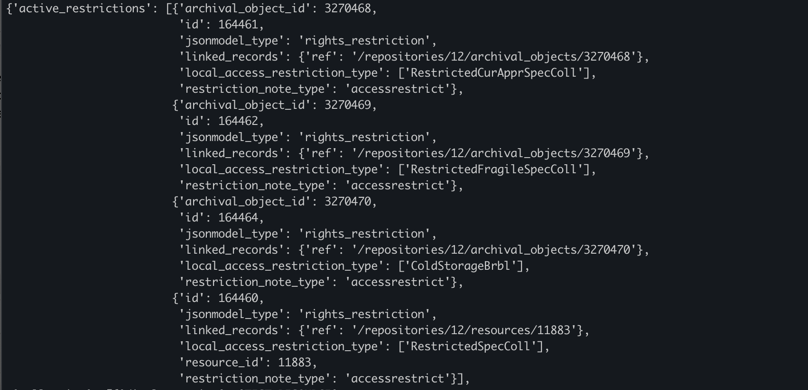
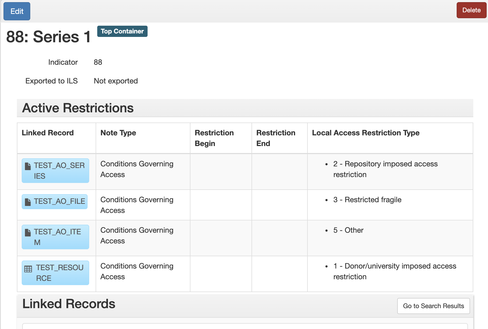
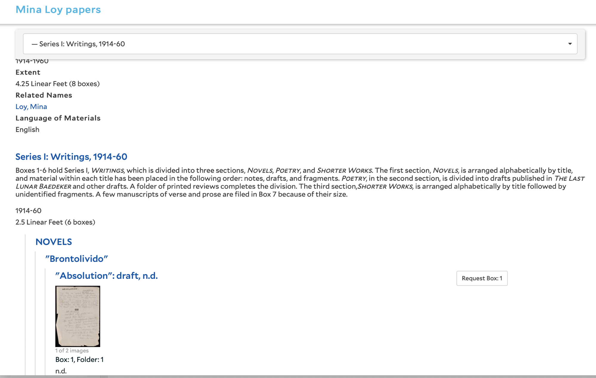

# ArchivesSpace Development FY 2021/22

## Area 1 – Requesting Digital/Digitized Materials in ArchivesSpace 

### 1.1 Photoduplication Requests

The stories in this section focus on new features that will facilitate submitting photoduplication requests for materials in ArchivesSpace via the Aeon request system. This should be accomplished either by modifying YUL’s existing [Aeon Fulfillment](https://github.com/YaleArchivesSpace/ArchivesSpace-Aeon-Fulfillment-Plugin)/[mapping](https://github.com/YaleArchivesSpace/yale_aeon_mappings) plugins, modifying Harvard’s existing [Aeon plugin](https://github.com/harvard-library/request_list), or creating a new plugin. Updates will also be made to the existing finding aid view code.

#### Story 1.1.1 

As a researcher, I want to be able to request a digital copy of an object through Archives at Yale.

__Background__

The PUI archival object pages should continue to have a single ‘Request’ button.

When clicked, rather than opening directly to the Aeon sign-in page, the button should open a modal popup that allows users to select ‘Reading Room’ or ‘Digital Copy’. A similar view should be available in the Finding Aid view when the ‘Request’ button is clicked.

If ‘Digital Copy’ is selected, the Aeon photoduplication request form should open and be populated by data from ArchivesSpace. If ‘Reading Room’ is selected, the Aeon reading room request form should open and be populated by data from ArchivesSpace (this functionality already exists). The Aeon mapping plugin can be used to specify the data mappings (these already exist for the reading room form). Unlike the current Aeon ERE form, this might instead be an OpenURL request to a single Aeon form.

#### Story 1.1.2 DEFER TO NEXT CYCLE

As a staff member, I want to be able to tell that an item requested for photoduplication is already available digitally.

__Background__

If an item has both a physical and digital object instance, and photoduplication is requested, a notification should be given to staff, based on the existence of the digital object instance, that the material is already available digitally. It should also indicate whether the digital object is ‘published; or unpublished’

This could be accomplished by importing the digital object URI (or possibly a file version within the digital object record that resolves to the digital content item) and the publish/unpublish indicator into unused Aeon fields.

#### Story 1.1.3

As a staff member, I want to be able to tell if an item requested for photoduplication has an access or use restriction.

__Background__

This could be implemented by populating an unused field in the Aeon photoduplication form with any machine-actionable restriction (for access restrictions this is either a local access restriction type or a date range; for use restrictions it is just a date range) that is linked to an archival object.

It will be necessary to import the specific local access restriction, rather than indicating restrictions with a ‘Y’ or ‘N’, as many archival objects have access restrictions solely on account of them being A/V or born-digital.

Ideally, the full array of machine-actionable restrictions (i.e what appears in the active_restrictions auto-generated field in top container records - described further in story 1.2.3), rather than just the lowest applicable restriction, will be imported into Aeon. For instance, if a format restriction (Restricted Fragile) is linked to an archival object, but there is also a content restriction (i.e. University-imposed restriction) at the series level, both should be imported into Aeon.

These mappings can all be specified in the Aeon mapping plugin.

#### Story 1.1.4

As a researcher, if an archival record has more than one associated top container or digital object instance, I want to be able to request just the containers/digital objects that I am interested in.

Refined to limit Digital Copy requests to 1, reading room requests to N (where Aeon will enforce actual request restrictions)

__Background__

Currently when an archival object has numerous linked instances (e.g [https://archives.yale.edu/repositories/12/archival_objects/2897533](https://archives.yale.edu/repositories/12/archival_objects/2897533)), the request button submits the request for all instances, and there is no option to remove any from the selection until you get to the Aeon request form, which can be confusing for users. Users should be able to select one or more instances within the ArchivesSpace PUI - this should be true for both reading room and copy requests. This should be implemented on the landing pages and the finding aid view.

Current finding aid view modal for a record with multiple containers. Could add checkboxes to this view to just request some of the containers.

). Requesting via Aeon should be enabled for digital objects. This would require creating mappings from digital object (and linked archival object) records to the Aeon reading room and photoduplication request forms. These mappings can be defined in the Aeon mapping plugin.

#### Story 1.2.2 Achieved through alternate means (restriction code above)

As a staff member, I want to be able to tell that a requested item is born-digital.

__Background__

Staff members need to know when a requested item is born-digital, since born-digital materials often have different access requirements than analog materials. This can be defined by a machine-actionable restriction or other existing field in ArchivesSpace, and mapped to an unused field in Aeon. The mappings can be defined in the Aeon mapping plugin.

#### Story 1.2.3

As a staff member, I want to be able to tell from the context of a linked digital object record if a requested item is restricted, whether or not it has a physical instance.

__Background__

The active_restrictions field is an auto-generated field that searches all ancestors of a linked archival object, retrieves data from the rights_restriction fields, and populates that data in an array within a top container record.

Active restrictions in a top container JSON record:

Active restrictions in the top container view of the staff interface:

This feature allows systems such as Aeon to be aware of all machine-actionable restrictions which apply to the material in a given container, from the collection level on down.

Currently the active_restrictions field is only present in top container records. Extending this field to digital object records would facilitate tracking restrictions on digital object instances when there is no top container instance present. If a record does not have a linked top container record there is no way to see the hierarchy of active restrictions that apply to the material.

## Area 2 – Displaying Digital Materials in ArchivesSpace

The stories in this section focus on the display of digital images in the ArchivesSpace staff and public user interfaces. 

### 2.1 Staff Interface

#### Story 2.1.1 

As a staff member, I want to be able to view thumbnail images of archival materials in the staff interface.

__Background__

If a digital object has a file URI which contains a link to a thumbnail, then the thumbnail should display in the search results and archival object/digital object landing pages of the staff interface. If there is no thumbnail, but there is a linked digital object, then an icon should be displayed instead. See following for specification of thumbnail identification.

The thumbnails or icons should be displayed in both the search results page and the landing pages for archival objects and digital objects.

On the search results page there should appear a fact which will filter to show only archival objects that have linked digital object(s).

Small icons (no thumbnails) should also appear next to archival object titles in the ‘Navigate the collection’ pane if linked digital objects are present.

To facilitate identification of thumbnail images for display, the following specifications originally [outlined by Cory Nimer](https://docs.google.com/document/d/1-fi-1jpE7GqWc0zWxWsRO9zgRmR1vFFygp6jGnKh23k/edit#) at BYU should be followed (links below include more info on each requirement):

[BYU REQ-3](https://docs.google.com/document/d/1Am1JNO1yTIGiVCMaPtx6DuMaiL7GZ64NOiMyRQOyNto/edit#heading=h.cqp8p422cyoj): “The system shall display the File Version designated as "Representative" in record displays for linked Digital Object and Digital Object Component records in the Public User Interface.” 

[BYU REQ-4](https://docs.google.com/document/d/1Am1JNO1yTIGiVCMaPtx6DuMaiL7GZ64NOiMyRQOyNto/edit#heading=h.2wnzrb1hisu8): “The system shall display the File Version designated as "Representative" from the Digital Object Instance designated as "Representative" in record displays for linked Resource, Archival Object, and Accession records in the Public User Interface.”

[BYU REQ-5](https://docs.google.com/document/d/1Am1JNO1yTIGiVCMaPtx6DuMaiL7GZ64NOiMyRQOyNto/edit#heading=h.4djbc1mdblb8): “The system shall display the File Version designated as "Representative" in search results and browse displays for linked Digital Object and Digital Object Component records in the Public User Interface.”

[BYU REQ-6](https://docs.google.com/document/d/1Am1JNO1yTIGiVCMaPtx6DuMaiL7GZ64NOiMyRQOyNto/edit#heading=h.nmm7h46n4v9p): “The system shall display the File Version designated as "Representative" from the Digital Object Instance designated as "Representative" in search result and browse displays for linked Resource, Archival Object, and Accession records in the Public User Interface.”

### 2.2 PUI

#### Story 2.2.1 

As a researcher, I want to be able to view thumbnail images of archival materials in the search result page of Archives at Yale.

__Background__

Only published digital objects should be displayed. If an archival object has a published digital object instance, but that instance has no available thumbnail, an icon should display instead. The thumbnail image should be a clickable link that resolves to a digital library link contained within a digital object record, similar to the way that thumbnail images work on archival object landing pages.

#### Story 2.2.2

As a researcher, I want to be able to view thumbnail images of archival materials in the finding aid view of Archives at Yale.

__Background__

Similarly to 2.2.1, only published digital objects should display, and an icon should display in cases where there is not an available thumbnail. The image should be clickable as in 2.2.1.

One [example](https://www.lib.ncsu.edu/findingaids/mc00456/contents) of this, as implemented by NC State. Presumably this could also be done in a search results page.

AAY mockup:

#### Story 2.2.3

As a researcher, I want to be able to filter search results to only show results with digitally-available material.

__Background__

One [example](https://hollisarchives.lib.harvard.edu/repositories/24/resources/3691/digital_only) of how this has been done is the Harvard PUI’s “Digital Material” search result tab, which relies on code in [this](https://github.com/harvard-library/aspace-hvd-pui) plugin. In Archives at Yale, this tab should appear next to the ‘Finding Aid View’ tab on the resource landing pages. The structure should be similar to what appears in the ‘Container List’ tab, with thumbnails (if present) or digital material icons included in the page.

Another [example](https://www.lib.ncsu.edu/findingaids/search?filters%5Bresource_digital_content%5D=true) is the NC State “Show only collections with digital content” facet. This should be implemented in Archives at Yale by including a facet to show only archival objects which have linked digital object instances, or resources which have archival object children which have linked digital objects.

#### Story 2.2.4

As a researcher, I want to be able to view and interact with digital images in ArchivesSpace via an embedded IIIF viewer.

__Background__

One example of a plugin which includes an embedded IIIF viewer is [here](https://archives.lib.virginia.edu/repositories/3/archival_objects/54178).

Example IIIF manifest URI that we would include in a digital object File URI record:  [https://collections.library.yale.edu/manifests/2020259](https://collections.library.yale.edu/manifests/2020259) 

And that example digital object would be connected to to the following archival component: [https://puitestarchivesspace.library.yale.edu/repositories/11/archival_objects/191008](https://puitestarchivesspace.library.yale.edu/repositories/11/archival_objects/191008) (which we can pull the JSON from, now that I’ve added a IIIF-linked digital object as an example…  and if we had that part working, we’d simply remove the other digital object)

## Area 3 – Update Aeon Add-On Client to match mappings from Aeon fulfillment plugin

### Story 3.1

As a staff user, I want the information that I find and populate into a form from within the Aeon staff client to match what happens when I initiate a similar request from Archives at Yale.

Starting point is [Harvard add-on](https://github.com/harvard-library/AeonASpaceContainersAddon) (but may need Yale version for some, and need to share Yale version with HM)

__Background__

Mappings should be managed from a single location (should match [ASpace-Aeon mappings](https://docs.google.com/spreadsheets/d/1K5ZOSUTa4gVzeHspy-Tsshm1RSZTgUHpDw9IqjU4lOc/edit#gid=1004404652))

[Harvard container demo video](https://drive.google.com/file/d/1ys1hnN7nZ6nYXjpCvpgUtuVr3aiGVp2V/view) (h/t Moira)

Important mappings to note (not necessarily comprehensive at this stage):

* Restriction information mapped  
    * Access Restriction Note mapped to iteminfo5
    * Use Restrictions Note mapped to iteminfo6
    * Extent(s) mapped to iteminfo7
    * Machine-actionable access restriction type(s) (1-5) mapped to iteminfo8
* Other differences in mapping (not all of these critical)
    * SystemID (ArchivesSpace or ArchivesSpace addon)
    * EAD Number 
        * In the plugin this comes over as [http://hdl.handle.net/10079/fa/beinecke.pforzheimer](http://hdl.handle.net/10079/fa/beinecke.pforzheimer)
        * Requesting from ASpace it comes over as [https://archives.yale.edu/repositories/11/archival_objects/278750](https://archives.yale.edu/repositories/11/archival_objects/278750)
    * Preferred citation note mapped to itemcitation
    * Author/Creator mapped to itemauthor
    * Archival Object Title mapped to itemSubTitle (currenlty the addon maps series title to itemSubTitle)
    * Date mapped to itemdate
    * top container URI fragment(s) mapped to iteminfo10
    * Location URI mapped to iteminfo9
    * Pickup location code (usually supplied by patron- currently for BRBL but will be needed by other repositories)
    * Root record (would like to replace with EAD ID and/or BIBID, but in the meantime this value can be used to grab the EAD ID / BIBID) mapped to iteminfo14

## Area 4 - Update ArchivesSpace Export Service plugin

__Background__

Update software components to newest versions, inclusive jRuby, Saxon-HE 10.3, Apache FOP 2.6, etc.

## Area 5 - Update staff-side “Download CSV” export process to remove empty columns

Long ago, a “Download CSV” option was added to the ArchivesSpace frontend to allow staff to download search results.  In theory, this would be a very handy feature!  However, the current process includes way too much data in standard exports, including tons of empty columns. Resulting files, in fact, usually cannot be opened in Excel due to the sheer number of empty columns (e.g. trying to download a small search result with a single agent record can result in a file that’s over 60 MB in size).  

More recently, this feature was turned off by default, and a new “limit_csv_fields” configuration option was added.  See [https://archivesspace.atlassian.net/browse/ANW-565](https://archivesspace.atlassian.net/browse/ANW-565) and [https://archivesspace.atlassian.net/browse/ANW-250#icft=ANW-250](https://archivesspace.atlassian.net/browse/ANW-250#icft=ANW-250) for further background information and desired behavior from users.

Ideally, the “Download CSV” feature could be set up so that a reasonable default set of data could be included with each export, including more data than what can be configured to display on the search-result screen, but not so much useless data that Excel cannot open a CSV file. 

Assuming that the ideal approach might require more work to detail which columns of data are actually useful and should be included (e.g. payment info from our local plugin for accession records) vs. what should be excluded (especially since the entire json blob is already included in this export), this scope of work suggests the following approach for the time being:

1. Add a new step to the “Download CSV” process that filters out empty columns before serializing the CSV file (if there are other easy wins, such as the ability to configure what data attributes should be included in the first place, all the better!)
2. Include this feature in Yale’s custom branch of ASpace;
3. Submit a pull request to ArchivesSpace core to do the same (assuming that such an approach is agreeable).

For the time being, we are testing a process of handling this post-processing step outside of ArchivesSpace. I can share sample files in Pivotal Tracker to illustrate the issue, but just as quick summary:  

* After doing a search within the staff interface, limiting to 39 accession records, and hitting the “Download CSV” button, an example resulting file is 4.8 MB in size and cannot be opened in Excel due to the number of columns;
* Once that file is post-processed outside of ArchivesSpace to remove the empty columns, the resulting file is down to 52 KB.  It still has a lot of useless data, and a total of 70 columns (most of which are not helpful at all), but it is much closer to being something that is usable.  

Also, outside of the full JSON record that is already included in the CSV export (column ‘BR’ in the post-processed file), I’m not sure that the other columns actually include all desired data, but simply removing the empty columns and delivering a file to the user that can be opened in Excel is much better than what we have now.  Help! 😅
