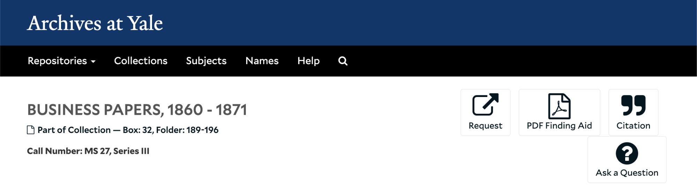
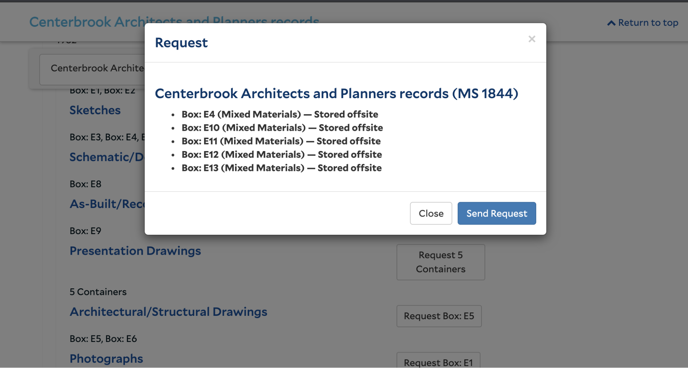

# Yale ArchivesSpace Development Stories 2016

Compiled by Mike Rush for the Yale Archival Management Systems Committee

September 2016

## Core Application Stories

* As a staff user, I want to be able to combine Boolean and Controlled Value fields in Advanced Search using the proper AND or OR operators. See [https://archivesspace.atlassian.net/browse/AR-1387](https://archivesspace.atlassian.net/browse/AR-1387).
 
Discussion: There is a bug that occurs when combining advanced search fields in certain sequences. When the first search field in Advanced Search is a Boolean field or a Controlled Value field, all subsequent search fields will lack a default “AND” operator, until a text or date field is present, after which all subsequent search fields will contain the default AND operator. To replicate this, start an advanced search, delete the default text box, add a Boolean search line, then a second line. The second line will lack the “AND” operator in the first box, and any submitted searches will return the error above. The same is true if you start an advanced search with a Controlled Value field. However, if the second field is for a text or date field, a third field will have the default AND operator. I can replicate this behavior in the official ASpace sandbox, so clearly there is a bug in the core application. One caveat: the core application only includes text, date, and Boolean fields in advanced search, so I can’t replicate the Controlled Value behavior in the sandbox. Any development on this story should be a fix contributed to the core application.

* As a staff user, I want to be able to search for date fields that do not have a value.

Discussion: It would be useful to be able to search for records in which a particular date field does not have a value assigned. Currently in the staff interface it is only possible to search in relation to a particular date value, not in the absence of a date. For example, it would be helpful to be able to search for any accession record which does not have a date value in the user defined date 2 field.

* As a staff user, I want to be able to search for controlled value fields that  do not have a selected value.

Discussion: For many controlled value fields, including all of the fields included in advanced search, it is permissible not to assign a value. It would be helpful to be able to search for records that do not have particular controlled value terms assigned. For example, if i want to find accessions with no accession type assigned, I currently have to search for NOT purchase, NOT gift, NOT transfer, and NOT deposit. Being able to search for accessions with no accession type value assigned would greatly simplify that query.

* As a staff user, I want to be able to search for records with empty text fields.

Discussion: It would be useful, for example, to be able to search for accession records with an empty Title field. So for each keyword search option, it would be helpful to return a set of records for which the selected field is empty. This would help for identifying records that need further work before they meet minimal descriptive requirements.

## Existing Yale Plugin Stories

* As a staff user, I would like the general Agent search to function properly as a keyword search.

Discussion: Agent text search doesn’t work properly. The only searches we can get to return results are an “\*” wildcard, which seems to return all records with linked agents, and “?”, which returns six records that are linked to an agent record for a corporate body with the name “?”. The search should function in the same way as the “Creator” search does, except instead of searching only linked agents with the role “Creator,” it should search all linked Agents. NB: locally we have relabelled this field “Linked Agent”.

* As a staff user, I would like to be able to search for records based on the name(s) of linked agents with the “Source” role.

Discussion: In the current core application, “Creator” is one of the advanced search keyword options. It searches the names of agents linked to accessions and resources with the role set to “Creator.” This works very well, and would also be useful for searching agents with the role “Source”. We would like to update the Extended Advanced Search plugin to add “Source” as an advanced search keyword field. The “Source” field would search the names of any agents linked to accessions or resources with the “Source” role, returning the record to which the agent is linked.

* As a staff user, I would like to be able to search for records based on the name(s) of linked agents with the “Subject” role.

Discussion: In the current core application, “Creator” is one of the advanced search keyword options. It searches the names of agents linked to accessions and resources with the role set to “Creator.” This works very well, and would also be useful for searching agents with the role “Subject”. We would like to update the Extended Advanced Search plugin to add “Agent Subject” as an advanced search keyword field. The “Agent Subject” field would search the names of any agents linked to accessions or resources with the “Subject” role, returning the record to which the agent is linked.

* As a staff user, I would like to be able to search on the “In Lot” Boolean from the Payment Summary in Advanced Search.

Discussion: We would like to update the Extended Advanced Search plugin (and the Payments Module plugin if necessary) to include an option to search on the “In Lot” Boolean field in Advanced Search.

* As a repository manager, I would like the “Restrictions apply?” Boolean search field to be removed from Advanced Search. 

Discussion: At Yale our local policy is to not use the “Restrictions apply?” field. As such it would be preferable not to include it as an option in Advanced Search.

* As a staff user, I would like the drop down menu for selecting a controlled value as part of Advanced Search to be styled correctly.
 
Discussion: When a Controlled Value field is added to an advanced search, the drop down menu for selecting a preferred term (not the drop down for selecting the field) is not styled in the same way as the rest of the application. We would like the style to be consistent to make it easier to select terms from the lists, in particular longs lists like Fund Code and Extent Type. Here are some examples of how it is currently rendering:

 
* As a staff user, I would like the External Documents? Option in Advanced Search to work.

Discussion: We would like to fix a bug in the Extended Advanced Search plugin that prevents the External Documents Boolean search from working. When we attempt a search using that field we get the following error. The expected behavior is to return any record with linked external documents if set to true and any record without linked external documents if set to false.

## New Yale Plugin Stories

* As a staff user, I would like all keyword searches to return results showing all terms in my search, rather than any of the terms in my search.

Discussion: The current ASpace Solr configuration essentially functions an assumed OR operator, so for keyword searches including two or more words, a search will return all results that contain one or more of those words. For example, as search for “Vincent Price” will return each result that contains Vincent and Price, Vincent but not Price, and Price but not Vincent. We would like to modify Solr’s settings to function as an assumed AND operator, so that a search for “Vincent Price” would only return results that included Vincent and Price. We discussed changing ASpace’s Solr settings with staff at Lyrasis (who hosts our TEST and PROD instances), and they recommended handling that change via a plugin.