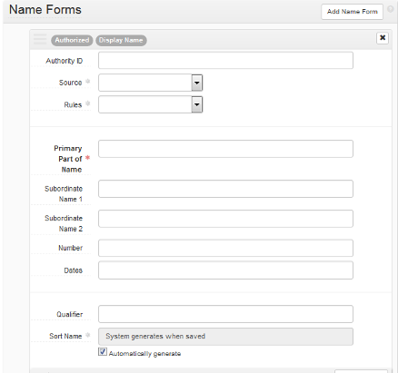

# ArchivesSpace Agent and Subject Records: Best Practices

Created by YAMS ArchivesSpace Agents and Subjects Task Force, February 2017; revised September 2017, February 2019, and March 2022

* Introduction
* Resource and Catalog Records Requirements
* Identifying Existing Agent and Subject Records
* Importing Records into ArchivesSpace
	1. Import LCNAF and LCSH records using the ArchivesSpace import plugin
	2. Edit imported agent records
	3. Edit imported subject records
* Merging Records
* Editing Records
* Creating New Agent Records
* Creating New Subject Records

## Introduction

These best practices were developed in 2017 by the ArchivesSpace Agents and Subjects Task Force, a subgroup of the Yale Archival Management Systems Committee charged with establishing cross-repository control of names and subjects in Yale’s ArchivesSpace database. This document was revised in 2019 February, with revised instructions for creating new records, and new instructions for identifying existing records, importing LCNAF and LCSH authority records, and merging duplicate records.

During 2017-2018, the agent and subject records created before the 2017 July implementation of these best practices were revised, after which the ArchivesSpace Agents and Subjects Task Force identified and merged or deleted circa 55,000 duplicate records. Most of this revision and merging was done via batch processing; remaining duplicate records may be identified and merged as needed by YUL staff, according to procedures outlined below. These procedures  assume familiarity with ArchivesSpace resource editing and linking, and with your repository’s local practice. For more guidance, consult with your supervisor.

This document is maintained by Yale Archival Management Systems Committee (YAMS). Please direct comments to the current chair(s) of YAMS.

## Resource and Catalog Records Requirements

Resource records for finding aids and their associated collection-level catalog records must meet the following requirements:
 
* Each resource record in ArchivesSpace must have a corresponding collection-level record in Voyager. The following elements are required for cross-referencing resource records and catalog records:
	- __In Voyager__ (035 ‡9 field) enter the ArchivesSpace EAD ID, in this format: __(YUL)ead.[repository id].[ead id]__  
	Examples: 
	035 ‡9 (YUL)ead.beinecke.livingston
	035 ‡9 (YUL)ead.divinity.196 
	- __In ArchivesSpace__ (end of Basic Information section) enter the __Voyager Bib ID__. The Bib ID may be copied from an 035 field added during Backstage authority processing. 
* Only create agent and subject records that you will link to finding aids. Finding aid resources must include links to all agent and subject records corresponding to the following:
	- Collection-level catalog records: all 1xx, 6xx, and 7xx fields 
	- Other levels of description: follow your repository’s local practice

For general instructions on linking agent and subject records to finding aids, see the [Linking Records](https://docs.google.com/document/d/1DI_7YNZy-RcjQ9hpMMbxJEkHFpYndzmDoG3ylOc38BY/edit#heading=h.2dvym10) section in the [ArchivesSpace at Yale: User Manual](https://docs.google.com/document/d/1DI_7YNZy-RcjQ9hpMMbxJEkHFpYndzmDoG3ylOc38BY).

## Identifying Existing Agent and Subject Records

__Search for records already in ArchivesSpace__ and prefer authority records displaying the following sources:

* __Agents__: LCNAF (identifiable by an URI in Authority ID field: id.loc.gov)
* __Subject, topical, geographic, or occupation__: LCSH (identifiable by an URI in Authority ID field: id.loc.gov)
* __Subject, genre__: AAT (identifiable by an URI in Authority ID field: vocab.getty.edu/aat/)
Merge any duplicate local records in ArchivesSpace into the preferred authority record.

__If no authority record is found in ArchivesSpace but one exists in LC, AAT, or another source__, search and import a new record into ArchivesSpace:

* __Agents__: search and import, using the LC import plugin 
* __Subjects, topical, geographic, or occupation__: search and import, using the LC import plugin 
* __Subjects, genre__: search [AAT website](http://vocab.getty.edu/) and create new record manually
* __If no LC or AAT authority is found__, optionally, in accordance with your repository’s local practice, search instead  [Union List of Artist Names](http://www.getty.edu/research/tools/vocabularies/ulan/index.html) or other authority databases and manually create a new agent record or new subject record

Merge any duplicate local records in ArchivesSpace into the imported or manually-created  authority record.

__If no authority record is found in any source__, determine if a local record exists in ArchivesSpace:

* Verify personal and corporate identities: 
	- Review usage in existing finding aids in [Archives at Yale](https://archives.yale.edu/).
	- Consult staff at other YUL repositories as needed

__If no authority record or local ArchivesSpace record is found__, manually create a new agent record or new subject record.

## Importing Records into ArchivesSpace

### Import LCNAF and LCSH records using the ArchivesSpace import plugin

* In ArchivesSpace, click on the __gear icon__ next to repository code on upper right
* Click on __Plugins__
* Choose __LCNAF import__
* Choose either __LCNAF or LCSH__ button. For names with both LCNAF and LCSH forms, note the following:
	- Corporate names: use LCNAF
	Example: United Nations (name authority record identifier:  http://id.loc.gov/authorities/names/n79021345)
	- Family names: use LCSH
	Example: Pease family (subject authority record URI: http://id.loc.gov/authorities/subjects/sh85099077)
* Enter search terms
	- Search personal names in this form: [last name], [first name]
* If a record is found, click __Select__
* Click __Import__
* After redirect to jobs page, wait until job has completed
* Click __Refresh page__
* Scroll to “New & Modified Records” and open record
* Click __Edit__, and edit fields as shown below

### Edit imported agent records

* Authority ID field: change the imported authority record identifier to a [LC linked data URI](http://id.loc.gov/) by preceding the identifier with: http://id.loc.gov/authorities/names/ 
Example:
	- Imported authority record identifier: n85286106
	- Authority ID field:  http://id.loc.gov/authorities/names/n85286106 
* If information is imported into the Dates of Existence fields, edit the following:
	- Begin and End fields verify or edit so that dates are in standard form: __YYYY, YYYY-MM, or YYYY-MM-DD__
	- After entering dates in standard form in Begin and End fields, delete Expression field
* For name/title records, edit title in Qualifier field:
	- Delete subfield labels supplied by ASpace 
	- Verify subfields and subfield order in conformance with LCNAF
	- Enter subfield delimiters, in this format: $[x]:  
	- Delete extra periods at ends of subfields
	Example: [LCNAF](http://id.loc.gov/authorities/names/no2002035409.html): ‡a Brahms, Johannes, ‡d 1833-1897. ‡t Gesänge, ‡n op. 72. ‡p: Alte Liebe
	Qualifier field, as imported: Number of part/section of a work: op. 72.. Name of a 
     part/section of a work: Alte Liebe. Title of work: Gesänge,.
	Qualifier field, edited: $t: Gesänge, $n: op. 72. $p: Alte Liebe

### Edit imported subject records

* Authority ID field: change the imported authority record identifier to a LC linked data URI by preceding the identifier with: http://id.loc.gov/authorities/subjects/
Example:
	- Imported authority record identifier: sh85099077
	- LC linked data URI Authority ID field:  http://id.loc.gov/authorities/subjects/sh85004336
* Optionally, if there is potentially outdated or harmful language used in the subject record scope note, consult with the [Reparative Archival Description Working Group (RAD)](https://web.library.yale.edu/committees/reparative-archival-description-task-force-rad) by contacting its chair. RAD will work with you to potentially identify a local revision to the scope note. Once that has been determined, RAD will follow these steps:
	- Edit the scope note to reflect locally-preferred language.
	- Add the following boilerplate text at the end of the scope note: This Library of Congress Subject Headings scope note was edited for local use in Archives at Yale by Yale University Library staff in [YEAR] to address outdated or harmful descriptive language. For more information, see the Yale Statement on Harmful Language in Archival Description: https://guides.library.yale.edu/specialcollections/statementondescription
	- Announce and document the change by:
		- Recording it in AMDECO meeting minutes as an update
		- Logging it via a list on the RAD LibGuide (to be set up as RAD sees fit, or documented as the A&I AG suggests)

## Merging Records

__To merge duplicates into a preferred authority or local record:__

* In ArchivesSpace, open the preferred record 
* Click __Merge__ (located to the left of the red __Delete__ box)
* Click the __down arrow__ to the right of the search box and choose __Browse__
* Search for name to merge into the preferred record 
* Select the correct record by __checking the box__ to the the left of the name, and click __Link to Agents__ 
* Do not select for merging any names followed by work titles or other subfields (i.e., $v Portraits) 
* Click __Merge__ button (below selection) and Merge again (in pop-up box)

After merging, resources linked to both records are now all linked to the preferred record.
Please note that when merging an agent record into another agent record, if the agent record that will be merged has any associated notes or contact details, that data will NOT be added to the record into which the agent is being merged. Please be sure to copy any existing notes or contact details that should be retained prior to performing a merge.

## Editing Records

__Optionally, update local agent records__:

* Verify that new information is for the same person
* Add birth and death dates or make other name form changes 
* Add a brief __Biography/Historical__ note, especially to distinguish from similar names. Optionally check __Publish__ to display this field in Archives at Yale.

Optionally, if you identify potentially outdated or harmful language used in the subject record scope note, consult with the [Reparative Archival Description Working Group (RAD)](https://web.library.yale.edu/committees/reparative-archival-description-task-force-rad) by contacting its chair. RAD will work with you to potentially identify a local revision to the scope note. Once that has been determined, RAD will follow these steps:

* Edit the scope note to reflect locally-preferred language.
* Add the following boilerplate text at the end of the scope note: This Library of Congress Subject Headings scope note was edited for local use in Archives at Yale by Yale University Library staff in [YEAR] to address outdated or harmful descriptive language. For more information, see the Yale Statement on Harmful Language in Archival Description: https://guides.library.yale.edu/specialcollections/statementondescription
* Announce and document the change by:
	- Recording it in AMDECO meeting minutes as an update
	- Logging it via a list on the RAD LibGuide (to-be-set up as RAD sees fit, or documented as the A&I AG suggests)

If you wish to make an LCSH proposal for a revised subject heading, contact the [Reparative Archival Description Working Group (RAD)](https://web.library.yale.edu/committees/reparative-archival-description-task-force-rad) chair. RAD which will bring the question to the Authorities and Identities Advisory Group for conversation and support. More information about the LCSH process is here: https://www.loc.gov/aba/publications/FreeSHM/H0400.pdf 

__General editing instructions__:

* __Do not enter punctuation or parentheses at the end of subfields__; all punctuation will be supplied by ArchivesSpace. 
* __Be sure you do not leave any blank spaces at the end of the subfields or any other data field.__

Fields in ArchivesSpace agent records map to MARC fields in Library of Congress Name Authority File (LCNAF) records as listed below.

### Agent

__Basic information__

* Dates of existence (personal)
	- Begin: 046 ‡f 
	- End: 046 ‡g
* Dates of existence (corporate)
	- Begin: 046 ‡s 
	- End: 046 ‡t

__Name Forms (personal)__

* Primary Part of Name: 100 ‡a (surname only)
* Rest of Name, personal: 100 ‡a (forename or initials only)
* Title, personal: 100 ‡c [includes name suffixes, such as Jr.]
* Fuller Form, personal: 100 ‡q
* Number, personal: 100 ‡b
* Dates, personal: 100 ‡d
* Qualifier: 100 ‡t and other subfields following ‡t

__Name Forms (corporate)__

* Primary Part of Name, corporate: 110 ‡a
* Subordinate Name, corporate: 110 ‡b
* Subordinate Name, conference: 111 ‡e
* Number, conference: 111 ‡n
* Dates, conference: 111 ‡d 
* Qualifier, conference: 111 ‡c

__Name forms (family)__

* Dates, family: 100 ‡d
* Qualifier, family: 100 ‡c, ‡g

The following LCNAF subdivisions are not mapped to agent records. After linking the agent to a resource record, add these as terms via the Add Term/Subdivision button. Do not include ending punctuation or trailing spaces:

* Free-floating subdivisions: ‡v and ‡x

###Subject

__Term__

* Topical: 150 ‡a
* Occupation: 150 ‡a
* Geographic: 151 ‡a
* Preferred title: 130 ‡a through ‡t

__Type__

* Topical: 150 ‡x
* Geographic: 150 ‡z
* Chronological: 150 ‡y
* Genre: 150 ‡v

## Creating New Agent Records

Manually create a new agent record only if no LCNAF authority record is available for import. Definitions of agent record fields in the instructions below reference corresponding MARC fields in LCNAF records.

The following instructions are for constructing an __Agent__ record for a __Person__. Follow these same basic instructions for Family and Corporate Entity records--any variants specific to those types will appear below.

Click __Create__ and choose the record types from the two dropdown menus

The __New Person__ screen will appear with the following fields:

#### Basic Information

Publish: check box

#### Dates of Existence

Optional; use primarily if an authorized name lacks life dates. To add, click the __Add Date__ box on right and a form will appear. For __Type__ choose __Range__

and enter dates (LCNAF 046 ‡f ‡g for personal names, or LCNAF 046 ‡s ‡t for family and  corporate names) in fields __Begin__ and/or __End__. 

#### Name Forms

Required.
__Authority ID__: required, if available from [LC Linked Data Service](http://id.loc.gov/); URI is found near the top of the entry 

To find the URI for a [ULAN](http://www.getty.edu/research/tools/vocabularies/ulan/index.html) record, click __Semantic View__ on the left above the name

which opens another screen with the URI up at the top: 

__Source__: required; choose __Library of Congress Name Authority File__, __Union List of Artist Names__, or appropriate __local library code__ if not in either authorized source.
__Rules__: choose Resource Description and Access if Source is a local library code; otherwise leave blank.
__Name Order__: required; choose Indirect for Person unless the person has a single name (then choose Direct).
__Primary part of name__: required. Use LCNAF 100 ‡a for family (surname) only
__Rest of Name__: Use LCNAF 100 ‡a for forename or initials only

Required when applicable:
* __Title__: LCNAF 100 ‡c [includes name suffixes, such as Jr.]
* __Fuller Form__: LCNAF 100 ‡q
* __Number__: LCNAF 100 ‡b
* __Dates__: LCNAF 100 ‡d
* __Qualifier__ (for name/title): LCNAF 100 ‡t and other subfields following ‡t

All other Name Forms elements: leave blank.
Do not include free-floating subdivisions (‡v, ‡x). After linking the agent to the resource, add these to the linked agent as terms/subdivisions in the resource record. See the [Linking Records](https://docs.google.com/document/d/1DI_7YNZy-RcjQ9hpMMbxJEkHFpYndzmDoG3ylOc38BY/edit#heading=h.2dvym10) section in the [ArchivesSpace at Yale: User Manual](https://docs.google.com/document/d/1DI_7YNZy-RcjQ9hpMMbxJEkHFpYndzmDoG3ylOc38BY).

__Sort name__: check __Automatically generate__ at end of field. 

Example of Person with Library of Congress authorized record:

#### Contact Details

Please note that contact details are never displayed in the ArchivesSpace public user interface, even if the agent record is published.

#### Notes - Biographical/Historical

Consider adding a brief __Biography/Historical__ note, especially to distinguish from similar names. Optionally check __Publish__ for display in Archives at Yale.

This note is required when creating an Agent record for a Yale staff member or student worker who will be adding or editing ArchivesSpace records. Add a __Biography/Historical__ note with the person’s YUL affiliation, including dates of service if known, followed by a semicolon and the person’s NetID. Do not check __Publish__.

Example of YUL Staff Person:

#### Other fields

Generally, do not use.

### For Family agent records

#### Name Forms

 
Required name element: __Family Name__: LCNAF 100 ‡a
Required when applicable:

* Dates: LCNAF 100 ‡d
* Qualifier: LCNAF 100 ‡c, ‡g

### For Corporate Entity agent records

#### Name Forms

 
Required name element: __Primary Part of Name__: LCNAF 110 ‡a
Required when applicable: __Subordinate Name__ 1 and 2: LCNAF 110 ‡b

All other name elements: blank

### For Corporate Entity (conference) agent records

#### Name forms

Required name elements: __Primary Part of Name__: LCNAF 111 ‡a
Required when applicable:

* __Subordinate Name__ 1 and 2: LCNAF 111 ‡e
* __Number__:  LCNAF 111 ‡n
* __Dates__:  LCNAF 111 ‡d 
* __Qualifier__:  LCNAF 111 ‡c

All other name elements: blank

## Creating New Subject Records

Manually create a new subject record only if no LCSH or AAT authority record is available for import/entry. Definitions of subject record fields in the instructions below reference corresponding MARC fields in LCSH records.

The following instructions are for constructing a __Subject__ record for a __Topical__ subject. Follow these same basic instructions for Occupation, Geographic, Preferred Title, and Genre records--any variants specific to those types will appear below. 

### Click __Create__ and choose __Subject__.

#### Basic information
Required: use default fields shown

__Authority ID__: optional. If available, use a URI from LC Linked Data Service or Art & Architecture Thesaurus.
__Source__: required. Choose __Library of Congress Subject Headings__, another thesaurus code, or appropriate Yale Library local code (at the end of the list) from the drop-down menu.

For LCSH subjects with subdivisions:
* If the subdivisions are free-floating, code the record as local, using the appropriate code
* If the entire heading, with subdivisions, has an authority record, record the LC linked data URI for the entire heading in the Authority ID field (Example: Carrots ‡x Diseases and Pests).

#### Terms and Subdivisions

__Term__: required: LCSH 150 ‡a, or local term
__Type__: required: use default, Topical

__Add Term/Subdivision__: optional and repeatable
__Term__: LCSH 150 ‡x, ‡z, ‡y, ‡v, or local term
__Type__: use one of the following:

* LCSH 150 ‡x: Topical
* LCSH 150 ‡z: Geographic
* LCSH 150 ‡y: Chronological
* LCSH 150 ‡v: Genre

#### Other fields
Generally, do not use External Documents.

### Create new subject: Occupation

#### Terms and Subdivisions

__Term__: required: LCSH 150 ‡a, or local term
__Type__: required: choose Occupation

__Add Term/Subdivision__: optional and repeatable
__Term__: LCSH 150 ‡y, ‡z, or local term
__Type__: choose Geographic or Chronological

### Create new subject: Geographic

#### Terms and Subdivisions

__Term__: required: LCSH 151 ‡a, or local term
__Type__: required: choose Geographic

__Add Term/Subdivision__: optional and repeatable
__Term__: LCSH 151 ‡v, ‡x, ‡y, ‡z, or local term
__Type__: choose Genre, Topical, Geographic,or Chronological 

### Create new subject: Preferred title

#### Terms and Subdivisions

__Term__: required: LCSH 130 ‡a through ‡t, or local term
__Type__: required: choose Preferred title

__Add Term/Subdivision__: optional and repeatable
__Term__: LCSH 130 ‡v through ‡z, or local term
__Type__: choose Genre, Topical, Geographic, or Chronological

### Create new subject: Genre

#### Terms and subdivisions

__Term__: required: choose term from AAT or other thesaurus, or local term
__Type__: required: choose Genre

__Add Term/Subdivision__: optional and repeatable
__Term__: local term
__Type__: choose appropriate term

