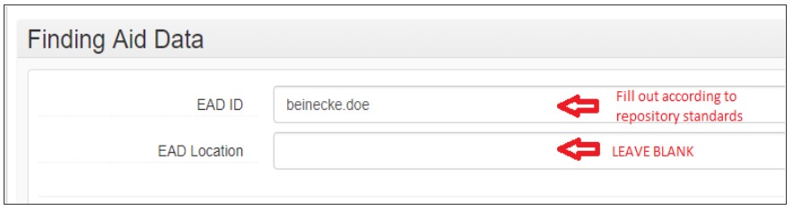
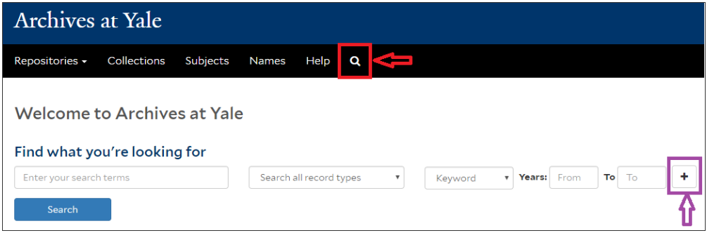
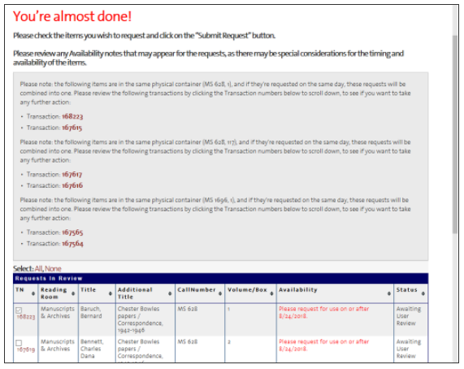
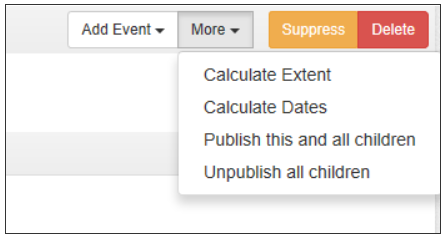
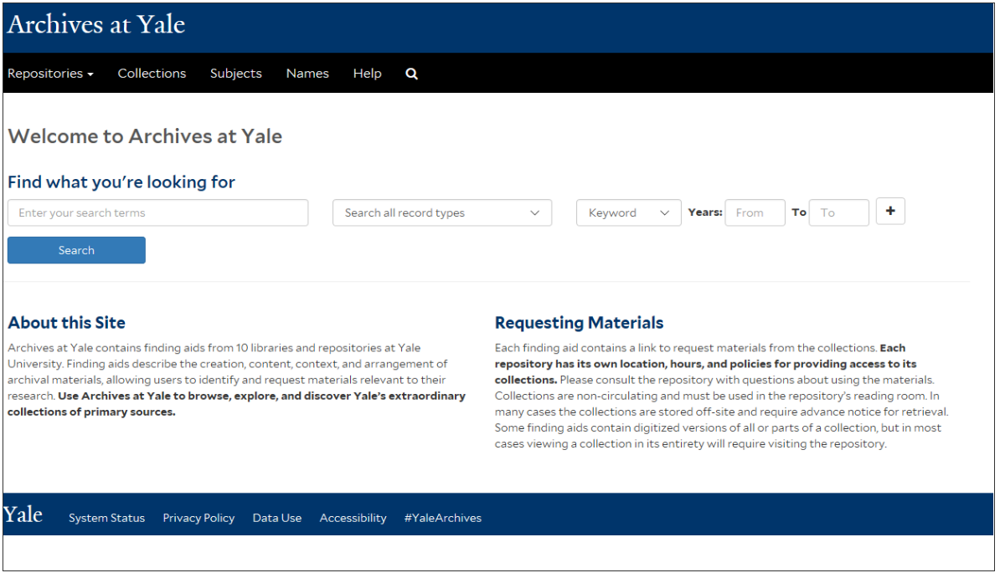

# Archives at Yale: Staff Training

## Intro

Welcome to Archives at Yale!

Archives at Yale uses ArchivesSpace - an open source web application for managing archives information. It is designed by archivists and supported by diverse archival repositories. Institutions who use ArchivesSpace include Harvard, Middlebury College, DePaul University, University of Virginia, University of Edinburgh, and many more.

## Data points

Each element of a collection (box, folder, item, etc.) is represented by a data point. Another way to think about this is that each element of a collection has its own URL. This structure allows you to easily search across YUL repositories. It also means that you must navigate through the data points - you may find yourself "clicking" more often to find what you are looking for.

## Breadcrumb trails

Locate the "breadcrumbs" in the interface. These will help orient you as you navigate Archives at Yale. Note that the breadcrumbs are linked, so you can return to previous points in your search.

## Changes to Archives at Yale

Because ArchivesSpace is an open source tool, we can make modifications to the interface to suit the needs of YUL repositories. Changes will be communicated to YUL staff by the YAMS (Yale Archival Management Systems) committee.

# Searching

## The Search Box

You can search collections directly from Archives at Yale's landing page. To return to this search box from anywhere on the site, click on the Search icon in the top menu bar. 

## Entering Your Search Terms

* If you use 1-3 search terms, Archives at Yale will return matches containing all of those words (anywhere in the record, not necessarily side by side). Therefore, searching for: Spanish Civil War will retrieve the same results as searching for: Spanish AND Civil AND War.
* If you use 4 or more search terms, Archives at Yale will return matches containing most of those words.
* You can use quotation marks " "  to search as a phrase. Searching for "Spanish Civil War" will return results containing the 3 terms in that exact order. 
* You can use the Boolean operators AND, NOT, OR between search terms. 
* Alternatively, you can input a first search term in the box, and add a new search row for each additional search term by expanding the plus (+) sign. A drop-down menu will allow you to select the relevant Boolean operator.

## Searching All Record Types vs. Collections

By default, Archives at Yale will retrieve results matching your search terms from all types of records in its database. An icon identifies each record type. Your results may include:

* Collections 

* Also called Resource records in ArchivesSpace
* When possible, Archives at Yale puts collections at the top of your results list.
* Individual parts of a collection 

* Also called Archival components or Archival objects
* Series, subseries, files, items, etc.
* Subjects 

* Controlled vocabularies for topical and genre/forms terms
* Names 

* Standardized headings for persons and organizations
* Unprocessed materials 

* Accession records from repositories who have elected to publish them (as of August 2018, only the Beinecke Library). 

If you want to search collection-level information only, find the option "Limit to collections" in the drop-down menu under "Search all record types".

With "Limit to collections", Archives at Yale will search for matches in collection-level fields (Title, Description of the Papers, Biographical / Historical Note, Subjects, etc). In the ArchivesSpace back-end, it queries resource records, but not accession records. Therefore, a "Limit to collections" search will not return matches from unprocessed materials.

## Searchable Field Selections

A drop-down menu offers 5 search field options:

1. **Keyword**: Is the default setting.
2. **Title**: Retrieves file titles, series titles, etc. in addition to collection titles (unless you limit to collections only).
3. **Creator**: Only searches the agent links coded as “creators” in the ArchivesSpace resource record. This usually represents the person(s) or corporate body responsible for creating the collection, though sometimes different creators has been identified for individual components of collections. Not all repositories at Yale have used this metadata field consistently over the years. 
* **Tips to find persons:**
    * **Use a title search:** Naming conventions mandates to record the name of a collection’s creator in the collection’s title. Additionally, the format for correspondence file titles typically include names.
    * **Use a keyword search**: It will retrieve names mentioned in descriptive notes, titles, name headings, etc. The creator field does not capture all the individuals and corporate bodies who created materials in a single collection.
1. **Subject**: Refers to the standardized subject headings assigned to a collection, or to a component part of the collection. Includes topical terms, geographic places, and genre/form terms. Does not include personal names added as agent links in ArchivesSpace (even if coded as a “subject” agent). To browse by name headings, navigate to the **Names** tab in the top menu bar.
2. **Call number**: Is the collection's unique identifier. Therefore, this is the only field that automatically limits results to collections only. You do not need to use quote to retrieve an exact match. However, some call number formats will match multiple results (e.g. searching MSS 52 returns MSS 52, OSB MSS 52, YCAL MSS 52).

## Limiting Searches

## **Limiting by date**

The main search box, and the Filter Results box allow you to limit your search to specific years. They will limit results to those with date spans _overlapping_ with the years you input as parameters.

Beware that the collection or component date(s) may not _exactly_ match your search parameter. For example, a search limited to the years 1800-1870 may return a collection spanning the years 1780-1850 or 1810-1905.

Searching From: 1800 To: [blank] = 1800 to present, while searching From: [blank] to 1800 = the earliest we have until 1800.

## **Limiting by repository**

1. Use the Repository filter in the results page, or
2. Navigate to the repository page from the top menu bar, and then use the repository's search box or browsing icon.

## Other Search Boxes

**Search within results**: 

**Search within collections:**

[Warning: Currently, if you enter multiple terms in the Search within Results and the Search Collection boxes, results will contain ANY of the words. These boxes do OR searches instead of AND (like the main search box). This is a known issue and under investigation.]

## Additional Information

**Punctuation:** is stripped during the query, whether you are using quotation marks or not. Therefore, including or not including hyphens in personal names, or dashes in subject headings, does not impact search results.

**Diacritics:** are supported but not necessary. For example, searching "Jean Francois Bory" will return the Jean-François Bory Papers.

**Stemming:** Archives at Yale automatically performs basic stemming on searches (e.g. searching for cats will also retrieve cat).

**Wildcards:** “Wildcard” symbols ? and * help retrieve a greater number of relevant results by searching for variant spellings and forms of the term concurrently.

**?** will be replaced by a single letter in, or at the end of, a search term (e.g. Searching for wom?n will find both wom_e_n and wom_a_n. Searching archiv? will find both archiv_e_ and archiv_y_)

_/*_ will be replaced by any number of letters (e.g. Searching for mission* will return results containing mission_s_, mission_ary_, mission_aries_, etc. Searching for migrat* will return migrat_e_, migrat_ory_, migrat_ion_, but not migra_n_t.)

**Searches are not case-sensitive.**

**Alternative to boolean operator NOT:** precede a term by a hyphen to exclude it from the search (e.g. mission -China ; art -British).

**Finding near terms:** Archives at Yale does not support the boolean operator NEAR. However, to find terms within a specified number of words of one another, add a tilde (~) and a number after the search terms. (e.g. “maps Asia”~5 will return results where the term maps occurs within 5 words of the term Asia).

#### Examples and Tips

## Subjects

"I am writing a paper on medical practice and patient care in the United States from about 1850 to 1920. I need to find relevant primary sources from at least 3 different doctors, clinics, or health advocates."

**Make use of date filters.**

**Try finding collections by type of record creators.**

Collection-level notes typically include a description of the activities of the creator(s) that provide context for the archival material. For example:

1. Limit to collection ; Keyword: physician. Years: 1850 to 1920.
2. Limit to collection ; Keyword: hospital. Years: 1850 to 1920.

**Try retrieving collections by subject.** 

Archives at Yale supports different strategies:

* If you know the authorized subject headings, search it as a phrase within Subject. Dashes for subdivisions are not mandatory.
    1. Subject: “Medicine -- practice”. Years: 1850 to 1920.
    2. Subject: "Medical care -- United States". Years: 1850 to 1920.
* Search topical terms as keywords within collections. This is a good strategy if you do not know the exact subject heading, or want to find additional results after trying subject headings. 
    3. “Medical practice” AND “United States” OR American. Years: 1850-1920.  Note a possible problem with this sample search: finding aids for U.S.-based materials often mention specific geographic locations (states, cities) without naming the country.
    4. Other possible keywords: medical care, patient care, health clinics, clinical notes.
* Browse subjects to find related materials:
    5. Click on the tab Subjects in the top menu, filter results by relevant terms like "medicine" or "medical", click on the authorized subject headings to browse linked collections.
    6. Or, find a relevant collection using a keyword search, scroll down its collection-level page to expand its assigned Subjects tab, and click on the subject links.

## Persons

"I’m compiling a biography on British General Henry Seymour Conway (1721-1795). Can I find letters to and from Conway at Yale?"

Yale does not have an Henry Seymour Conway collection, but there are letters across collections in various repositories.

**Do not filter the search by Creator.**

Even if Yale repositories housed a collection of Conway materials, you would miss on all relevant correspondence in other collections. Moreover, the creator field has not been used consistently across repositories over time.

**Search in all record types.**

Collection-level notes are unlikely to list all correspondents featured in a collection. Correspondent names are likely to be listed in file titles.

**Search the full name as keyword.**

Try both with and without quotation marks.

* Searching as a phrase "Henry Seymour Conway" will retrieve results matching the name in that order. Because file title conventions generally list correspondents by "last name, first name", this strategy may exclude relevant results.
* Searching Henry Seymour Conway will retrieve results containing all parts of the name, but not necessarily in that order or next to one another. This search may return some irrelevant matches.

**Look at the breadcrumb at the bottom of each result to evaluate its relevance.** 

Because Archives at Yale returns archival records at any level of description, it helps to know where a record fits within its parent collection. Series titles can be especially useful in gaging possible material type and subject matter. Additionally, if a collection component has its own scope and contents note, the results list will display it.

## Known-item search

"I heard that you have Gertrude Stein’s notebooks with drafts of the libretto for Virgil Thomson’s opera _Four Saints in Three Acts_. Is that true? If so, which collection and box should I request for the reading room?"

Try searching "Four Saints in Three Acts" (with quotation marks) in a first row AND notebooks in a second row as keywords. This will return fewer results than just the opera title.

Alternatively, think about the document’s creator. Do a general keyword search for Gertrude Stein, open the finding aid for her papers, and search “Four Saints in Three Acts” within the collection. Note: Not all document creators have their own archival collection, and some creators appear in multiple collections. For instance, the Music Library has Virgil Thomson’s papers, which could have contained writings by Stein for the opera.

The notebooks are in the Gertrude Stein and Alice B. Toklas papers, Beinecke Library.

"I conducted research on Randolph Bourne at the Beinecke a year ago, and forgot to note down complete citation information. For citation purposes, could you tell me the archival box number that contains his letter to Alyse Gregory, dated Nov. 10, 1916?"

The easiest way to locate correspondence between two persons is to search both names as keywords across all record types.

The letter may be housed in a file with letters covering a long time span, so limiting the search by the letter’s year is not always helpful. The letter is located in the Alyse Gregory papers, in a correspondence file titled _Bourne, Randolph Silliman, 1914-18, n.d._

#### Looking at Finding Aids

## Intro

Finding aids in Archives at Yale look different than in the Yale Finding Aid Database (YFAD). There are three ways to view a finding aid: **Collection Overview**, **Finding Aid view**, and **Container List** - as well as the option to download a pdf of the finding aid.

## Collection Overview

Collection Overview gives select information about a collection, with additional fields collapsed below. There is a Navigation Bar on the right side of the screen, which features expandable levels of information.

## Finding aid view

Finding Aid View allows the user to scroll through the entire finding aid. The material loads dynamically as you scroll. Note that this particular feature does need some adjustment, and will not be fully operational until early 2019. In the interim, please direct patrons to the PDF download.

## Container List

The Container List view is very helpful for staff. Clicking on the number of the container will show you what items are in that container.

#### Requesting Materials

## Introduction

**General information about requesting materials can be found in the lower right corner of the Archives at Yale home page, under "Requesting Materials." Patrons are advised to consult with the repository for specific hours, access policies, etc. Contact information for each repository is given under the top bar tab "Repositories".**

## Requesting materials (part one)

**Request materials by clicking on the "Request" icon. After you click "Request," you will be directed to "Login" to Aeon through the Yale University Library.**

## Requesting Materials (part two)

**After logging into Aeon, your requests will appear in a queue. If you have duplicate requests (since materials is requested at the folder level), you will be notified that they will merge into a single entry. Like with YFAD, you will have to enter the scheduled date for viewing the material before clicking "Submit."**

## Requesting Materials

**When using the Navigate the Collection pane, requesting materials may only be done at the folder or item level. An error message will appear if an attempt is made to request material at the collection or series level.**

**It is also possible to place a request through the Container List view. After you click on the container, a request icon will appear at the top of the page. In this case, it is not necessary to select a specific folder or item to request.**

#### Publishing Finding Aids

## Screencast

[Publishing and editing finding aids YouTube video embedded here](https://www.youtube.com/watch?v=ougznxYHrdQ&feature=emb_imp_woyt)

Please note that this screencast was recorded in the spring of 2018, before several cosmetic and functional changes were made to the public user interface. MOST IMPORTANTLY: It is now possible to publish and unpublish at lower levels of description than collection, as explained in the [Publishing Archival Records](https://guides.library.yale.edu/c.php?g=754688&p=557399) page. For every record below the collection level that has child records (series, subseries, file headings), two new functions have been implemented in August 2018: 

1. "Publish this and all chidren"
2. "Unpublish all children"

## Intro

**The Archives at Yale public interface connects directly to the staff side of ArchivesSpace. This makes publishing and editing finding aids an easy, breezy process - new content will display to the public within minutes!**

However, there are a few important things to know to ensure that the Archives at Yale interface and the staff interface are properly synced:

1. Check your account's default settings for publishing content. 
2. Use the publishing buttons to display new finding aids.
3. Determine which metadata fields become visible to the public, and which remain internal.
4. Edit content and add new components to published finding aids.
5. Verify your finding aids meet the requirements for Archives at Yale to generate a PDF version.

These topics are all covered in the drop-down menu under the tab "Publishing in Archives at Yale".

#### Verifying Your Default Settings

## Checking your default settings

A default setting in the ArchivesSpace staff interface will determine whether the new content you create will be automatically displayed in the public interface, or not. Because creating a finding aid is a lengthy process that requires many revisions before the description is ready to be shared publicly, **you should set your default to not publish.** This will give you greater control to roll out finding aids as ready. 

**Step 1:** At the upper right corner of ArchivesSpace, click on the drop-down menu next to your username and select **My repository Preferences**. (For the most of us, selecting My Global Preferences will lead to an error message.)

**Step 2:** Make sure that the box "Publish?" is unchecked.

**Now:** Whenever you create a new archival record at any level of description (collection, series, file, etc) or add a note to a record, the box "Publish?" will appear unchecked. 

#### Publishing Archival Records

## Publishing Full Finding Aids

After completing a finding aid, go to its collection-level page and click on "**Publish All**". 

Then, after a minute or two, you can use "**View Published**" to be directed to the Archives at Yale public interface and see the finding aid live. You may need to refresh your browser.

In the staff interface, a green message and a check in the "**Publish?**" box will appear to confirm the publication.

Why couldn't you simply check the "**Publish?**" box instead clicking the "**Publish All**" button? Because the public would then only see the collection-level description (Summary, Biographical Statements, etc), but not any series, subseries, and files in the hierarchy below.

The **"Publish All"** function will publish all notes created in the Notes section. See the page **[Understanding Publish All ](https://guides.library.yale.edu/c.php?g=754688&p=5573999)**for more information and options of fields to use for internal notes that will not be affected by the **"Publish All"** function.

## Publishing Parts of Collections

To publish only selected components of a collection:

1. Publish the collection-level record without its components by ticking the **"Publish?"** checkbox on your resource record and saving. This will publish the main parent record without its associated children (series, subseries, etc), unlike the **"Publish All"** button. 

2. Navigate to the level of collection you want to publish. (If you want to publish only 1 subseries within a series, you will have to repeat the previous step for the series-level record: tick the** "Publish?"** checkbox at the series level).
3. Expand the drop-down menu under **"More"** at the top right of your record, and select **"Publish this and all children". (**Nota bene: This option will only appear for components that have children. To publish or unpublish files or items at the lowest level of the hierarchy, you'll have to manually tick the **"Publish?"** box for each.)

## "Publish?" Checkbox

The following principles apply when manually publishing and unpublishing content at any level of the collection using the "Publish?" checkbox: 

1. ** Publishing a parent record does not automatically publish the child record _(except when using the "Publish All" or "Publish this and all children" functions)._**
2. ** BUT un-publishing a parent record automatically un-publishes the child record _(except when using the "Unpublish all chidren" function)._**

Here is an example to illustrate these principles:

Let's say you were to go into the _Writings, 1970-2005_ series-level page and check the "Publish?" box. Patrons using the Archives at Yale public interface would see the series-level information (title, date, extent, descriptive notes, etc.), but they would not see the file _Scientific article, 2002_. Such granular publishing control can be beneficial if, for instance, the contents of a series are to be kept confidential and restricted until a certain date. Note that, for a series record to display successfully in the public interface, its parent collection record must also be published.

However, if you tried to publish only the _Scientific article, 2002_ file without also publishing its parent series _Writings, 1970-2005_, you would get a warning message and fail to display the content in Archives at Yale.

The system was designed so that you cannot accidentally display information about an orphaned child record without its associated parent record.

#### Understanding "Publish All"

## "Publish All" 101

Despite claiming to publish it all, the "Publish All" button does not actually publish *all* metadata input in the staff interface. A significant number of metadata fields and records exist for collection management purposes only and will never be displayed to the public. The tables below summarize which fields get published when you hit "Publish All", and which do not.

#### Published with "Publish All"

* Parent record (collection) + all child records (series, subseries, files, items)
* Notes fields at all levels of description

* Top Container contents (displayed in Container Inventory + Physical Storage Information)
* External documents
* All subjects linked to the published record

Not published with "Publish All"

* Agent records (new agents must be manually published, and linked to the archival record)
* Event records
* Repository Processing Note field
* Rights Statements fields
* Collection Management fields
* Related Accessions links
* All user-defined fields (exception: the Voyager BibID field, which is displayed as an Orbis link thanks to a local plug-in)
* Digital Objects records + Preservica metadata [pending further development...]
* Any new child records, notes, external documents added after the initial publishing (assuming your default settings are to not publish, as recommended)

## Internal Notes Options

If you need to record internal information for collection management purposes, you may use the following options that will not be displayed to the public:

1. Archival objects at any level of description > Basic information > Repository processing note 

2. Archival objects at any level of description > Top bar Add event > Outcome note 

3. At collection level > Collection management > fields like Processing plan

#### Editing Content

## Navigating Between Staff and Public Interfaces

Thanks to the **"View Published"** button in your resource record, you can move from the staff interface to the public interface to view a published finding aid. Similarly, you can navigate directly from the public interface to the staff interface to edit records using the **"Staff Only"** icon. 

**The "Staff Only" editing icon will only appear if:**

1. **You are logged in the ArchivesSpace staff interface in the same browser.**
2. **You are permitted to edit the record._ (Most staff members creating archival description can only edit finding aids of their own repositories. For example, a Beinecke Library staff looking at a Divinity Library finding aid will not see the "Staff Only" icon.)_**

The **"Staff Only"** icon will appear at many levels of description in the public interface (collection-level, series, files, top container records, etc.) and will link to the corresponding record in the staff interface. In the example below, an edit is made in a file description:

The **"Staff Only"** editing button is the only way to reach from the public interface a specific part of a finding aid in the staff interface. 

## Saving Edits to a Published Record

Edits to published content made in the staff interface, like fixing a typo, changing a date of creation, or adding a sentence to an existing note, will be updated automatically in the public interface. All you have to do is saving your changes ("Save Resource" or "Save Archival Object") as usual.

**Note:** If you have an Archives at Yale tab open while making edits, you may need to refresh your browser before seeing the changes displayed.

If you have set your defaults to not publish, as is recommended here, more substantial additions to published resources will need your manual input before they are added to Archives at Yale. There are two cases where edits require manual publication:

1. You added 1 or more subrecords (new series, subseries, files, or items) to a published resource.
2. You added a note to a resource or a subrecord.

After publishing a resource, any new subrecord or note will display a blank "Publish?" box. When ready, you have the option to check the "Publish?" box for each new subrecord/note you create, or hitting the collection-level "Publish All" button another time.

**Remember:**

1. Clicking the "Publish?" box for a parent record (like an added series) will not publish child records (the files listed under that new series).
2. Multi-part notes have two "Publish?" boxes (one for the note label, one for the note text). Both must be checked in order to display properly. 

3. If you must record information that should not be public, but that cannot go in internal collection management fields, you may add notes to your resource or subrecords after hitting "Publish All", making sure their "Publish?" boxes are blank. However, if you later make public additions to your resource, you will not be able to use the "Publish All" function without risking exposing the confidential notes. Any workflows involving confidential information should be treated with care during the transition to the new public user interface.

#### Preparing PDF Creation

## Introduction

The Yale archival community is working on improving the ArchivesSpace Public User Interface's PDF creation process. The out-of-the-box PUI software offers users the option of generating a new PDF version of a finding aid every time they use the "Print" icon in the collection-level page. The Yale enhancement will provide users with a static PDF with improved formatting deriving from a validated EAD file. 

## New PDF Creation Process

New resource records published in the Archives at Yale platform are indexed and displayed as a dynamic finding aid within minutes. A PDF version of the finding aid will not immediately be available. Overnight, the ArchivesSpace Export Service will export the EAD file for each newly published resource record. Once the EAD file is validated, a PDF will be created and posted on Archives at Yale. It should be available for downloading and printing the next day.

## Requirements for the Creation of Handle Links

In order for a new Handle to be created by the nightly export service, resource records must fulfill the following requirements:

1. **A collection-level record is published.** _(Associated child records like series, subseries, files, and items do not need to have been published for the PDF to generate successfully out of the EAD file. However, unpublished child records will not appear in the PDF.)_
2. **The field EAD ID has a value**.
3. **The field EAD Location has been left blank.** _(A new handle will be created and will populate that field the following day.)_

#### Problems or Questions?

## Questions

**Have a question?**

The Help page contains information about searching, requesting, and more.

## Problems

**Need to report a problem?**

Use the "Report a Problem" form on the [Library IT web page](https://web.library.yale.edu/lit) 

