# ArchivesSpace at Yale: User Manual

## Overview: ArchivesSpace Application and its Governance

### Scope of User Manual

**What’s covered**

- What is ArchivesSpace.

- Yale ArchivesSpace policies and procedures.

- Creation of Accession records.

- Creation of Resource records.

- Creation and management of Agent and Subject records, and how to link
  them to Accession and Resource records.

- Recording and management of physical locations within a repository.

- Production of description output files in standardized data structures
  such as EAD and MARCXML.

- Application of a content standard, in this case DACS, where
  applicable, to determine the kind and form of data recorded in an
  ArchivesSpace record.

- Technical and administrative issues relevant to managing your
  ArchivesSpace repository at Yale.

**What isn’t covered**

The following aspects of ArchivesSpace are either not covered or only
touched upon:

- Installation, upgrading, and repairing the application.

- Working with the underlying database application.

- Mapping legacy data.

- Customizing the ArchivesSpace Public User Interface (PUI).

You will find more information about these topics in the ArchivesSpace
member services documentation.

To request edits to this user manual or to note errors, please email
your ArchivesSpace liaison.

### ArchivesSpace Documentation

**ArchivesSpace Help Center:**

[**<u>https://archivesspace.atlassian.net/wiki/spaces/ADC/pages/917045261/ArchivesSpace+Help+Center</u>**](https://archivesspace.atlassian.net/wiki/spaces/ADC/pages/917045261/ArchivesSpace+Help+Center)

\*use your Yale email to establish an ArchivesSpace Help Center account

**ArchivesSpace Committee at Yale LibGuide:**

[<u>http://guides.library.yale.edu/archivesspace</u>](http://guides.library.yale.edu/archivesspace)

**ArchivesSpace Committee at Yale Blog:**

[<u>http://campuspress.yale.edu/yalearchivesspace/</u>](http://campuspress.yale.edu/yalearchivesspace/)

**ArchivesSpace at Yale listserv:**

This is a YUL managed listserv to share best practice, ask for help,
report problems, and notify users of systems issues related to
ArchivesSpace at Yale. Please visit:
[<u>http://mailman.yale.edu/mailman/listinfo/yulaspace</u>](http://mailman.yale.edu/mailman/listinfo/yulaspace)
to enter your yale email address and subscribe. Once you are subscribed
to the list, you may send email to the address:
[<u>yulaspace@mailman.yale.edu</u>](mailto:yulaspace@mailman.yale.edu)

The list will be monitored by members of the ArchivesSpace Committee to
make sure all questions are answered.

### An Introduction to ArchivesSpace

**ArchivesSpace is:**

- An open source, online database application to support basic
  collection management, archival processing, and production of access
  instruments, including finding aids and catalog records.

- Governed by a membership community.

- An application that promotes data standardization:

  - Informed by DACS, the U.S. national content standard for archival
    description; and also informed by international archival descriptive
    standards -- ISAD(G) and ISAAR (CPF).

  - Supports the use of data value standards for subject headings,
    dates, languages, and other descriptive data.

  - Supports exports into common data structure standards: EAD, MARCXML,
    Dublin Core, MODS, METS.

- An application that promotes efficiency:

  - Integrates a range of archival functions.

  - Facilitates repurposing of data.

  - Automates encoding and reporting.

### Governance of ArchivesSpace at Yale

ArchivesSpace at Yale is collaboratively managed by a group of
archivists and IT professionals who comprise the Yale Archival
Management Systems Committee. The Committee’s work is informed by the
following goals:

- the implementation and maintenance of ArchivesSpace as the main
  archival management system at Yale;

- a commitment to the future development of ArchivesSpace in order to
  increase its functionality to meet Yale needs and to support the
  development of the application as a strong product;

- the creation of a YUL/Yale committee to inform and support all Yale
  units implementing ArchivesSpace and to bring together disparate
  archival collections management practices;

- active participation in the ArchivesSpace community beyond Yale
  through membership, Board participation, active communication with
  other users, and contribution of resources.

Every repository on campus using ArchivesSpace has been assigned a Yale
Archival Management Systems Committee liaison. This person will provide
support and training on using the system, answer any technical,
administrative, or system-related questions that you have about
ArchivesSpace, consult on data migrations and/or exports when needed,
and coordinate the process of adding and removing users for your
repository in ArchivesSpace.

YUL IT has committed to supporting ArchivesSpace as our enterprise
archival management system. They have been installing updates and new
releases, advising on development work, and ensuring that ArchivesSpace
and our work meets University requirements.

A complete list of Yale Archival Management Systems Committee members
and liaisons is available on the Yale Archival Management Systems
Committee LibGuide:
[<u>https://guides.library.yale.edu/archivesspace</u>](https://guides.library.yale.edu/archivesspace).

In committing to a single instance of ArchivesSpace at Yale, its
implementation is providing us with a unique opportunity to share name
and subject authorities and further develop cooperation among the
University’s repositories. We hope that this ArchivesSpace manual will
help all of us work together more effectively.

## Application Overview

### Staff interface

The initial Staff Interface is divided into four command areas or zones:
1: Repository/Application Management; 2: User Permissions, Preferences
Management, Reports, Imports, and Plugins; 3: Browsing, Creating,
Editing, and Deleting Records; and 4: Search and Advanced Search.

Note: Unless illustrating functions requiring higher permission levels,
screenshots are of Advanced Data Entry views.

1\. Repository / Application Management: This is where you will verify
that you are working in your own repository.

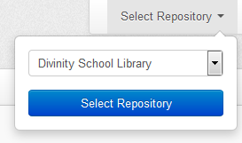

Access the online help center.

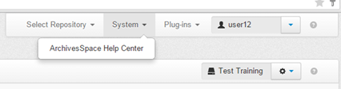

And, view or set your preferences or log out.

> 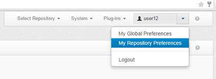 style="width:5.34896in;height:1.97267in" />

2\. User Permissions, Preferences Management, Reports, Imports, and
Plugins:

> 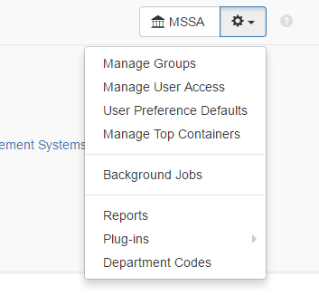 style="width:3.67708in;height:3.39583in" />

3\. Creating, Editing, Deleting Records (see **Create** drop-down menu):

> 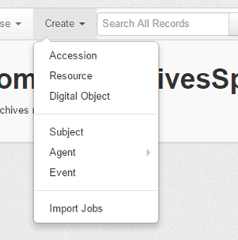 style="width:2.70313in;height:2.72109in" />
>
> Accession, Resource, and Digital Object records are known collectively
> as archival objects or material description records. Resource and
> Digital Object records both allow for multi-level description or the
> presence of component records.
>
> The other records—Subject, Agent, Location, and Event—are for
> amplifying the description record, indicating the whereabouts of
> described material(s), and recording actions done to the described
> materials.
>
> All of the record types for the **Create** option can be created
> independently of any other record and subsequently linked to other
> records. For example, subject and agent records can be created in
> advance of their linking to material description records.
>
> To import legacy data (EAD, MARC, accession CSV file), use the Import
> Jobs link at the bottom of the **Create** drop-down menu.
>
> 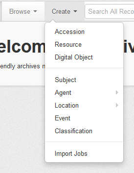 style="width:2.62308in;height:3.36979in" />
>
> Each function outlined in the **Create** drop-down is also available
> to be viewed in the **Browse** menu. Note that Collection Management
> records only appear as an option on the **Browse** record option and
> not on the **Create** record option. That is because a Collection
> Management record is assumed to be about certain material and, thus,
> can only be created in the context of a material description record
> for the material (i.e. an Accession, Resource, or Digital Object
> record).

4\. Keyword search (labelled Search All Records) and Advanced Search
drop-down (click the down arrow next to Search All Records to see
Advanced Search):

> Both options permit searching every type of record in the
> ArchivesSpace application. With Advanced Search, four types of search
> fields (Text, Date, Boolean, and Controlled Value) can be linked
> together (click green button to add a search row). Each type of
> advanced search can be scoped to various fields.

1.  Text

    - Keyword (searches all text fields)

    - Linked Agent

    - Bibliographic Citation

    - Call Number

    - Condition Description

    - Container Summary

    - Content Description

    - Record Created By

    - Creator

    - Department

    - Extent Number

    - Fiscal Year

    - General Note

    - Identifier

    - Inventory

    - Invoice Number

    - Record Last Modified By

    - Monographic Series

    - Notes

    - Invoice Number

    - Payment Authorizer

    - Physical Details

    - Place of Publication

    - Plating Information

    - Processors

    - Provenance

    - Linked Subject

    - Title

    - Title Main Entry

2.  Date

    - Accession Date

    - Accession Completed Date

    - Begin

    - Record Created

    - End

    - Event Begin

    - Payment Date

    - Record Updated

    - Event End

3.  Boolean

    - Access Restrictions?

    - Authorization Received?

    - External Documents?

    - Material Type - Audiovisual Materials?

    - Material Type - Books?

    - Material Type - Computer Files?

    - Material Type - Games?

    - Material Type - Manuscripts?

    - Material Type - Maps?

    - Material Type - Microforms?

    - Material Type - Photographs?

    - Material Type - Realia?

    - Material Type - Serials?

    - Material Type - Works of Art?

    - Published? (This refers to whether a record -- be it a resource
      record, an archival object, a digital object, or an accession --
      is marked as publish or internal-only. This indication affects the
      ArchivesSpace Public User Interface, as well as the EAD
      serialization, since it indicates that the record’s audience =
      internal only)

    - Record Reviewed

    - Restrictions Apply?

    - Rights Statements?

    - Suppressed? (This searches whether a record is suppressed from EAD
      or MARC export).

    - Use Restrictions?

4.  Controlled Value

    - Acquisition Type

    - BRBL Owner

    - Event Outcome

    - Event Type

    - Extent Type

    - Fund Code

    - Priority

    - Processing Status

    - Role

> These advanced search fields can be used in any combination together,
> but the search must be connected with Boolean operators. AND, OR, and
> NOT are available, with AND being the default option for linking the
> search fields together. Example:

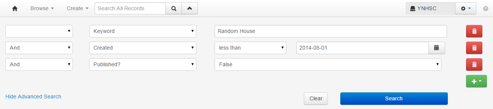

###  Record Template

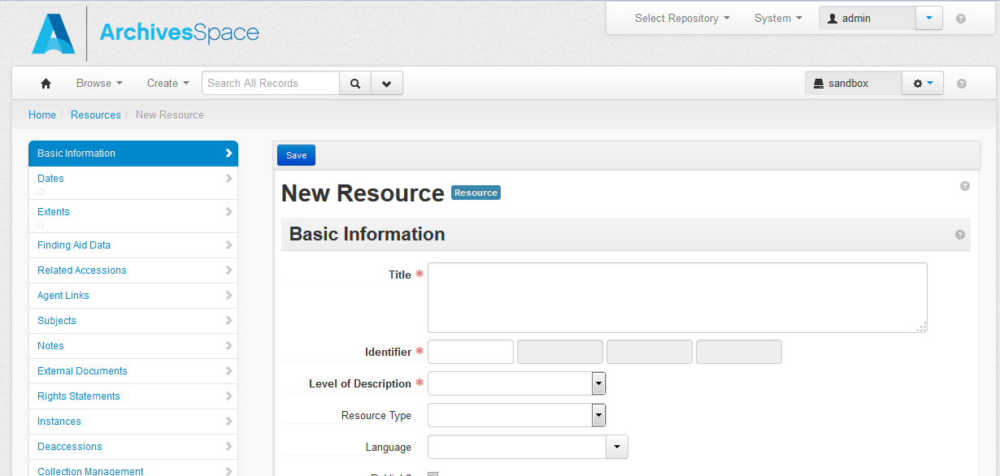

**Navigation panel**

When creating a new record via the **Create** drop-down menu, the
navigation panel on the left side of the ArchivesSpace staff interface
provides a snapshot of the major high-level sections of an ArchivesSpace
record.

Clicking on any section of the navigation panel takes the staff user
directly to the ArchivesSpace data fields associated with that section,
highlighting the selected section, as shown in the illustration below of
the data fields associated with the Collections Management section of an
ArchivesSpace Resource record. An ArchivesSpace record is a linear
document, and, while scrolling through a record, the highlighted section
of the navigation panel will change to keep the staff user oriented to
the current position within the record.

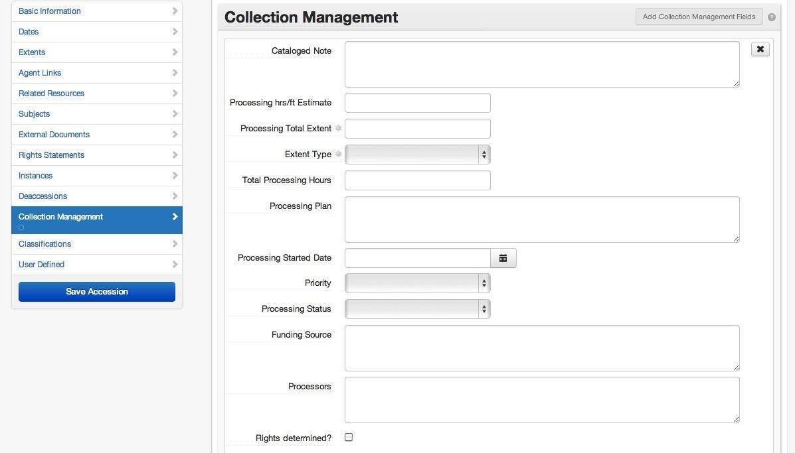

**Rollover texts**

Rollover texts are associated with almost all of the labels in the
ArchivesSpace records; hover your mouse over a particular heading or
label to see the rollover text (also known as a tool tip). Typically,
the rollover consists of a definition of the element, a reference to the
appropriate rule in DACS or to elements in export data formats, such as
MARC, and examples of good practice.

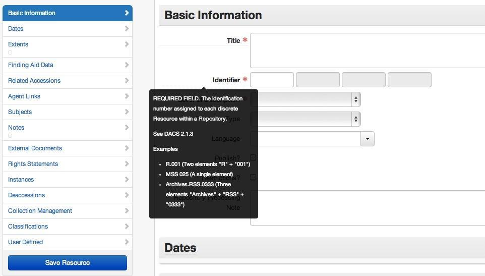

**Records and sub-records**

ArchivesSpace uses the terminology “records” to describe parts of the
application where the staff user can record various archival
functions.The following definitions should help you to better understand
the ArchivesSpace record types and how they relate to one another.

- **Repository record**

> Provides information about the repository having custody of the
> resources being described. The Yale ArchivesSpace installation is used
> by a number of different repositories, each with its own Repository
> record. A Repository record describes the basic characteristics of the
> physical repository.

- **User record**

> Allows individual staff users to have ArchivesSpace accounts with
> varying levels of permission to access and make changes in parts of
> the database.

- **Accession record**

> Records information documenting the accession transaction and can
> include information about physical, intellectual, and legal control
> over acquisitions to the repository.

- **Resource record**

> Describes a unit of materials, from an item to a manuscript collection
> or record group, managed according to archival principles. Resource
> records can be single or multi-level records as defined in ISAD(G) and
> DACS. Descriptions of materials in Resource records can be linked to
> information about physical manifestations (containers) or digital
> manifestations (Digital Objects).

- **Digital Object record**

> The Digital Object record is the place for technical and
> administrative metadata about digital objects. The Digital Object
> record can either be single- or multi-level; that is, it can have
> sub-components just like a Resource record. Moreover, the record can
> represent the structural relationship between the metadata and
> associated digital files--whether as simple relationships (e.g., a
> metadata record associated with a scanned image, and its derivatives)
> or complex relationships (e.g., a metadata record for a multi-paged
> item; and additionally, a metadata record for each scanned page, and
> its derivatives). One or more file versions can be referenced from the
> Digital Object metadata record.[1] The Digital Object record can be
> created from within a Resource record, or created independently and
> then either linked or not to a Resource record.

- **Subject record**

> Describes the principal themes or topical contents of the records
> being described, as well as format and genre characteristics or
> occupations, that are important as access points. Subject records can
> be simple or compound hierarchical records, and can be applied at any
> level of description for Accessions, Resources, and Digital Objects.
> The content of these records should be carefully controlled by
> existing subject vocabularies.

- **Agent record**  
  Describes persons, families, or corporate entities that have a
  specified relationship to the records being described, such as
  creator, source (i.e., donor), subject, rights owner, or to an Event.
  The Agent record is also used for managing relationships among agents.

- **Classification record**

> Used to create or edit a hierarchy of record groups, subgroups or
> fonds, at as few or as many levels as required by a repository.
> Classifications define a repository’s overall arrangement scheme.
> ArchivesSpace displays a classification in a tree structure containing
> a hierarchy of categories and subcategories. A tree is formed from a
> root term (shown in the system by the classification name) and the
> branches (subgroups) of the tree are the classification terms. Each
> classification term can itself contain zero or more classification
> terms. The classification tree is formed of classification terms with
> a classification name at the root (shown at the top of the structure).

- **Location record**

> Describes any storage locations--shelves, drawers, file cabinets,
> bins, walls, etc.--where a repository stores archival materials.
> Location records are designed to track both temporary locations and
> permanent storage locations. Location records are intended to
> represent physical shelving spaces and not web-accessible file
> locations. The latter can be represented using URIs recorded as part
> of Digital Object records.  
> Location records must be created in accordance with the Yale schema so
> that other systems (Aeon, Voyager) can read the data predictably and
> reliably and send materials to the proper place.

- **Event record**

> Describes an action involving a selected object in the archival
> repository (at any level in a multi-level hierarchy) and an agent.
> Events represent a specific action that one or more agents undertook
> in relation to one or more archival objects at a specific date and
> time or a range of dates and times. Events can be used, for example,
> to document actions that alter archival records, create new
> relationships between archival records, or record validity and
> integrity checks for born-digital records.

Each ArchivesSpace record has available to it several sub-record types.
A sub-record is a linked record that can only be created and edited
through the primary record. Some sub-records are required in some
contexts, based on required elements dictated by our content standard.
All sub-records have their own requirements. Sub-records in
ArchivesSpace include:

- **Dates sub-record  
  **For recording types of dates about the material or entity being
  described, e.g., date of creation, of broadcast, or publication.
  Occurs in Accessions, Resource, Resource component, Digital Object,
  Digital Object component, and Deaccession records.

- **Extents sub-record  
  **For recording the extent for the whole or part(s) of the described
  material. Occurs in Accessions, Resource, Resource component, Digital
  Object, Digital Object component, and Deaccession records.

- **Notes sub-record  
  **For recording notes providing more detailed description of processed
  archival materials. Occurs in Resource, Resource component, Digital
  Object, and Digital Object component records.

- **Rights sub-record  
  **For indicating the rights status of the material being described.
  Occurs in Accession, Resource, Resource component, Digital Object, and
  Digital Object component records.

- **Deaccessions sub-record  
  **For indicating materials that have been removed from an accession or
  from a processed collection. Occurs in Accession and Resource records.

- **Collection Management sub-record  
  **For recording information about the work on the materials being
  described. Occurs in Accession, Resource, and Digital Object records.
  Further guidance about the use of collection management records will
  be determined after initial ArchivesSpace migration.

### Data entry considerations within the staff interface

**When multiple users edit a record at the same time**

ArchivesSpace is a networked application in which more than one user can
access and view the same record at the same time. A situation may occur
where two people attempt to save the same record at the same time.

ArchivesSpace resolves this potential conflict with the “first to save
wins” method. What this means is that if two people open the same
record, both edit it independently then both save it, the first person
to save will be successful, the second person to save will receive an
error message indicating the local copy of the record is now outdated
and they must reload the record and re-enter any unsaved changes.

Remember to save frequently when editing records that others may want to
edit as well.

**Required data fields**

ArchivesSpace marks required fields with a red asterisk and bold type.

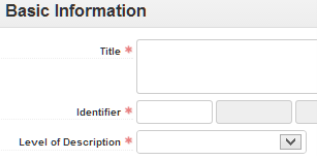

If a sub-form or field is conditionally required, this is noted in a
text box when you hover over the field. Conditionally required fields
are marked with a gray asterisk.

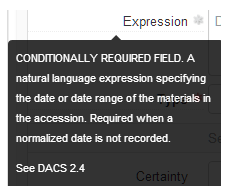

**EAD tagging within data fields**

There are circumstances in which you will want to provide more granular
encoding than ArchivesSpace creates fields for in its forms. To
accommodate this, within Notes sub-records and several other fields in
the resource record, ArchivesSpace provides an auto-complete function
for EAD tags. You can either directly include EAD markup within the data
field -- or type "\<" to invoke the auto-complete function.

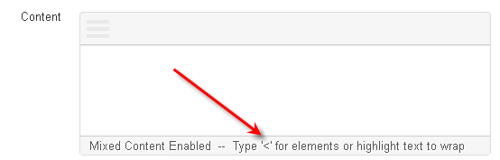

> 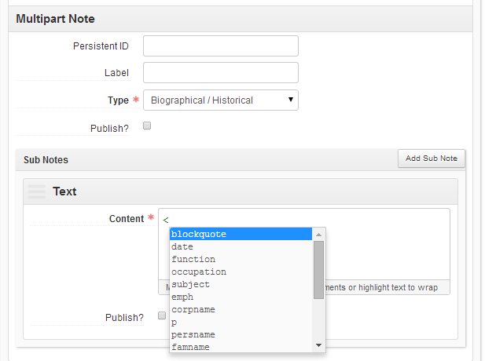 style="width:5.30933in;height:3.95833in" />

Be careful when adding EAD tags, since mistakes can invalidate the
resulting document in EAD export.

Even though the auto-complete function doesn't appear on data fields
external to Notes sub-records, you can still enter EAD tags into other
fields. Notice, however, that the underlying data will have a specific
mapping to an EAD tag -- and the particular tag may only allow for
certain nested EAD tags. The [**<u>ArchivesSpace
website</u>**](http://archivesspace.org/application/data-import-and-export-maps/)
(ArchivesSpace Application \> Technical Documentation \> EAD Import /
Export Map) provides a summary of export mappings from Resource record
data fields into EAD.

**Special characters within data fields**

Special characters, or text from any international writing system, can
be inputted directly as UTF-8 Unicode using typical Mac or Windows
keyboard commands in your browser.

**Punctuation within data fields**

ArchivesSpace does not supply any end punctuation after text entered
within data fields. If you want to see punctuation appear, you must
include it inside of data fields. Consult with your repository’s style
guide for guidance about using punctuation.

**Expanding data fields**

Some data fields can be expanded to allow for entering multiple lines of
text -- or long narrative statements. Select and drag the bottom right
corner of the data field to expand it.

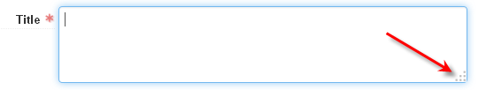

**Supported Browsers**

When using ArchivesSpace, you must use Internet Explorer version 11+,
Firefox 8+, Chrome, or Safari 5+.

## Repository Records

### Functional overview

A Repository record is created during the initial setup of
ArchivesSpace. After set up, this record can be edited and additional
Repository records can be created through the **Manage Repositories**
function of the **Systems** drop-down menu. The Repository record serves
two basic purposes: to store information for later output and to
demarcate the data of one repository from that of another repository.

The Repository record stores data such as the repository’s contact
information and identifying codes for later output to access instruments
such as EAD-encoded finding aids. Recording and storing this information
in one place – at the repository level of description – alleviates the
need for repetitive data entry at the resource level and makes revision
of all ArchivesSpace exports easier.

The second purpose of the Repository record is to distinguish one
repository’s Accession records, Resource records, and data rules from
those of another repository using the same multi-repository
implementation of ArchivesSpace.

NOTE: To perform any tasks related to managing Repository records, you
need to be signed in with a *System Administrator* account.

### Creating and managing Repository records

Repository information was migrated from Archivists’ Toolkit. You may
wish to review this information to double-check its accuracy.

When creating a Repository record, only two data fields are required:

- **Repository Name:** The full name of the repository that has
  responsibility for the records being described.

- **Repository Short Name:** An abbreviation or acronym of the
  repository name. This is the name shown in most places in the
  ArchivesSpace interface. You should choose a short name that will
  allow users to easily differentiate between repositories on your
  system if you have multiple repositories.

**Enhancing a Repository record**

1.  Enter detailed additional information about your repository,
    including **Organization/Agency Code**, **Country**, **Home Page
    URL**, **Branding Image URL** (for a repository logo that should
    appear on your finding aids), and information concerning **Contact
    Details** (address, phone, etc.).

2.  After editing, save your additional information by clicking **Save
    Repository**.

## User Records and User Management

### Functional overview

A user record is created for each user of ArchivesSpace and permissions
are managed by Repository Managers and by the Yale Archival Management
Systems Committee. New user records are created when a user registers a
new account after which the user record can be edited to assign
permissions within a specific repository or repositories. User records
should not be deleted at any time, and user records for staff members no
longer at Yale are not deleted from the system.

The User record serves several purposes: it stores data about the user,
including name, department, and contact information; it stores data
about what the user can do in the database; and it allows the system to
store data about what actions the user performed in the system. To
perform any actions in the ArchivesSpace staff interface, you need to be
signed in as a user.

User accounts are managed by the Yale Archival Management Systems
Committee and are governed by the [<u>Yale ArchivesSpace User Management
Policy</u>](https://docs.google.com/document/d/1sSM_Cnk9u0_gcdFADZ7BobvAN9kIjlcj9jBgWLZP8w4/edit?usp=sharing)
section, below

### Yale ArchivesSpace User Management Policy

*5/2015; revised 12/2018; revised 6/2020*

This policy governs:

- The creation, management, and deactivation of user accounts within
  ArchivesSpace

- The granting and revocation of privileges associated with each user
  account

- The authentication by which the user establishes a connection to their
  account

#### Rationale

This approach to user groups gives the greatest possible flexibility to
workers in repositories to assign and remove privileges as staff
responsibilities change while still protecting the data in other
repositories. These permissions atomize common work functions (creation,
read access, update access, and delete) by record type (accessions,
resources, containers, and records shared across repositories) and make
clear which functions affect only the user’s repository and which affect
all repositories.

#### Scope

This policy applies to all ArchivesSpace accounts at Yale University.
This document includes statements on access control, privileges,
authentication/password management, and the information required to
request a user account.

#### Access Control

- Access to ArchivesSpace will be primarily limited to users with Yale
  > NetIDs who require access to the system for their work. Users
  > external to Yale (e.g., consultants) may be granted access to the
  > system on a case-by-case basis.

- Access is managed separately for all three instances of ArchivesSpace
  > at Yale: development (DEV), production (PROD), and test (TEST).
  > Access to the TEST and DEV environments is managed on an as-needed
  > basis.

- Certain software systems which are integrated with ArchivesSpace (i.e.
  > Preservica, EAD export service) utilize user accounts to perform GET
  > and POST requests against the ArchivesSpace API. These accounts are
  > identified by the name of the service (i.e. preservicaprod,
  > ead_export_service).

- The YAMS co-chairs have system administrator permissions. Additional
  > system administrator permissions may be granted on a case-by-case
  > basis.

- The person enacting any change to a user account must be different
  > from the person requesting the change.

- Accounts should never be deleted from the ArchivesSpace database;
  > instead, when a user no longer requires access to the ArchivesSpace
  > database, their account will be deactivated by removing any
  > repository roles associated with that account.

- Repository managers are responsible for either deactivating user
  > accounts themselves or alerting YAMS when staff or student workers
  > are no longer active.

- Accounts will be reviewed annually by YAMS for inactive NetIDs to
  > determine if any need to be deactivated.

- Accounts may be re-activated -- but only after a request has been
  > issued and approved by following the same procedures required for
  > requesting a new account.

#### Authentication/Password Management

For authentication to the Staff Interface, ArchivesSpace will use CAS
for staff logins, thereby allowing most users to manage passwords
externally.

For authentication to the API, users will have to use a local password.
These can be set by the system administrator and will have to be reset
by the same.

A system administrator account exists but is not used. That account’s
password may be reset by a sysadmin if the account must be used.

Aside from administrative and API passwords, no other passwords should
be assigned within the ArchivesSpace application.

#### Guidance for Users

Getting access to ArchivesSpace requires following the User Account
Creation steps as outlined in the YAMS LibGuide: [<u>Yale Archival
Management Systems Committee: User Account
Creation</u>](https://guides.library.yale.edu/c.php?g=296249&p=4694567)

In order for the user to be assigned roles within the system, she must
follow the above guidelines to create her account. These steps are
necessary in order for the username (the user’s NetID) to be present in
the system and for her repository manager to assign her roles.

The second step is for the repository manager to give that user access
to whichever user groups the repository manager deems appropriate. All
groups are additive and access must be explicitly granted to each group.

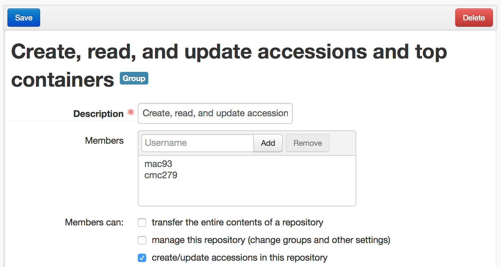

For instance, if you want a user to be able to create accessions AND
resources, you must add that user to both the “Create, read, and update
accessions and top containers” group and the “Create, read and update
resources and top containers” group. A user can be assigned to a group
by entering her NetID in the “Members” field of a group. This step must
be repeated for each group that a user will be assigned to.

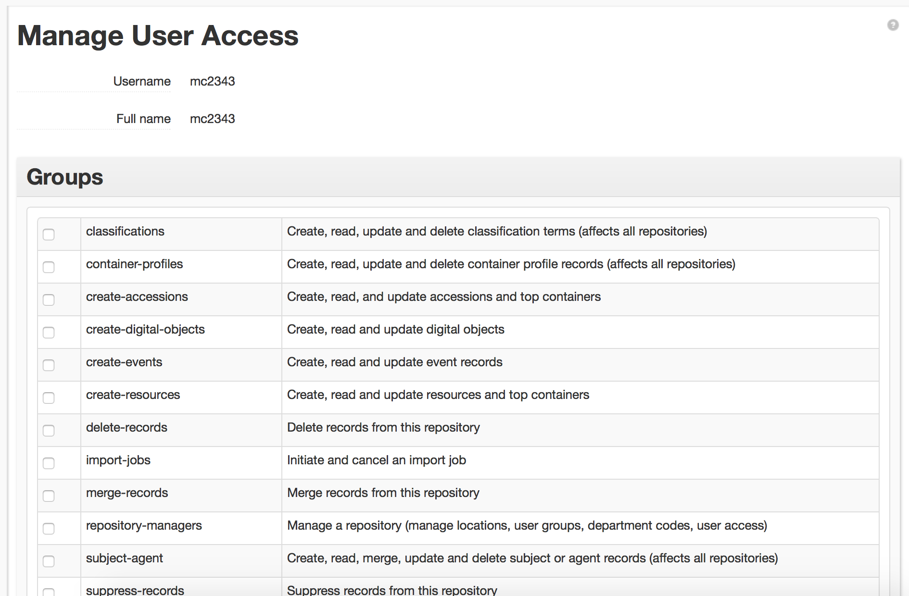

Multiple user groups may also be assigned to a user by selecting their
username under Manage Users, then selecting Edit Groups. User groups can
be added or removed by checking and unchecking the check boxes next to
each user group. See the [<u>User Groups at
Yale</u>](##user-groups-at-yale) section of this document for definitions
and permissions associated with each group.

#### Guidance for Assigning Permissions

#### Repository managers internal to the repository

Repository managers generally have the following permissions within
their repository:

- Assessments -- Create, read, update and delete assessment records

- Create-accessions -- Create, read, and update accessions and top
  containers

- Create-digital-object -- Create, read and update digital objects

- Create-events -- Create, read and update event records

- Create-resources -- Create, read and update resources and top
  containers

- Delete-records -- Delete records from this repository

- Import-jobs -- Initiate and cancel an import job

- Manage-top-containers -- Delete or bulk update top containers in this
  repository

- Merge-records -- Merge records from this repository

- Repository-managers -- Manage a repository (manage locations, user
  groups, department codes, user access)

- Subject-agent -- Create, read, merge, update and delete subject or
  agent records (affects all repositories)

- Suppress-records -- Suppress records from this repository

- Transfer-distinct-records -- Transfer distinct records across a
  repository

- View-records -- View (non-suppressed) records in this repository

- View-suppressed-records -- View suppressed records in this repository

- Vocabulary-classification -- Create, read, update and delete
  vocabulary or classification terms (affects all repositories)

#### Archivist staff members internal to the repository

Archivist staff members generally have the following permissions within
their repository:

- Assessments -- Create, read, update and delete assessment records

- Create-accessions -- Create, read, and update accessions and top
  containers

- Create-digital-objects -- Create, read and update digital objects

- Create-events -- Create, read and update event records

- Create-resources -- Create, read and update resources and top
  containers

- Delete-records -- Delete records from this repository

- Import-jobs -- Initiate and cancel an import job

- Manage-top-containers -- Delete or bulk update top containers in this
  repository

- Merge-records -- Merge records from this repository

- Subject-agent -- Create, read, merge, update and delete subject or
  agent records (affects all repositories)

- View-records -- View (non-suppressed) records in this repository

- View-suppressed-records -- View suppressed records in this repository

- Vocabulary-classification -- Create, read, update and delete
  vocabulary or classification terms (affects all repositories)

#### Technical services support staff members internal to the repository

Technical services support staff members generally have the following
permissions within their repository:

- Assessments -- Create, read, update and delete assessment records

- Create-accessions -- Create, read, and update accessions and top
  containers

- Create-digital-objects -- Create, read and update digital objects

- Create-events -- Create, read and update event records

- Create-resources -- Create, read and update resources and top
  containers

- Delete-records -- Delete records from this repository

- Import-jobs -- Initiate and cancel an import job

- Manage-top-containers -- Delete or bulk update top containers in this
  repository

- Merge-records -- Merge records from this repository

- Subject-agent -- Create, read, merge, update and delete subject or
  agent records (affects all repositories)

- View-records -- View (non-suppressed) records in this repository

- Vocabulary-classification -- Create, read, update and delete
  vocabulary or classification terms (affects all repositories)

#### Staff members internal to the repository without regular data entry responsibilities

Non-technical services staff members generally have the following
permissions within their repository:

- View-records -- View (non-suppressed) records in this repository

The following additional permissions may also be added in some
instances, if the staff member requires these permissions for their work
and has received proper training:

- Create-accessions -- Create, read, and update accessions and top
  containers

- Create-digital-objects -- Create, read and update digital objects

- Create-events -- Create, read and update event records

- Create-resources -- Create, read and update resources and top
  containers

#### Student staff members in the repository

Student staff members generally have the following permissions within
their repository:

- Create-events -- Create, read and update event records

- Create-resources -- Create, read and update resources and top
  containers

- Manage-top-containers -- Delete or bulk update top containers in this
  repository

- View-records -- View (non-suppressed) records in this repository

#### Staff members external to the repository

In some cases, staff members at Yale have repository permissions for
repositories outside of their home repository. For example, as noted
above, the YAMS co-chairs have system administrator permissions. In some
cases, staff members in one repository or department require permissions
in another repository. Such permissions are granted by the repository
managers on a case-by-case basis and are documented by YAMS in a
spreadsheet of who has which exceptional permissions and why. YAMS
periodically audits that list against the Account Manager.

### User Groups at Yale

User groups at Yale are comprised of a set of functions that a user can
perform. These functions are hard-coded into the application and not
changeable. This means that although we have a great deal of flexibility
in assigning permissions as sets of these hard-coded functions, there
are some options that are simply not available. For instance, the “view
records” function gives a user permission to view all non-suppressed
records in a repository. At this time, there is no option to only let
users see a single record type (e.g., only accessions or only
resources).

Yale User Permission Groups include the following:

#### Create, read, update and delete assessment records\*

**assessments**

X create/update assessment records

X delete assessment records

*\*BRBL only as of 6/2020*

###
#### Manage a repository (manage locations, user groups, department codes, user access)

**repository-managers**

X manage this repository (change groups and other settings)

X create and run a background job

X cancel a background job

#### Transfer the entire contents of a repository

**transfer-contents**

X transfer the entire contents of a repository

#### Transfer distinct records across a repository

**transfer-distinct-records**

X transfer major record types between repositories

#### Create, read, and update accessions and top containers

**create-accessions**

X create/update accessions in this repository

X view the records in this repository

X create/update top container records

#### Create, read and update resources and top containers

**create-resources**

X create/update resources in this repository

X view the records in this repository

X create/update top container records

X delete/bulk update top container records \*BRBL

X manage RDE templates

#### Create, read and update digital objects

**create-digital-objects**

X create/update digital objects in this repository

X view the records in this repository

#### Create, read and update event records

**create-events**

X create/update event records in this repository

X view the records in this repository

#### Create, read, update and delete container profile records (affects all repositories)

**container-profiles**

X create/update/delete container profile records

#### Suppress records from this repository

**suppress-records**

X suppress the major record types in this repository

X view suppressed records in this repository

#### Delete records from this repository

**delete-records**

X delete event records in this repository

X delete the major record types in this repository

X delete/bulk update top container records

#### Delete or bulk update top containers in this repository

**manage-top-containers**

X delete/bulk update top container records

#### Merge records from this repository

**merge-records**

X merge the major record types in this repository

#### View suppressed records in this repository

**view-suppressed-records**

X view suppressed records in this repository

#### View (non-suppressed) records in this repository

**view-records**

X view the records in this repository

#### Initiate and cancel an import job

**import-jobs**

X create/update resources in this repository *\*BRBL only*

X view the records in this repository *\*BRBL only*

X initiate import jobs

X cancel an import job

X merge the major records types in this repository *\*BRBL only*

X create and run a background job

X cancel a background job

#### Create, merge, update and delete subject or agent records (affects all repositories)

**subject-agent**

X create/update/delete subject records

X create/update/delete agent records

X merge agent/subject records

#### Create, update and delete vocabulary or classification terms (affects all repositories)

**vocabulary-classification**

X create/update classifications and classification terms

X delete classifications and classification terms

X create/update/delete vocabulary records

Examples of custom Yale User Permission groups include:

#### Printed Acquisitions\*

**Printed-Acq**

X create/update accessions in this repository

X create/update event records in this repository

X view the records in this repository

X initiate import jobs

X cancel an import job

\**BRBL only*

#### Student workers\*

**MusicLibraryStudentStaff**

X create/update resources in this repository

X view the records in this repository

X create and update top container records

\**Music only*

#### Delete/Cancel/Transfer permissions not explicitly specified in other groups\*

**higher_level_permissions**

X transfer the entire contents of a repository

X delete event records in this repository

X transfer major record types between repositories

X view suppressed records in this repository

X create/update classifications and classification terms

X delete classifications and classification terms

X cancel an import job

X merge the major record types in this repository

\**Fortunoff_Testimonies only*

### User Permission Groups provided in ArchivesSpace by Default

#### System Administrator

Has all read/write and functional permissions for all repositories
sharing the ArchivesSpace installation.

#### Advanced Data Entry users of the \[Repo name\] repository\*

**repository-advanced-data-entry**

X create/update accessions in this repository

X create/update resources in this repository

X create/update digital objects in this repository

X create/update event records in this repository

X view the records in this repository

X initiate import jobs

X create/update/delete subject records

X create/update/delete agent records

X create/update/delete vocabulary records

X create/update top container records

X delete/bulk update top container records

X create/update/delete container profile records

X create/update/delete location profile records

X create and run a background job

#### Archivists of the \[Repo name\] repository\*

**repository-archivists**

X create/update accessions in this repository

X create/update resources in this repository

X create/update digital objects in this repository

X create/update event records in this repository

X view the records in this repository

X initiate import jobs

X create/update/delete subject records

X create/update/delete agent records

X create/update/delete vocabulary records

X create/update top container records

X delete/bulk update top container records

X create/update/delete container profile records

X create/update/delete location profile records

X create and run a background job

#### Basic data entry users of the \[Repo name\] repository\*

**repository-basic-data-entry**

X create/update accessions in this repository

X create/update resources in this repository

X create/update digital objects in this repository

X view the records in this repository

X create and run a background job

#### Managers of the \[Repo name\] repository\*

**repository-managers**

X manage this repository

X create/update accessions in this repository

X create/update resources in this repository

X create/update digital objects in this repository

X create/update event records in this repository

X suppress the major record types in this repository

X delete the major record types in this repository

X view the records in this repository

X initiate import jobs

X create/update/delete subject records

X create/update/delete agent records

X create/update/delete vocabulary records

X create/update top container records

X delete/bulk update top container records

X create/update/delete container profile records

X manage RDE templates

X create/update/delete location profile records

X create and run a background job

X cancel a background job

#### Project managers of the \[Repo name\] repository\*

**repository-project-managers**

X create/update accessions in this repository

X create/update resources in this repository

X create/update digital objects in this repository

X create/update event records in this repository

X suppress the major record types in this repository

X delete the major record types in this repository

X view the records in this repository

X initiate import jobs

X create/update/delete subject records

X create/update/delete agent records

X create/update/delete vocabulary records

X merge agent/subject records

X create/update top container records

X delete/bulk update top container records

X create/update/delete container profile records

X create/update/delete location profile records

X create and run a background job

X cancel a background job

#### Viewers of the \[Repo name\] repository\*

**repository-viewers**

X view the records in this repository

### Creating and managing User records

Only three elements are required to create a user record, one of which
must be confirmed by re-entering its value.

- **Username:** The login name the user will use to access an
  ArchivesSpace repository.

- **Full name:** The full given and surname of the user.

- **Password/Confirm Password:** The password the user will use, along
  with her or his username, to access the API

New user records are created via the user account creation process
described on the Yale Archival Management Systems Committee LibGuide:
[<u>https://guides.library.yale.edu/c.php?g=296249&p=4694567</u>](https://guides.library.yale.edu/c.php?g=296249&p=4694567)

After user records are created, repository managers should immediately
edit the corresponding agent record to include the following in the
agent’s bioghist note: Yale NetID; department; title; and dates of
service (e.g. Archivist, Beinecke Library (2010-2017); NetID: abc123).

**Editing a User record**

1.  Select **Manage User Access** on the **Gear** option on the top
    toolbar.

2.  Click on the **Edit** option for the User record to be edited.

3.  Update the record as needed.

4.  Click on **Update Account** to save the updated User record.

**Deleting a User record**

As per the Yale ArchivesSpace User Management Policy, User records are
not deleted.

## Location Records

### Functional overview

Location records describe any storage locations—shelves, drawers, file
cabinets, bins, walls, etc.—where archival materials are stored.
Location records are designed to track both the permanent and temporary
locations of materials.

Location records are intended for physical shelving spaces and not for
web-accessible file locations. Locations for materials on the web are
managed via URIs recorded as part of Digital Object records.

Location records use a coordinate system to represent a repository’s
storage space. For example, a coordinate may be a range, shelf, or flat
file storage number. Up to three of these coordinates can be recorded.
If storage units have not yet been assigned some sort of unique
identifier, they will need to be named in some manner in order to create
Location records in ArchivesSpace. Location records can be entered and
edited at any time, but it may be most effective to create them all at
once for an entire repository and link to them as needed.

Coordinates have labels and indicators. A label may be “Shelf”,
“Cabinet”, etc., and an indicator would be “1”, “2e7”, etc. It is
important to not have labels and indicators in the same field.

### Yale Locations Guidelines

<table>
<colgroup>
<col style="width: 25%" />
<col style="width: 25%" />
<col style="width: 25%" />
<col style="width: 25%" />
</colgroup>
<tbody>
<tr class="odd">
<td>AS Location</td>
<td>Use for</td>
<td>Example(s)</td>
<td>Notes</td>
</tr>
<tr class="even">
<td>Building</td>
<td>Unique nickname for the Building</td>
<td><ul>
<li>
SML
</li>
<li>
LSF
</li>
<li>
BRBL1
</li>
</ul></td>
<td></td>
</tr>
<tr class="odd">
<td>Floor</td>
<td>DO NOT USE if an official room number is available</td>
<td></td>
<td>
Using official room numbers; should negate need for Floor.

Only use for non-LSF locations
</td>
</tr>
<tr class="even">
<td>Room</td>
<td>Use for non-LSF room indicator as per official building map</td>
<td><ul>
<li>
B51-A
</li>
</ul></td>
<td>Only use for non-LSF locations</td>
</tr>
<tr class="odd">
<td>Area</td>
<td>DO NOT USE</td>
<td></td>
<td></td>
</tr>
<tr class="even">
<td>Barcode</td>
<td></td>
<td></td>
<td>Only use for non-LSF locations</td>
</tr>
<tr class="odd">
<td>Classification</td>
<td>DO NOT USE</td>
<td></td>
<td></td>
</tr>
<tr class="even">
<td>Coordinate Label 1</td>
<td>Primary location coordinate</td>
<td><ul>
<li>
Shelving Range
</li>
<li>
Microfilm cabinet
</li>
<li>
Flat storage cabinet
</li>
<li>
LSF
</li>
</ul></td>
<td>For the LSF location only; the building name is also the Coordinate
1 Label (this is because a building name and Coordinate 1 Label or
Indicator are required for a valid Location record.)</td>
</tr>
<tr class="odd">
<td>Coordinate Indicator 1</td>
<td></td>
<td></td>
<td>Only use for non-LSF locations</td>
</tr>
<tr class="even">
<td>Coordinate Label 2</td>
<td>Use for secondary location coordinate</td>
<td><ul>
<li>
Shelving Sections
</li>
<li>
Cabinet Drawers
</li>
</ul></td>
<td>Only use for non-LSF locations</td>
</tr>
<tr class="odd">
<td>Coordinate Indicator 2</td>
<td></td>
<td></td>
<td>Only use for non-LSF locations</td>
</tr>
<tr class="even">
<td>Coordinate Label 3</td>
<td>Use for tertiary location coordinate</td>
<td><ul>
<li>
Shelf
</li>
</ul></td>
<td>Only use for non-LSF locations</td>
</tr>
<tr class="odd">
<td>
Coordinate

Indicator 3
</td>
<td></td>
<td></td>
<td>Only use for non-LSF locations</td>
</tr>
</tbody>
</table>

Example of an MSSA locations

<table>
<colgroup>
<col style="width: 8%" />
<col style="width: 8%" />
<col style="width: 8%" />
<col style="width: 8%" />
<col style="width: 8%" />
<col style="width: 8%" />
<col style="width: 8%" />
<col style="width: 8%" />
<col style="width: 8%" />
<col style="width: 8%" />
<col style="width: 8%" />
<col style="width: 8%" />
</colgroup>
<tbody>
<tr class="odd">
<td>Building</td>
<td>Floor</td>
<td>Room</td>
<td>Area</td>
<td>Barcode</td>
<td>Classification</td>
<td>Coordinate Label 1</td>
<td>Coordinate Indicator 1</td>
<td>Coordinate Labe 2l</td>
<td>Coordinate Indicator 2</td>
<td>Coordinate Label 3</td>
<td>
Coordinate

Indicator 3
</td>
</tr>
<tr class="even">
<td>SML</td>
<td></td>
<td>B51-A</td>
<td></td>
<td></td>
<td></td>
<td>Range</td>
<td>1</td>
<td>Section</td>
<td>A</td>
<td>Shelf</td>
<td>3</td>
</tr>
<tr class="odd">
<td>LSF</td>
<td></td>
<td></td>
<td></td>
<td></td>
<td></td>
<td>LSF</td>
<td></td>
<td></td>
<td></td>
<td></td>
<td></td>
</tr>
<tr class="even">
<td>SML</td>
<td></td>
<td>B54</td>
<td></td>
<td></td>
<td></td>
<td>Cabinet</td>
<td>A</td>
<td>Drawer</td>
<td>1</td>
<td></td>
<td></td>
</tr>
</tbody>
</table>

(NOTE: All location coordinate identifiers are UPPERCASE.)

### Creating and managing Location records

Location records can be created one at a time before or at the time of
accession or resource description. As a time-saving device, Location
records can also be created in batches in advance of linking them to
collection materials or as new storage units are established. Those
Location records can then be assigned to accessions and resources as
needed. Be aware, however, that locations cannot be deleted in batches.

**Creating single Location records**

1.  On the main toolbar, click **Create**, select **Location** and then
    select Single Location.

2.  Record a value for **Building Name**. This is a required field.

3.  Enter either **Coordinate Label 1** and **Coordinate Indicator 1**
    or a value for **Barcode**. This is the minimum amount of data
    required for a single Location record.  
    (Do not use **Classification Number**.)

4.  Save the Location record by pressing the **Save Location** command
    button at the bottom of the record. If entering more than one single
    Location record, click on the **+1** button. This will save the
    current record and open a new Location record template.

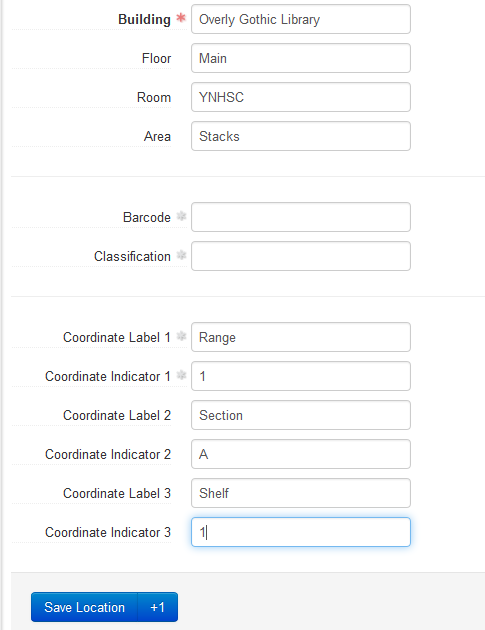

**Creating multiple Location records**

1.  On the main toolbar, click **Create**, select **Location**, and then
    select Create Batch Locations.

2.  In the **Base Location** section, record a value for **Building
    Name**. This is a required field. You can also enter data in other
    fields in the **Base Location** section if you wish, but do not
    enter coordinate information here.

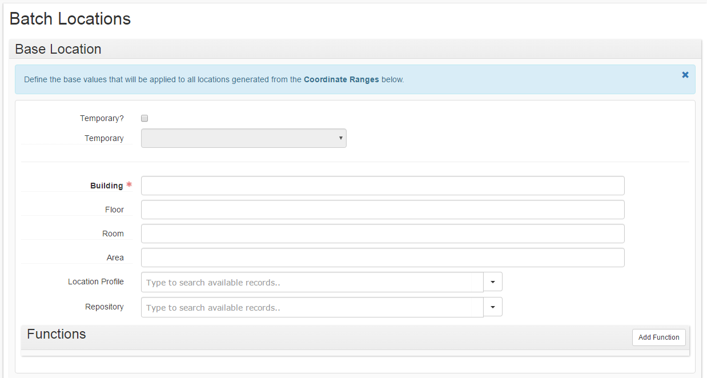

3.  In the **Coordinate Ranges** section, enter values for **Coordinate
    Range 1’s** **Label**, **Range Start**, and **Range End**. This is
    the minimum amount of data required to generate a batch of
    locations.

4.  Enter values for **Coordinate Range 2** and **Coordinate Range 3**
    if warranted.

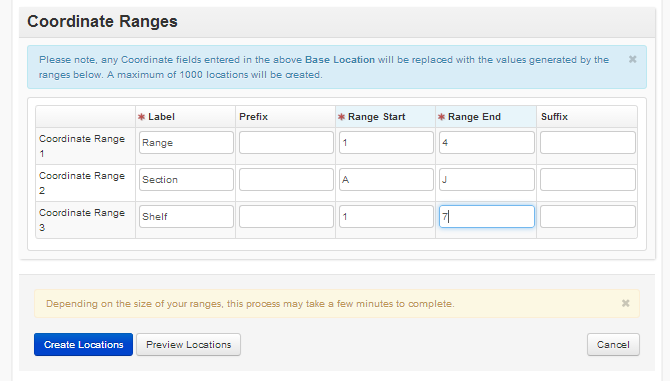

5.  You may review your locations to make sure they are correctly formed
    by clicking on the **Preview Locations** button.

> 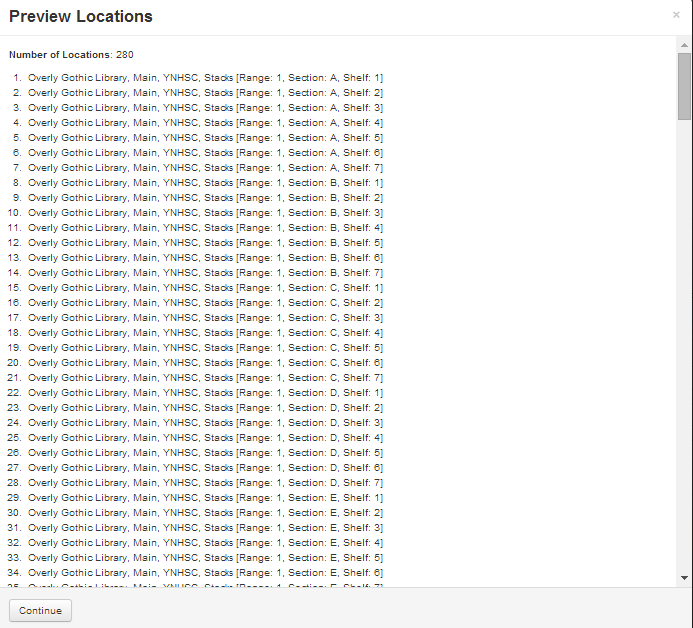 style="width:5.59803in;height:5.07292in" />

6.  Click on the **Create Locations** button to generate the batch of
    Location records (the number of records generated is determined by
    the coordinate information provided). Generate additional batches of
    records by changing values for the coordinates or, if appropriate,
    values for the shelving location.

## Managing Top Containers

### Functional Overview

One feature of ArchivesSpace is the ability to act on containers as
distinct entities, as well as the ability to act on them in bulk. This
section is an introduction to using the “Manage Top Containers” function
in ArchivesSpace.

### Navigating to the Manage Top Container Function

“Manage Top Containers” is available under the gear menu for the
repository name.

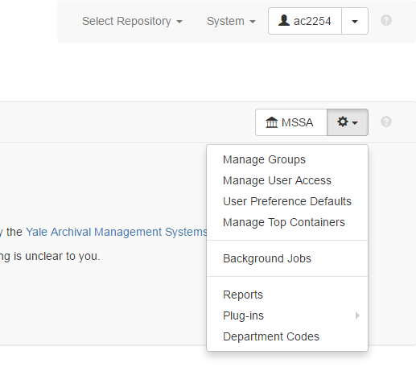

### Searching

The manage top container view is both a way to act on containers and a
useful search tool.

To search for distinct top containers, a number of fields can be used in
combination with one another.

- **Keyword search**: This searches all fields in the top container view
  -- resource name, resource identifier, accession name, accession
  identifier, container profile name, container indicator, container
  barcode, and current location. You can perform a boolean NOT operation
  by putting a minus sign in front of the text in the keyword search
  term.

- **Barcode:** Searches by barcode of the top container

- **Resource:** Start typing to find the resource you want to enter, or
  click on the triangle at the end of the field to browse.

- **Accession:** Start typing to find the accession you want to enter,
  or click on the triangle at the end of the field to browse.

- **Container Profile:** Start typing to find the container profile you
  want to enter, or click on the triangle at the end of the field to
  browse.

- **Location:** Start typing to find the location you want to enter, or
  click on the triangle at the end of the field to browse. Please note
  that because of a known bug in the application, typing a hyphen will
  result in the typeahead not producing any results.

- **Exported to ILS**

- The **Unassociated Containers** search is primarily to support
  clean-up. If a resource or accession record is deleted, the top
  containers created as part of that record will still remain. By
  searching for “unassociated containers”, you can find and delete
  containers that are no longer in use.

Examples of search:

1.  **See all of the distinct top containers in a collection.** In this
    example, I want to see which containers are in the Yale Athletics
    Photographs collection.

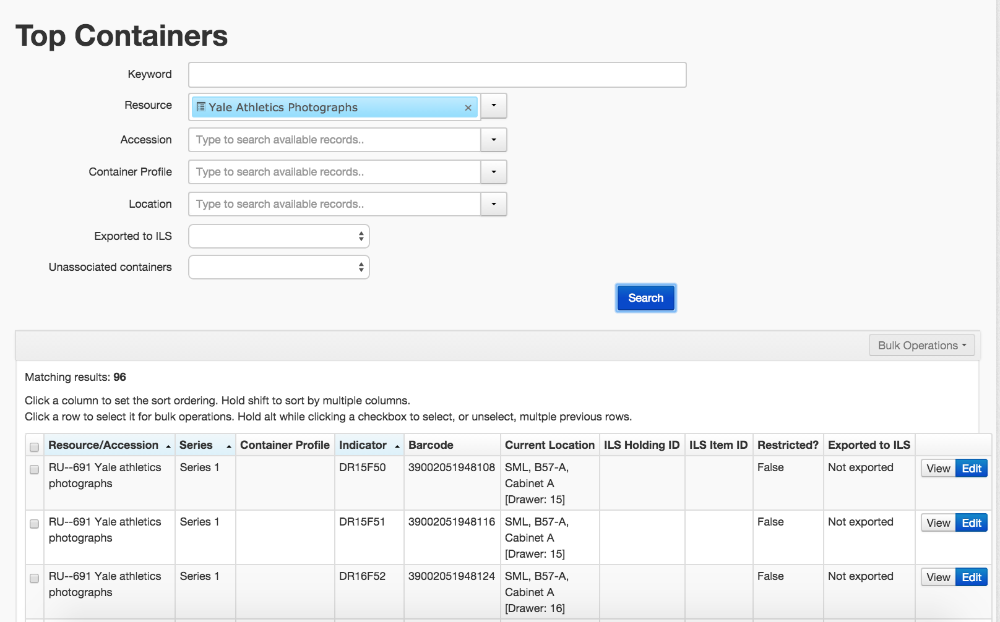

2.  **Find all of the containers in a particular location.** In this
    example, I want to know all of the containers that are house in SML
    150-B, Drawer 1.

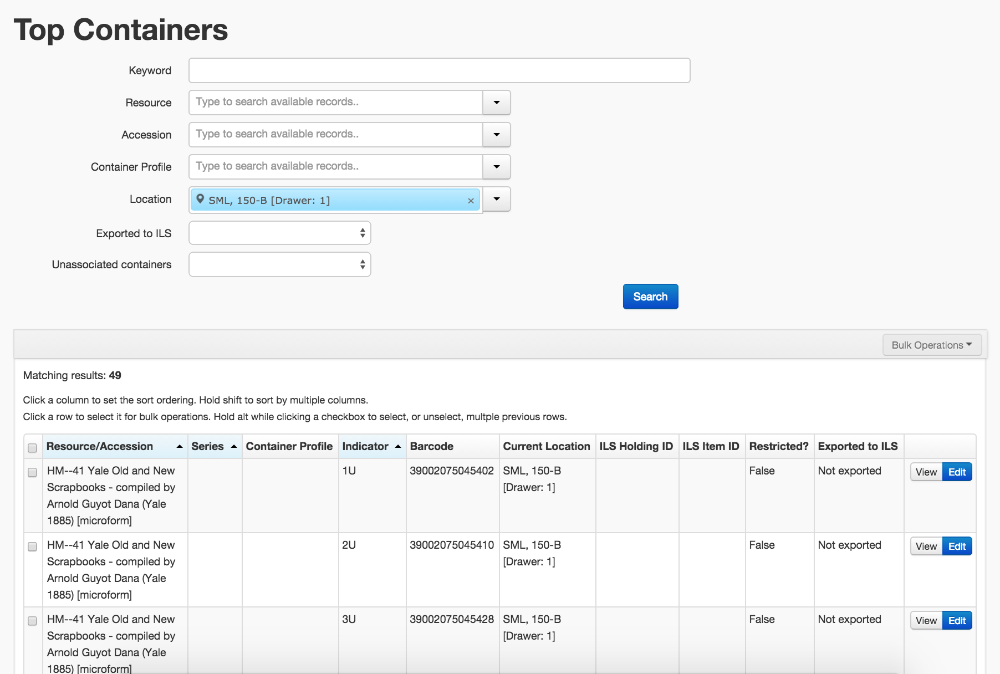

In this example, the location is entered in the “Location” field and the
results show us that there are 49 containers that match this location.
The results tell us which resource or accession this container belongs
to, which series (if applicable), container profiles, container numbers,
barcodes, ILS information and restriction information.\\

3.  **Find examples of container profiles**. For instance, you may know
    that all “blue” boxes are non-archival and want to bring them
    together for a re-housing project.

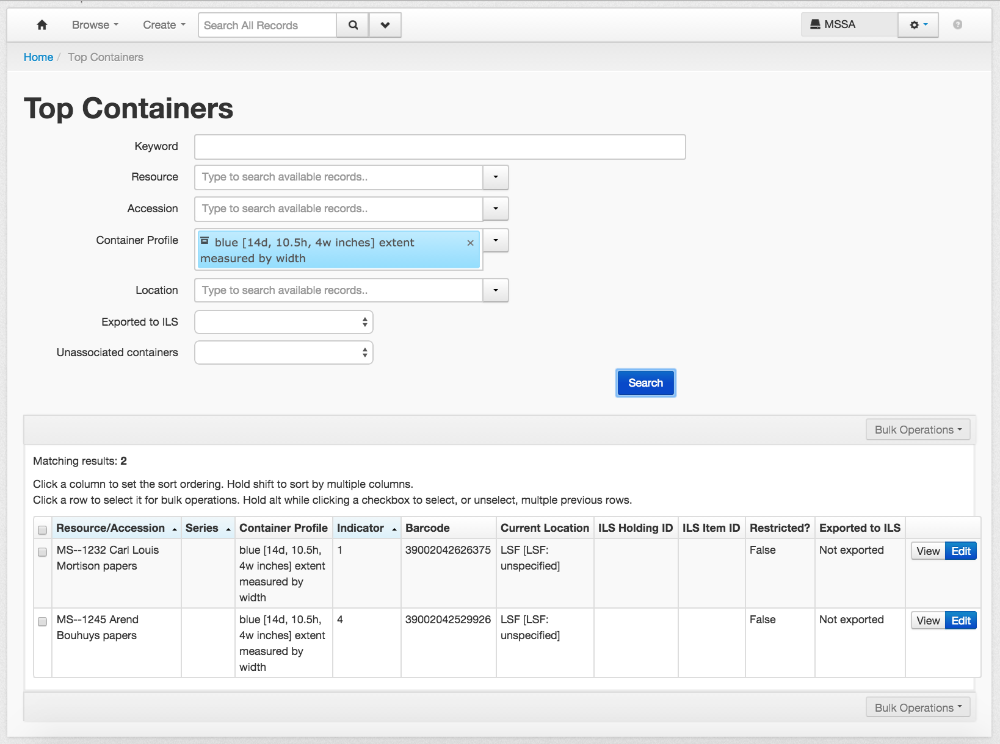

In this example, I searched for a container profile of “blue” and found
that there are two top containers that have that container profile. I
now know their location, their barcode, and the resource record
associated with them, which will make it possible to do a re-housing
project.

### Updating elements from containers in bulk

**Selecting top containers:**

From within a result set, there is the ability to select all containers,
select no containers, select containers individually (as a set), or
select from a contiguous range. Click a row or rows to select it for
bulk operations.

From the “manage top containers” screen is the ability to update the
following elements:

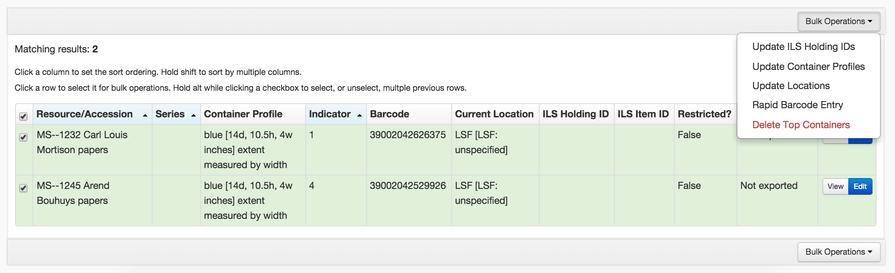

**Update ILS Holding IDs**

This may be used to reconcile the Voyager holdings ID for containers.
There is no current use for this at Yale.

**Update Container Profiles**

This is an opportunity to set information about container profiles in
bulk.

**Update Locations**

This function allows the user to change the locations of containers
singularly or en masse to a new permanent location or locations.

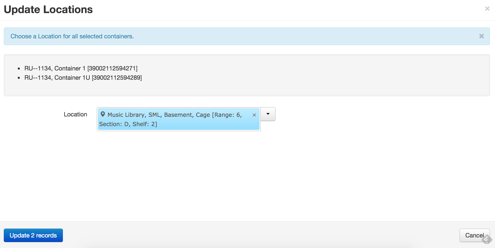

**Rapid Barcode Entry**

With this feature, an archivist can enter all of the barcodes for a
group of containers at once. Note that barcodes cannot be repeated
within the system and that a specified barcode length can be set. For
YUL repositories, all barcodes must be 14 digits.

**Delete Top Containers**

This option removes top containers and all information contained
therein. It does not remove information in resource records, components,
or accessions, although it does break the link between these records and
a top container.

## Container Profile Records

### Functional Overview

Container profiles are associated with top containers, and provide
information about the physical container in which archival materials are
housed. With this data, we can calculate how much space a collection
occupies.

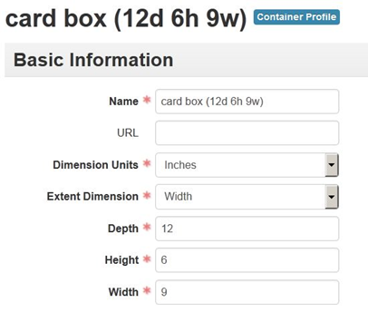

### Associating an existing container profile with a top container record

- Instructions for this can be found in the [<u>Managing Top
  Containers</u>](##managing-top-containers) section of the manual.

### Creating a container profile

On the main toolbar, click Plug-ins and select Manage Container
Profiles.

In the upper right corner of the Container Profiles main page, click
Create Container Profile.

Enter the following information

- Name - A descriptive name for the container type. Since this value
  must be unique, we also include a summary of the container’s
  dimensions in parentheses. See below for guidance on general name
  types for container profiles.

- Dimension units - The unit of measurement used to measure the
  dimensions of a container. Container profile dimensions are always
  measured in inches.

- Extent Dimension – The dimension of a container used to measure linear
  extent. **Width** is always used to measure linear extent at Yale.

- Depth, Height, and Width measurements of the container. When measuring
  a container, you should always round up to the nearest whole inch.

  - Depth represents the distance from the front of the shelf to the
    back of the shelf.

  - Height represents the distance from the bottom of the box upwards.

  - Width is the edge of the container that faces out on the shelf.

    - For flat boxes, the long edge is measured as width.

    - For containers in which materials are stored upright (i.e. archive
      boxes, record cartons, card boxes, etc.), the edge facing the
      front of the shelf (often the short edge) is measured as width.

    - For two-dimensional containers (folders of any size), the long
      side should be measured as width and the height should be measured
      as 0.5 inches.

Click Save Container Profile.

### Rules for creating container profiles

- Permission to create container profiles is given at the discretion of
  repository managers.

- Container profiles are shared across all repositories.

- Container profiles for most standard-sized, commercially-produced
  containers used in Yale repositories have already been created in
  ArchivesSpace. Before creating a new container profile for a
  standard-sized box, please search the existing container profiles to
  confirm that it doesn’t already exist.

- All containers are measured to the nearest inch on each side, with the
  exception of folders, which are consistently measured as being 0.25
  inches high. This means that there may be two different containers of
  relatively different sizes that belong to the same container profile.
  Since the goal of container profiles is to give a ballpark estimate of
  the size of our holdings, these marginal differences are acceptable.

  - n.b. -- a folder of any size should be referred to as a folder
    (including broadside, folio folder, etc.) Because of the uniqueness
    constraint, a folder’s name should include its width and depth
    dimensions. There’s no need to include its height dimension, since
    all folders are assigned a default height of 0.25 inches.

- For flat boxes and folders, assign width to the longest side.

- Container profiles refer to the boxes in which materials are stored.
  In some cases, container profile names may refer to a particular
  material or carrier type. Keep in mind, however, that in all cases,
  the container profile name has nothing to do with the materials
  therein.

  - Example: A set of earrings may be kept in a 5-inch audiotape box.
    Never assume that the container profile name refers to the box’s
    contents.

### Container profile names

In order to minimize the possible proliferation of names, we've decided
on a small group of name types. When creating a container profile,
please use a name type from this list. If no value on this list
describes the container that you would like to create a profile for,
please contact the [<u>Yale Archival Management Systems
Committee</u>](http://guides.library.yale.edu/archivesspace/members).

Since container profile names must be unique, the name should be a
combination of the name type and a summary of the dimensions.

**<u>Examples</u>**

- flat box (21d 1.5h 25w)

### Container profiles for custom-made boxes

Many Yale repositories use custom-made boxes to house oddly-sized or
shaped materials that won’t fit safely into standard-sized containers.
In order to prevent an unmanageable proliferation of container profiles
in ArchivesSpace, a single set of uniform container profiles for custom
boxes has been created. These container profiles correspond
approximately to the most common types and dimensions of custom boxes
used in Yale repositories. They are as follows:

- Custom box \[vertical octavo, 1" wide\] (1" w x 10" h x 9" d)

- Custom box \[vertical octavo, 3" wide\] (3" w x 10" h x 9" d)

- Custom box \[vertical quarto, 1" wide\] (1" w x 15" h x 13" d)

- Custom box \[vertical quarto, 3" wide\] (3" w x 15" h x 13" d)

- Custom box \[flat, 12" wide\] (12" w x 3" h x 10" d)

- Custom box \[flat, 18" wide\] (18" w x 3" h x 14" d)

- Custom box \[flat, 24" wide\] (24" w x 3" h x 20" d)

- Custom box \[flat, 30" wide\] (30" w x 3" h x 24" d)

- Custom box \[flat, 36" wide\] (36" w x 3" h x 30" d)

- Custom box \[flat, 42" wide\] (42" w x 3" h x 36" d)

### Rules for assigning container profiles to custom containers

- For containers smaller than 42 inches in width, round up to the next
  closest size container.

- For containers larger than 42 inches in width, assign "Custom box
  (flat, 42" wide) (42" w x 3" h x 36" d)"

- For custom containers made for objects that do not correspond to the
  above standard custom boxes, indicate: Object box (##” w x \##” h x \##”
  d)

### Strategies for searching, browsing, and choosing container profiles

- When searching for a container profile in a typeahead field (for
  example, in the Create Top Container window), look for words in bold
  text in your search results. When an exact match for your search
  term(s) is found in a record, that term will appear in bold.

- Using the Browse feature provides you with a greater number of tools
  for finding container profile records. To browse for a container
  profile from the Create Top Container Window, open the drop-down menu
  next to the typeahead and click on Browse. Some tips for browsing top
  container records:

  - In the search field in the top left corner of the Browse window, you
    can use quotation marks to search for an exact phrase. If you use
    the correct container profile name (example: “archive half legal”),
    this will make your search more accurate and greatly reduce your
    search results.

  - On the left side of the browser window, you can browse containers
    according to their height, width, or depth dimensions (but not all
    three at the same time). Click on the link next to the desired
    dimension and measurement to see all container profile records for
    boxes that include that dimension.

## Accession Records

### Functional overview

Accession records store information about the receipt and legal transfer
of archival materials. An accession may be a single item or an
aggregation of materials. It may be the beginning of a new resource or
multiple resources, or an accrual to an existing resource.

Accession records may also be linked to other types of ArchivesSpace
records, such as existing Resource, Digital Object, Subject, Agent, and
even other Accession records.

Data in an Accession record can also be transferred into two types of
records. It can be spawned into additional Accession records to reflect
hierarchical or sibling relationships. It can also be spawned into a new
Resource record. Edits to a spawned Resource record do not change the
Accession record it came from. Only the first Accession record can be
spawned to the Resource record; data from subsequent Accession records
associated with the same resource will need to be entered manually. The
process of spawning new Resource records from Accession records is
covered in the [<u>Spawning a Resource Record</u>](##_20xfydz) section of
this manual.

### Creating and managing Accession records

ArchivesSpace requires two elements in an Accession record, though you
may enter many more if warranted:

- **Identifier**

- **Accession Date**

**Creating an Accession record**

1.  On the main toolbar, click **Create** and select **Accession**.

2.  Enter the following information:

> **Accession Date:** This field is automatically filled with the
> current date. Edit the accession date as necessary. The accession date
> may represent the date of the receipt of the materials or the invoice
> date. Assign according to your repository procedures.
>
> **Identifier:** An accession identifier is comprised of three
> segments. The first segment is the fiscal year of the accession. This
> is set automatically based upon the assigned accession date. The
> second segment is a department code. If your repository has multiple
> departments, select the appropriate code from the drop-down menu. If
> your repository has only one department code, it will be assigned by
> default. The third segment is a four-digit number that is assigned in
> a sequence for each department and fiscal year. The third segment will
> be generated automatically upon saving the new accession record. Do
> not use this field for unique identifiers assigned to individual
> pieces of media for the purposes of tracking and managing the media.
>
> 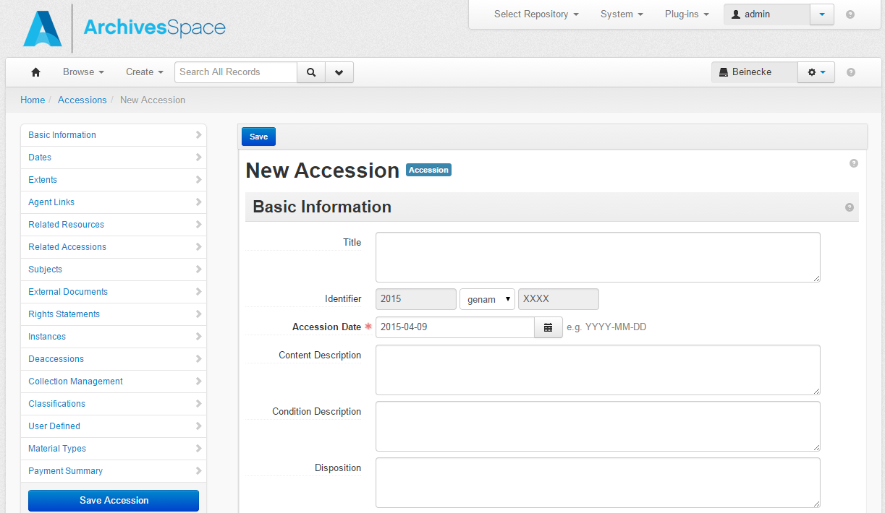 style="width:5.94271in;height:3.45152in" />

3.  Click **Save Accession**. If any required element is missing, you
    will be prompted to add the information, which you must do in order
    to save the record.

#### Adding further information to an Accession record

After the minimum information about an accession has been entered, you
can continue to describe the accession using the sub-records available
in the left navigation bar.

When you add a sub-record, depending on the type of record, specific
fields may be required. If any required information is missing, you will
be prompted to add the required information.

Below is a summary of selected additional, optional key data fields
often used in the creation of accession records. In all cases, follow
your repository’s guidelines and supervisor’s instructions when creating
accession records.

#### Basic Information

- **Title:** Consult DACS and your repository’s accession guidelines for
  advice on forming titles.

- **Content Description:** Open text field. A description of the types
  of material and topical contents of the accession. For born-digital
  materials, you may insert information such as operating systems,
  hardware information, and software dependencies here, if known.

- **Condition Description:** Open text field. A description of the
  physical condition of the contents of the accession, including any
  special handling requirements. Particular preservation concerns may be
  noted here, including issues of fragility or obsolescence.

- **Disposition:** Open text field. A note to describe a range of
  processes associated with implementing appraisal, destruction, and
  preservation decisions. Disposition is a comprehensive term that
  includes both destruction and transfer of records.

- **Inventory:** Open text field. A note that can capture a list of the
  contents of the accession.

- **Provenance:** Open text field. A note that provides source
  information about an accession, such as custodial history and detailed
  acquisition information.

- **Retention Rule:** Open text field. A note indicating the retention
  authority or rule for the accession.

- **General Note:** Open text field. A catch all note field for any
  information that does not fit in any of the more specifically defined
  fields. This field does not display in the Public User Interface, and
  should only be used for internal notes.

- **Acquisition Type:** Choose from a drop-down list. A categorical
  descriptor for the type of acquisition. Possible data values include
  deposit, gift, purchase, transfer. May be left unassigned if the
  acquisition type is unknown.

- **Resource Type:** Not used by Yale. A list of terms for categorizing
  resources into basic types.

- **Restrictions Apply:** Not used at Yale.

- **Publish:** Select or clear the check box. A selected check box
  indicates that this accession will be published to the Public User
  Interface.

- **Access Restrictions:** Select or clear the check box. A selected
  check box indicates that access to the materials is restricted.

- **Access Restrictions Note:** Open text field. A statement indicating
  what materials in the accession have access restrictions, what the
  authority of the restriction is, and for how long the restriction will
  be in effect. If Access Restrictions (see above) is selected this
  field should include a relevant explanation.

- **Use Restrictions:** Select or clear the check box. A selected check
  box indicates that there are use restrictions for materials in the
  accession.

- **Use Restrictions Note:** Open text field. A statement indicating
  which materials have use restrictions, how the materials can be used,
  what the authority of the restriction is, and for how long the
  restriction will be in effect. If Use Restrictions (see above) is
  selected this field should include a relevant explanation. Additional
  information may also be recorded in a Rights sub-record.

#### Dates sub-record 

This sub-record identifies and records the date(s) that pertain to the
creation, assembly, accumulation, and/or maintenance and use of the
materials being described. The required fields are **Label** and
**Type**.

- **Label:** Choose from a drop-down list. Describes the type of
  activity that the date signifies.

- **Expression:** A natural language expression specifying the date or
  date range of the materials is required when a normalized date is not
  recorded or when the date expression is different than the normalized
  date values. Examples include:

  - 1870 - circa 1879

  - Easter 1925

  - 1955-1959, undated

- **Type:** Choose from a drop-down list. Indicate the type of date
  sub-record, either a single date or a date range (inclusive or bulk).
  This is a required field for date sub-records.

Optionally, you may specify normalized date values. Normalized values
can be input into the Begin and End date fields either manually in the
YYYY, YYYY-MM, or YYYY-MM-DD formats, or by clicking on the calendar
icon and choosing the appropriate date.

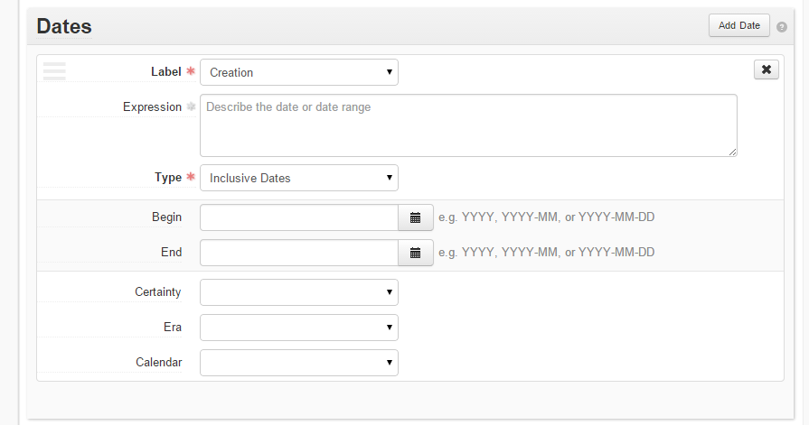

#### Extents sub-record

This sub-record is used for recording the size of the described
materials. The required fields are **Portion**, **Number**, and
**Type**. Users may use multiple, parallel extent sub-records within a
single accession record.

- **Portion:** Choose from a drop-down list. Used to specify whether an
  extent statement relates to the whole or a part of a given described
  aggregation or item. At least one extent sub-record should refer to
  the whole accession.

- **Number:** Open text field. A numeric value for indicating the number
  of units in the extent statement, e.g., 5, 11.5, 245. Used in
  conjunction with **Type** to provide a structured extent statement.

- **Type:** Choose from a drop-down list. A term indicating the type of
  unit used to measure the extent of materials described. For
  born-digital material that arrived on physical media, indicate the
  carrier type(s) (e.g. external hard drive). For born-digital material
  that arrived via transfer without a carrier, indicate quantity of data
  transferred in gigabytes.

- **Container Summary**: Open text field. A list of container and
  container types housing the materials described in the component
  record.

- **Physical Details**: Open text field. Other physical details of the
  materials described, e.g., analog, black and white, negatives.

- **Dimensions:** Open text field. The dimensions of the materials
  described.

Extent sub-records may be entered manually. Alternatively, Extent
sub-records for archival components in Top Containers can be generated
with the Extent Calculator button. The Extent Calculator creates a draft
extent sub-record that may be edited before saving. Note: this will not
replace an existing extent sub-record. If an existing sub-record becomes
obsolete; the user must delete the old extent subrecord.

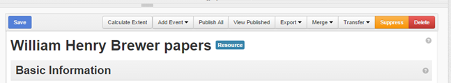

#### Deaccessions sub-record 

This sub-record identifies the scope and circumstances of materials
permanently removed from the accession. The required fields are
**Portion** and **Description**, as well as a **Deaccession Date**.

- **Portion:** Choose from a drop-down list. Options include “whole” and
  “part.” If the entirety of the accession has been deaccessioned,
  select “whole.” Otherwise, if not all of the accession has been
  deaccessioned, select “part.”

- **Description:** Open text field. Describe the nature of the
  deaccessioned materials.

- **Reason:** Open text field. Summarize the reasons why the materials
  were deaccessioned.

- **Disposition:** Open text field. Describe what was done with the
  deaccessioned materials.

- **Notification Given?:** Boolean field. Select this field if any
  notice of the deaccession has been sent.

- **Deaccession Date:** Select the type of date (most likely a single
  date), then provide both a date expression value and a normalized
  “Begin” date.

Optionally, you may provide a deaccession extent sub-record. To do so,
under the Deaccession Date, click “Add Extent.” Required fields include
**Portion**, **Number**, and **Type**.

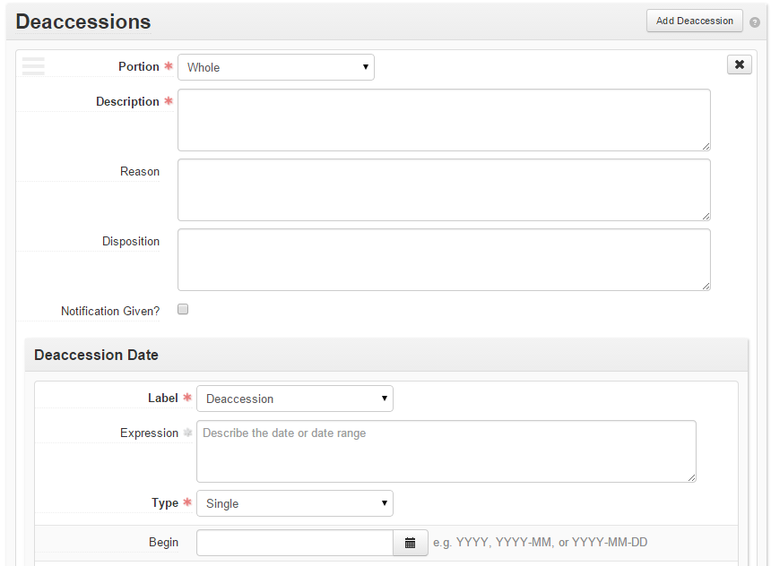

#### Material Types sub-record 

This sub-record contains eleven Boolean fields that may be used to
indicate the presence of specific material formats in the accession.
There are no required fields. The material types that may be flagged by
checking the corresponding box as follows:

- Books

- Games

- Maps

- Microforms

- Realia

- Serials

- Audiovisual Materials

- Computer Files

- Manuscripts

- Photographs

- Works of Art

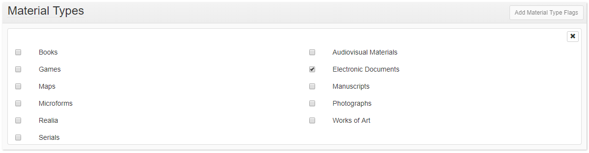

If you frequently accession a particular type of material, as a user you
may set default Material Type values that will automatically be selected
when you create a Material Types sub-record. In the top toolbar, click
on the drop-down menu next to your user name and select “My Repository
Preferences.” Default Material Types can be selected at the bottom of
the page. After choosing your default values, click on save at the top
of the page.

#### Payment Summary sub-record 

This sub-record captures information regarding the details of payments
made for purchased accessions. There are no required fields. Payment
information consists of one Payment Summary and zero or more Payment
sub-records. The Payment Summary may contain the following information:

- **Total Price:** A number representing the total cost of the purchased
  accession

- **Currency:** A controlled value list. Select the code correspondent
  to the currency in which all payments were made. USD (US Dollar) is
  the default. Other currencies may be selected by clicking on the “X”
  to clear the field, then either using the type-ahead functionality to
  find the appropriate currency code or by clicking on the down arrow
  and manually selecting from the list.

- **In Lot:** A Boolean field. Selecting “In Lot” will indicate that the
  accession combines multiple line items in an invoice.

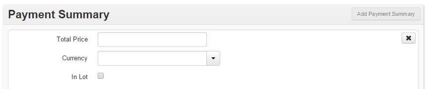

After the Payment Summary has been completed, you may add information
about individual Payments. There are no required fields in a Payment
sub-record. You may supply the following pieces of information:

- **Payment Date:** A normalized date field. Provide the date in
  YYYY-MM-DD format, or click on the calendar to select the date.

- **Invoice Number:** An open text field for capturing invoice numbers.

- **Fund Code:** A controlled value list of Fund codes. Select the fund
  with which the payment was made from the list by either using the
  type-ahead function or by clicking on the down arrow and selecting
  from the list.

- **Amount:** A number representing the amount of the payment.

- **USD Equivalent** **Amount:** If the payment is not in USD and your
  repository chooses to track cumulative expenditures, supply a number
  of the approximate amount spent in USD.

- **Authorizer:** A link to an agent. Select the agent record for the
  staff member responsible for authorizing the payment.

- **Note:** An open text field for recording any necessary or useful
  notes about the payment.

For simple transactions, a single Payment sub-record will suffice. You
will need to supply multiple Payment sub-records if a single purchase is
paid for on multiple funds, or if subsequent payments are scheduled for
future dates.

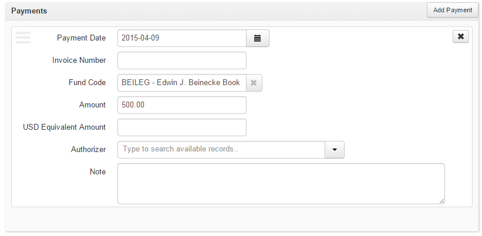

#### Spawning Accession Records

To create a copy of an existing Accession record, do the following:

1\. Click on the Spawn option at the top of the Accession record
template.

2\. Select Accession.

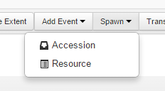

3\. The spawned Accession record will appear. Provide the appropriate
Identifier and Accession Date and make additional edits as necessary.

4\. Click Save.

All Basic Information is copied to the newly spawned Accession record
except for the identifier and accession date. Other sections copied to
the new record include the following: Dates, Extents, Agent Links,
Subjects, and User Defined. Sections not copied to the new record
include Related Resources, Related Accessions, External Documents,
Rights Statements, Instances, Deaccessions, Collection Management, and
Classifications.

## Resource Records: Single-Level

### Functional overview

Within the context of ArchivesSpace, resources can be defined as
materials that are in the custody of an archival repository and are
being controlled according to archival principles. An ArchivesSpace
resource may be comprised of one item, or, more typically, it will be an
aggregation of items that can be of any extent or complexity.

ArchivesSpace supports description of the resource as an intellectual
entity and also as one or more physical or digital entities that may
embody the intellectual item. The description of the archival resource
can be supplemented with certain context and content descriptors (names
and subjects).

### Creating and managing Resource records

There are two ways to create Resource records in ArchivesSpace. One way
is to create a Resource record within the Resource module. The other way
is to “spawn” a Resource record from an existing Accession record. Both
ways are described below and are subject to the same record
requirements.

  
A Resource record must have the following data:

- **Title**

- **Resource Identifier**

- **Level of Description**, chosen from a controlled value list
  containing the values: class, collection, file, item, record group,
  series, subgroup, subseries, or other level

- **Language**

- **Extents sub-record**

- **Dates sub-record**

A valid Resource record may not satisfy all the DACS minimum
requirements, as it may lack the following:

- **Scope and Content note** (Notes sub-record)

- **Conditions Governing Access note** (Notes sub-record)

Other DACS requirements, such as the **Reference Code Element**, are
recorded in the ArchivesSpace repository record.

Your repository may have other elements that are required in every
record.

#### Creating a Resource record

1.  From the Main Screen, select **Create** and select the **Resource**
    option.

2.  In the **Basic Information** area, record the **Title**,
    **Identifier** (which is where the collection call number is
    recorded), and **Level of Description** of the resource.

3.  Record the primary **Language** (recommended for DACS compliance) of
    the materials in the resource.

4.  Indicate if any restrictions apply to the resource by checking the
    Restrictions? checkbox. (Note: this is not used at Yale)

5.  If you intend for your finding aid to be exported to YFAD, check
    “Publish?.” Do not check this until all work has been completed and
    the finding aid is ready for publication.

> 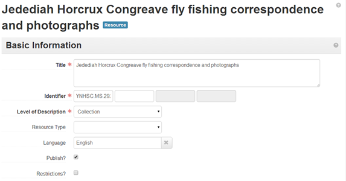 style="width:5.96875in;height:3.125in" />

6.  For the Extents sub-record:

- Indicate in **Portion** if the extent statement characterizes the
  entire resource ("Whole" default) or part of the resource ("Part").
  One extent statement for the “Whole” resource is required, and one or
  more extent statements for parts of the resource may be recorded. For
  example, you might indicate that an entire collection has a “whole”
  extent statement of 55 Linear Feet, as well as a “part” extent
  statement of 30 3.5” floppy disks (where the “part” extent statements
  may or may not add up to the whole)

- Record the **Number** for the extent measurement, e.g., 5.

- Select the **Type** of extent from the controlled value list, e.g.,
  linear feet.

- Optionally, in **Container Summary** note the number and type of
  containers comprising the extent in the container summary, e.g., 3
  record cartons, 4 archives boxes, and 3 oversized folders.

- Optionally, record specific **Physical Details** and **Dimensions**.

- Optionally, record one or more **Extents** statements for parts of the
  resource, e.g., the number of audiocassettes in the resource.  
    
  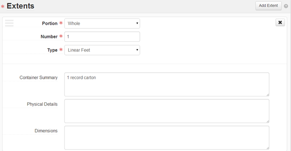

7.  Within the **Dates** sub-record, record the date(s) (recommended and
    required for DACS compliance) for the resource.

- From the **Label** (required) controlled value list, select the term
  that best characterizes the date.

- Enter a date **Expression** (natural language, e.g., “between May 1
  and May 5, 1970”) and/or normalized **Begin** and **End** dates.

- From the **Type** (required) controlled value list, indicate if the
  date is for single, bulk, or inclusive date(s).

- If appropriate, select values for **Certainty**, **Era**, and
  **Calendar**.**  
  **  
  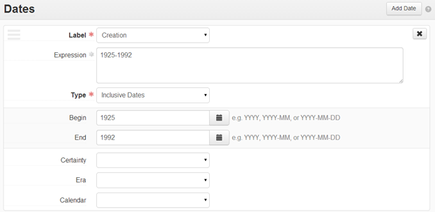

> Save the record by clicking on **Save Resource** at the bottom of the
> record index or on the **Save** button at the top of the Resource
> record.

When you add a sub-record, depending on the type of record, specific
fields may be required. If any required information is missing, you will
be prompted to add the required information.

#### Spawning a Resource record

A preliminary Resource record can be generated from an Accession record.
To do so, open the Accession record from which the Resource record will
be spawned and then click on the **Spawn** option at the top of the
Accession record template and choose Resource.

Some, but not all, of the information recorded in the Accession record
will be copied to the newly created and linked Resource record.

The same Accession record can be used to spawn two or more Resource
records, provided each spawned resource has a unique identifier.
However, once a Resource record has been spawned from an Accession
record, subsequent modifications to that Resource record need to be made
manually (for example, manual updates will be needed to note the
inclusion of subsequent accruals). A second, third, or later Accession
record for an addition to a resource cannot be spawned to the existing
Resource record. Those Accession records can be linked to the resource
in order to show all the accessions that have been processed as part of
the resource.

For first time accessions for newly acquired resources, think about the
data you are inputting for the accession as the beginning of the
Resource record. The more careful you are in creating quality content
and formatting the accession data, the more work you can save when it
comes time to create the Resource record.

#### Spawning and linking a preliminarily populated Resource record from an Accession record 

1.  Click on the **Spawn** option at the top of the Accession record
    template and select Resource.

> 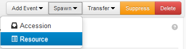 style="width:3.79167in;height:1in" />

2.  Click on the option for Resource.

3.  A Resource record template will load and will contain values carried
    forward from the Accession record.  
      
    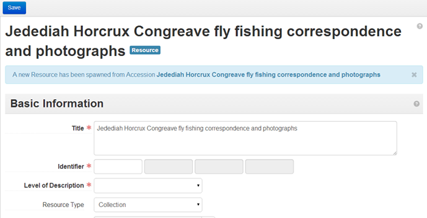

4.  Complete the Resource record according to the input requirements for
    Resource records described above and the needs of the materials
    being described.

5.  Click on **Save** to save the spawned Resource record.

The resulting Resource record will contain in its data fields some of
the data recorded in the Accession record on which it is based. The
table below identifies what parts of the Accession record are
transferred to what parts of the Resource record:

#### Accession record to Resource record: mapped elements

<table>
<colgroup>
<col style="width: 47%" />
<col style="width: 52%" />
</colgroup>
<tbody>
<tr class="odd">
<td colspan="2"><strong>Directly mapped fields</strong></td>
</tr>
<tr class="even">
<td><strong>Accession record elements: field label</strong></td>
<td><strong>Resource record elements: field label</strong></td>
</tr>
<tr class="odd">
<td>Title</td>
<td>Title</td>
</tr>
<tr class="even">
<td>Extent Portion</td>
<td>Extent Portion</td>
</tr>
<tr class="odd">
<td>Extent Number</td>
<td>Extent Number</td>
</tr>
<tr class="even">
<td>Extent Type</td>
<td>Extent Type</td>
</tr>
<tr class="odd">
<td>Extent Container Summary</td>
<td>Extent Container Summary</td>
</tr>
<tr class="even">
<td>Extent Physical Details</td>
<td>Extent Physical Details</td>
</tr>
<tr class="odd">
<td>Extent Dimensions</td>
<td>Extent Dimensions</td>
</tr>
<tr class="even">
<td>Date Label</td>
<td>Date Label</td>
</tr>
<tr class="odd">
<td>Date Type</td>
<td>Date Type</td>
</tr>
<tr class="even">
<td>Date Expression</td>
<td>Date Expression</td>
</tr>
<tr class="odd">
<td>Date Begin</td>
<td>Date Begin</td>
</tr>
<tr class="even">
<td>Date End</td>
<td>Date End</td>
</tr>
<tr class="odd">
<td>Bulk Date Begin</td>
<td>Bulk Date Begin</td>
</tr>
<tr class="even">
<td>Bulk Date End</td>
<td>Bulk Date End</td>
</tr>
<tr class="odd">
<td>Resource type</td>
<td>Resource type</td>
</tr>
<tr class="even">
<td>Publish</td>
<td>Publish</td>
</tr>
<tr class="odd">
<td colspan="2"><strong>Indirectly Mapped Fields</strong></td>
</tr>
<tr class="even">
<td>Content Description</td>
<td>Scope and Contents Note</td>
</tr>
<tr class="odd">
<td>Condition Description</td>
<td>Physical Description Note</td>
</tr>
<tr class="even">
<td>Accession Title</td>
<td>Accession Linked</td>
</tr>
<tr class="odd">
<td>Agent (Linked)</td>
<td>Agent (Linked)</td>
</tr>
<tr class="even">
<td>Subject (Linked)</td>
<td>Subject (Linked)</td>
</tr>
</tbody>
</table>

#### Adding further information to a Resource record

#### Notes sub-records

Through the use of various notes, the description of an archival
resource can be extended considerably. ArchivesSpace supports 29 notes,
each of which can be repeated and all of which are available in the
**Notes** section of the Resource record template. Use guidelines in
DACS to formulate notes.

- **Abstract**

- **Accruals Note**

- **Appraisal Note**

- **Arrangement Note**

- **Bibliography**

- **Biographical/Historical Note**

- **Conditions Governing Access Note**

> Information in this note can be made machine-actionable by entering a
> restriction begin date and restriction end date **OR** by choosing a
> restriction type. This information will serialize to our circulation
> system and will help manage the restriction status of materials in our
> care. While users may have a Conditions Governing Access Note without
> using the date begin and date end or restriction types, users should
> not use begin and end dates or restriction types without an
> accompanying Conditions Governing Access Note. See “[<u>Local Access
> Restriction Types</u>](##local-access-restriction-types)” section for
> further information.
>
> 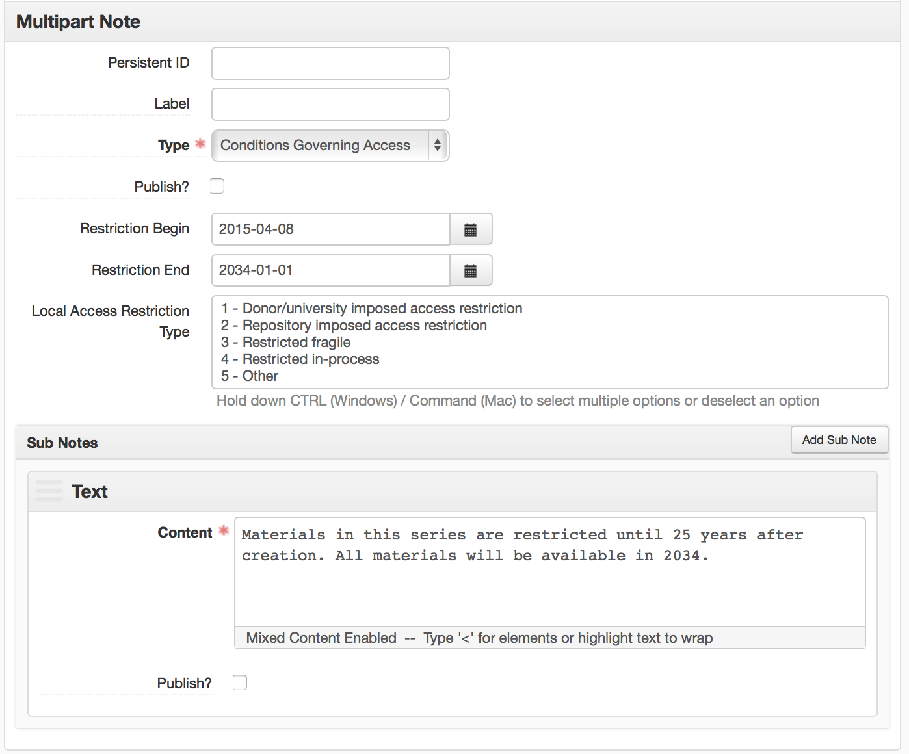 style="width:5.53646in;height:4.5871in"
> alt="Screen Shot 2015-04-07 at 8.30.05 PM.png" />
>
> The actionable restriction information is associated with the Top
> Containers linked to the archival component and is inherited by child
> archival components and their associated Top Containers. The
> information is serialized and machine-actionable as well as viewable
> in the Restricted? column of the Manage Top Container search results
> view.
>
> 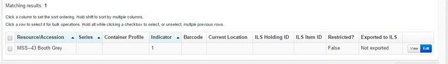 style="width:6.68229in;height:0.92708in" />

- **Conditions Governing Use Note**

> Information in this note can be made machine-actionable by entering a
> use restriction begin date and end date or by choosing a restriction
> type. This information will serialize to our circulation system and
> will help manage the use restriction status of materials in our care.
> While users may include a Conditions Governing Access Note without
> using the use restriction begin and end dates or restriction types,
> users should not use begin and end dates or restriction types without
> an accompanying Conditions Governing Use Note.

- **Custodial History Note**

- **Dimensions Note**

- **Existence and Location of Copies Note**

- **Existence and Location of Originals Note**

- **File Plan Note**

- **General Note**

- **Immediate Source of Acquisition Note**

- **Index**

- **Language of Materials Note**

- **Legal Status Note**

- **Materials Specific Details Note**

- **Other Finding Aids Note**

- **Physical Characteristics and Technical Requirements Note**

- **Physical Description Note**

- **Physical Facet Note**

- **Physical Location Note**

- **Preferred Citation Note**

- **Processing Information Note**

- **Related Materials Note**

- **Scope and Contents Note**

- **Separated Materials Note**

To add **Notes** sub-records to a Resource record:

1.  Click on **Add Note** in the **Note** section banner.  
      
    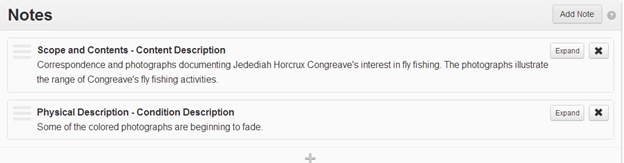

2.  From the **Note Type** controlled value list, select the type of
    note to be recorded.  
      
    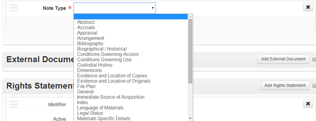

3.  Optionally, record a **Persistent ID** for the note if desired. The
    persistent ID must be unique within the context of the complete
    resource description.

4.  Optionally, record a **Label** for the note. The label will replace
    the note type in outputs such as EAD.

5.  Enter the note text in the **Content** frame.  
      
    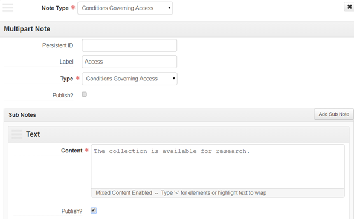

6.  Click on Save or Save Resource to save the note to the overall
    resource description.

Note order is determined by the Yale finding aid stylesheet and the
default note order in the ArchivesSpace Public User Interface (PUI).

#### Local Access Restriction Types

###### Introduction

This section outlines local access restriction types used in Yale’s
ArchivesSpace instance. This functionality was built as part of Yale’s
contribution to the top containers module and integrated into
ArchivesSpace’s core code in version 1.5.

Local access restriction types (see “B” in the below screenshot) are
built into the Conditions Governing Access note and provide a way for
staff to use the machine-actionable functionality of ArchivesSpace to
facilitate management and review of access restrictions on our
collections. While the Conditions Governing Access notes textual sub
note (see “C” in the below screenshot) provides a textual,
human-readable means for communicating access restrictions with users,
the local access restriction types provide a machine-actionable way for
restrictions to interact with other systems at Yale, particularly Aeon.

Therefore, in addition to documenting access restrictions in a textual
sub note, staff should ensure that restrictions are machine-actionable
at the appropriate level of description by using the ArchivesSpace local
access restriction type field and/or restriction begin and end dates
(see “A” in the below screenshot), as needed. Staff should always use a
local access restriction type and should not use the restriction begin
and end dates without using an accompanying local access restriction
type; this is because using restriction begin and end dates without a
local access restriction type will cause machine-actionable restrictions
to expire without requiring staff to review the material and/or update
the textual sub note.

Staff should be aware that machine-actionable local access restriction
types are inherited at lower levels of description; a local access
restriction type applied at the collection level, for example, will be
inherited down to all subcomponents of the collection. Staff should also
be aware that multiple local access restriction types may be used for
the same material.

Staff should also note that local access restriction type information
and machine-actionable restriction begin and end dates are not
publicly-viewable. Users will only be able to view published access
information provided in the Conditions Governing Access textual sub
note.

YAMS recommends that each repository run periodic reports on their
expiring restrictions. Repositories should contact YAMS for guidance on
running these reports.

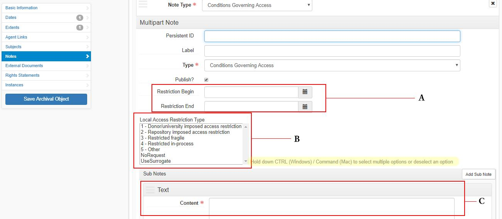

###### Types and their usage

<table>
<colgroup>
<col style="width: 15%" />
<col style="width: 20%" />
<col style="width: 64%" />
</colgroup>
<tbody>
<tr class="odd">
<td>Translated Value</td>
<td>Database Value</td>
<td>Guidelines for Use</td>
</tr>
<tr class="even">
<td>1 - Donor/University imposed access restriction</td>
<td>RestrictedSpecColl</td>
<td>
Should be used for time-delimited restrictions imposed by law,
donors, or university policy, including:

<ul>
<li>
Restricted university records
</li>
<li>
Restricted medical records (HIPAA)
</li>
<li>
Restricted student records (FERPA)
</li>
<li>
Restrictions dictated by the deed of gift or purchase
contract
</li>
</ul>

These restrictions may or may not be time-delimited or may have
non-specific end dates (e.g. a future death date). Restrictions with an
end date attached still require user action to remove the
machine-actionable restriction (and update the textual note) as long as
the local access restriction type has been applied.

Example: <a
href="https://archives.yale.edu/repositories/12/resources/5260"><u>Richard
C. Levin papers (MSSA MS 1995)</u></a>

Example: <a
href="https://archives.yale.edu/repositories/12/resources/4848"><u>William
Timbers papers (MSSA MS 1711)</u></a>
</td>
</tr>
<tr class="odd">
<td>2 - Repository permission required access restriction</td>
<td>RestrictedCurApprSpecColl</td>
<td>
Should be used exclusively for repository imposed restrictions,
including:

<ul>
<li>
“Safe items,” or material with use restrictions requiring
appointment-only access or special access provisions (e.g., signing an
additional access agreement, no photography allowed)
</li>
<li>
Material requiring curatorial approval for access
</li>
<li>
Sensitive material the repository, rather than the donor, chooses
to restrict
</li>
</ul>

Example:

<a
href="https://archives.yale.edu/repositories/12/archival_objects/1181742"><u>Joseph
Albers papers (MSSA MS 32) &gt; Writings by Albers &gt; Books &gt;
Interaction of Color, 1963</u></a>
</td>
</tr>
<tr class="even">
<td>3 - Restricted fragile</td>
<td>RestrictedFragileSpecColl</td>
<td>
Should be used for audiovisual material, born-digital, and other
fragile materials that are too fragile for researchers to use. In some
cases a surrogate may be available when the original is restricted.

Example: <a
href="https://archives.yale.edu/repositories/12/archival_objects/2912877"><u>David
Brion Davis Papers (MSSA MS 1970) &gt; Additional material &gt; Lectures
&gt; Audiotapes</u></a>
</td>
</tr>
<tr class="odd">
<td>4 - Restricted in-process</td>
<td>InProcessSpecColl</td>
<td>
Should be used at the collection level to signal a temporary
access restriction while we work on a collection.

Example: <a
href="https://archives.yale.edu/repositories/12/archival_objects/1693851"><u>Ogden
Rogers Reid papers &gt; Additional Material, 1974-1982</u></a>
</td>
</tr>
<tr class="even">
<td>5 - Other</td>
<td>ColdStorageBrbl</td>
<td>DO NOT USE (Pending update to cold storage documentation). This was
created as a temporary location management tool for BRBL. It is not a
restriction—in each case where it is used, the Voyager statcat for
Restricted Fragile is the appropriate restriction designation. Material
with this restriction should also be designated “3 - Restricted
fragile”</td>
</tr>
<tr class="odd">
<td>NoRequest</td>
<td>NoRequest</td>
<td>
Should be used only for material that cannot be requested through
Archives at Yale (e.g./i.e. Kissinger). When used, the Request button
will not display in Archives at Yale.

Example: <a
href="https://archives.yale.edu/repositories/12/archival_objects/2091050"><u>Henry
A. Kissinger papers, part III &gt; Correspondence</u></a>
</td>
</tr>
<tr class="even">
<td>UseSurrogate</td>
<td>UseSurrogate</td>
<td>
Should be used for material that requires the use of a surrogate
(e.g. digitized surrogates or microfilm) instead of original material.
This is a way to communicate with staff handling access requests that a
use surrogate exists and should be paged instead of the original. Can be
used in tandem with other restriction types (i.e. 3-Restricted
fragile).

Example: <a
href="https://archives.yale.edu/repositories/12/resources/4223"><u>Eugene
Clarence Gardner papers (MSSA MS 598)</u></a>
</td>
</tr>
</tbody>
</table>

###### ArchivesSpace restriction types and Aeon

When a machine-readable access restriction is present, the letter “Y”
appears on Aeon field “iteminfo1” (“Restriction”) signaling the presence
of an access restriction. Machine-readable access restrictions are
imported into Aeon as data and pulled into Aeon Field “iteminfo8”.

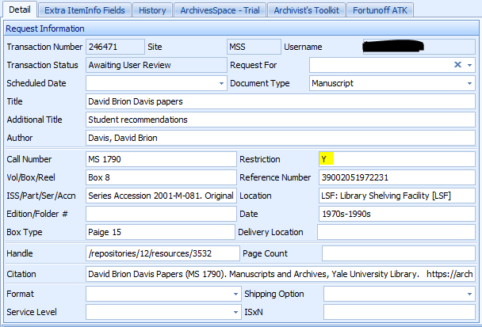
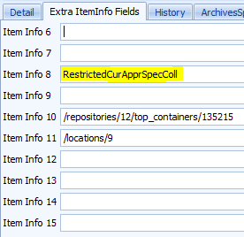

Based on the info in these “iteminfo” fields, items may then be routed
into different Aeon queues, though this varies by repository. For
example: At the Beinecke Library, items with a “Y” in Aeon Field
“iteminfo1” are routed to a separate “New Restrictions” request queue
that is monitored by Access Services staff. Access services staff then
reviews these items and communicates with the patron about access.

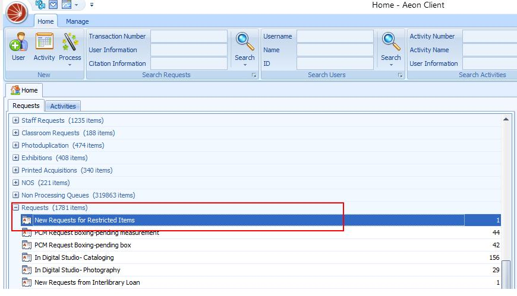

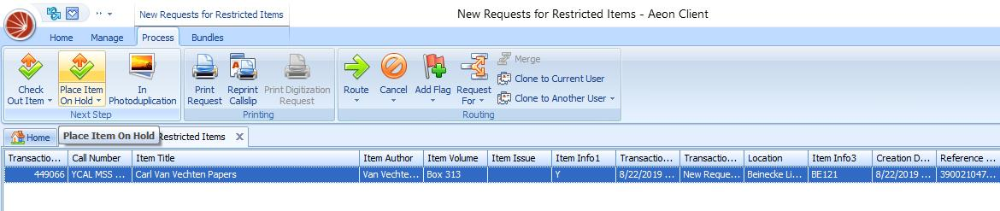

In the User’s Aeon web-view of submitted requests, items with a
machine-actionable restriction will include the note “Restricted
Material” in the “Status” column after the user submits the request (see
red section in screenshot below).

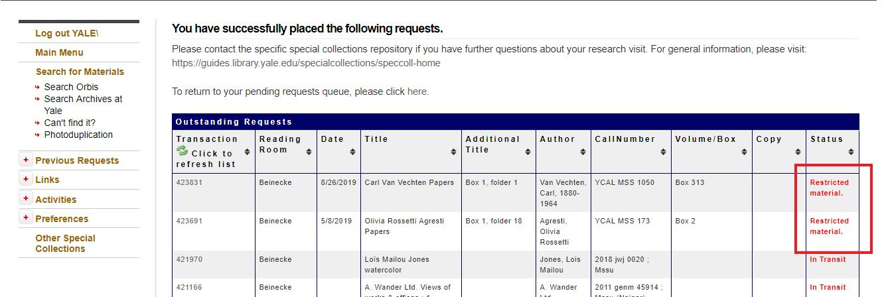

###### Other restrictions and Aeon

Access restriction notes are imported into Aeon and pulled into Aeon
Field “iteminfo5”. These notes are often inherited so do not always
apply to every item.

Use restriction notes are imported into Aeon and pulled into Aeon Field
“iteminfo6”

###### Guidance on requesting new restriction types

YAMS would like to maintain as few restriction type variants as possible
while still accommodating restriction use cases. If the current
restriction types do not meet a repository’s needs, the repository may
request a new restriction type through their YAMS repository liaison. A
repository liaison may propose a new restriction type for approval by
YAMS on behalf of a repository.

Requests for new restriction types should include the following:

- Reason for introducing a new restriction type including:

  - Use cases

  - Reason why existing restriction types are insufficient for use cases

- Translated value (human readable restriction name for the staff
  interface display)

- Suggested guidelines for the use of the restriction type

- Desired relationship with Aeon

#### Finding Aid Data

Bibliographic information about a finding aid for the resource can also
be added to the Resource record. This information is used to identify
and provide bibliographic descriptive data about the finding aid for the
resource and should not be confused with description of the archival
resource itself. Finding aid information is not required for a valid
Resource record by ArchivesSpace, but some fields are required for
export to YFAD.

To add finding aid information to the Resource record:

1.  Select the **Finding Aid Data** section in the Resource record
    template.

2.  Enter information for all pertinent fields, as determined by local
    guidelines (note: after January 2019, users must leave “EAD
    location” blank)

3.  Required fields in this section for the ArchivesSpace system
    include: Language of Description and Script of Description. For most
    Yale finding aids, these will be English and Latin, respectively.
    For finding aids written in a language other than English, the
    appropriate language should be recorded in Language of Description.
    Any finding aid languages with non-Latin scripts should have their
    script indicated in Script of Description.

4.  Click on **Save** or **Save Resource** to save the information as
    part of the Resource record.

5.  Required fields prior to publication in YFAD include: EAD ID,
    Finding Aid Title, and Finding Aid Filing Title.

#### Agent and Subject records

Names of entities (e.g., persons, families, or corporate entities) that
have played a significant role in creating, using, and maintaining the
archival materials are considered the creator of the materials. These
persons, families, or corporate entities may also be represented
topically as subjects of the materials, as may other topical subjects
describing what the materials are about. Lastly, persons, families, or
corporate entities can be defined as sources (i.e. donors) of the
materials.

Terms representing all of these contextual and topical relationships can
be added to the Resource description by linking Agent and Subject
records to it. This will be covered in a later section in this manual.

## Resource Records: Lower-Levels

### Functional overview

ArchivesSpace also supports the creation of Resource records comprising
multiple levels of description, using component records. Resource
component records have the following characteristics:

- Serve to describe the logical or physical parts of a resource that
  make up an aggregation of archival materials.

- Require the following elements:

  - **Level**: chosen from a pick list containing the values class,
    file, item, series, subseries, subgroup, or other level. Note:
    typically you will not use the level values of collection or record
    group for Resource component records, since components are parts of
    a broader resource that will have one of those levels.

  - Either of the following:

    - **Title**

    - **Dates** sub-record (either expression or normalized dates)

Like the Resource record, the Resource component record accommodates
extensive description of the component, including the same support for
Notes sub-records and controlled access headings. You should use the
guidelines for subsequent levels of description in DACS and
repository-specific guidelines to help you determine which of the
available ArchivesSpace fields should be used.

### Creating and managing resource component records

The following are the command functions for navigation and creating
components on the ArchivesSpace Resource template (note: you must open
the Resource record in edit mode to have access to the command functions
that allow you to create components):  
  
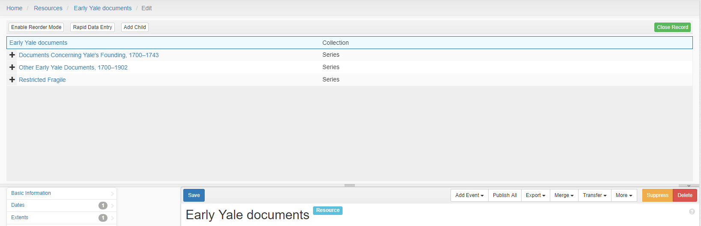

- **Add Child**: This button will open a new component record that is
  hierarchically subordinate to the context record (the record from
  which you use the **Add Child** button).

> Each Child record represents a level of hierarchy. ArchivesSpace will
> support an unlimited hierarchy; however, using numbered components in
> an EAD export requires the hierarchy to be limited to 12 levels.

- **Add Sibling**: This button will open a new component record that is
  at the same level as the context record and that follows the context
  record within the component sequence.

> ArchivesSpace places no limit on the number of sibling records, nor
> does EAD, the primary export option for a resource description in
> ArchivesSpace.

- **Transfer**: You can use this button to transfer a component or a set
  of components from one resource to another.

- **Rapid Data Entry**: This option is for entering a series of
  components at the same level that have very similar data, e.g., level
  of description, instance type, container type, container identifier,
  etc. The Rapid Data Entry option is discussed in greater detail at the
  end of this section.

- Enable Reorder Mode: You can rearrange a multi-level description by
  using this option and then using the cut/paste or Move menus or by
  dragging and dropping. You can:

  - Move a component to a new position within the same level,

  - Promote a component, i.e., move it higher in the hierarchy, or

  - Demote a component, i.e., move it lower in the hierarchy.

> Bear in mind that all components that are children of a component that
> is moved will move with their parent component.

To create a Resource component record, select a context record in the
multi-level description for the component record. The context record
will be the parent record if there are no other component records in the
description, and the only choice will be to create a child component.

#### Creating Resource component records

1.  Select a context record.

2.  Choose either to **Add Child** or **Add Sibling** component record.
    Adding a child component record will be the only option if the
    context record is the top-level Resource record.

3.  A blank component record template will be loaded.

4.  Select a **Level of Description** for the component record.

5.  Enter a **Title**; or alternatively enter a **Date Expression**
    and/or **Begin** date and **End** date for the materials.

6.  Add any additional information warranted for the resource component
    record description.

7.  Save the record by pressing the **Save** command button at the
    bottom right corner of the window.  
      
    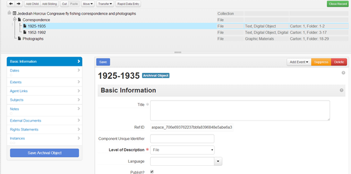

When you add a sub-record, depending on the type of sub-record, specific
fields may be required. If any required information is missing, you will
be prompted to add the required information.

####  Publishing and unpublishing component records

The “Publish this and all children” and “Unpublish all children” menu
items (located under the More drop down menu) allow staff users to
publish and unpublish archival components en masse in the Public User
Interface.

The “Publish this and all children” option publishes the selected
component and all of its children (both direct descendents and inherited
descendents). The option also publishes all notes associated with the
component and its children, with the exception of machine-generated
Preservica notes.

The “Unpublish all children” option unpublishes all the children
components of the selected record (both direct descendents and inherited
descendents). This option does not unpublish the selected component
itself. The option also unpublishes all notes associated with the
component and its children.

Staff should be aware that unpublished notes are indexed in the Public
User Interface. They will therefore be searchable by users, but the note
itself will not display in the Public User Interface.

Note that the publish/unpublish all feature does not publish linked
agent records. There is also no option to reindex a top container via
this feature.

#### Adding Instances to a Resource or Resource component record

"Instances" in ArchivesSpace refer to embodiments of the same content in
different media. For example, a Resource record or Resource record
component may describe a letter which exists in multiple formats:

- Ink on a sheet of paper

- A microfilm image of the letter

- A digital object

The letter is physically represented in three distinct formats.
ArchivesSpace is structured to allow you to use the same description for
multiple instances rather than repeating the description for each new
instance.

Equally important, the instance declaration also enables describing the
containers that house an analog instance, e.g., a folder inside a box.
The container information can then be linked to the Location record
designating where the container is stored, either permanently or
temporarily. For digital objects, the instance record allows you to
describe the digital object and record information about the files that
comprise it, as well as indicate its location on the web or within a
file management system.

In short, the ArchivesSpace instance data model supports assertions of
the following type: the described content exists in a certain physical
format, which is housed in a certain container and located at a certain
place in a repository.

Because archivists typically describe materials at aggregate levels,
instances can be created at any level in ArchivesSpace: collection,
series, file, etc.

Note that digital media, such as a 3.5 inch computer disk or a CD-ROM
that might be part of an archival resource, is not considered to be a
digital object in ArchivesSpace. Digital object records in ArchivesSpace
are intended to describe either digitized surrogates or born-digital
materials that are stored on a server or other digital storage media and
are accessible by staff and/or researchers via a network.

**Adding Instances**

To declare an instance for the content described in a resource or
resource component record:

1.  On the **Instances** bar for the Resource or Resource component
    record, click on **Add Container Instance** if the instance
    declaration is for analog content or on **Add Digital Object** if
    the instance declaration is for digitally available content.  
      
    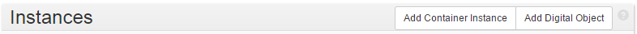

2.  Select the **Type** of instance you wish to declare. You should
    always select “Mixed Materials.”

3.  Next, you’re going to be either creating a container or linking an
    already-created container to this record.

    1.  If you’re adding a new component to a box of materials that
        already exists as part of the collection, simply start typing
        that box number and choose it.

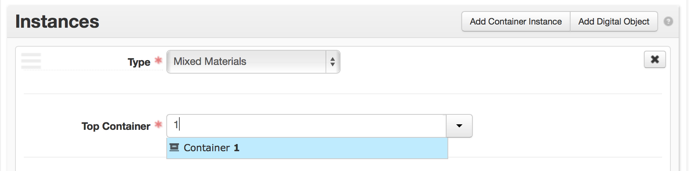

2.  The “top container” refers to the container that circulates and
    usually has a barcode. It’s often useful to add information about
    “children” containers, like folders.

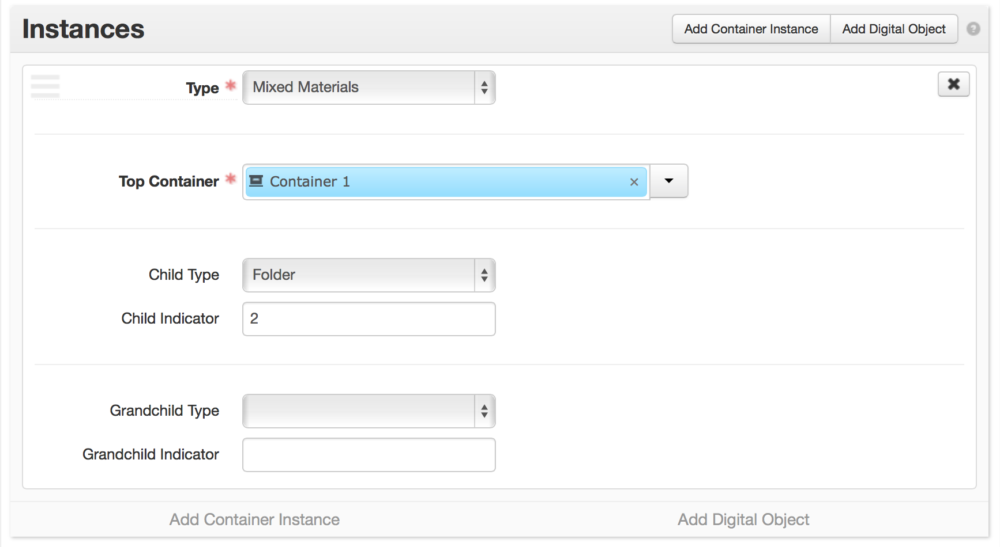

3.  If the box doesn’t already exist in the database, click on the
    triangle at the end of the Top Container data field and choose
    “Create.”  
    **NOTE: Once you’ve created a top container, you won’t need to
    create that same top container again.** For instance, if you’re
    describing Box 1, Folder 1 (and you haven’t described anything else
    in Box 1), you’ll need to create a top container for Box 1. Once you
    describe material in Box 1, Folder 2, you do *not* need to create
    Box 1 again. You can use the typeahead to simply link to Box 1.

> 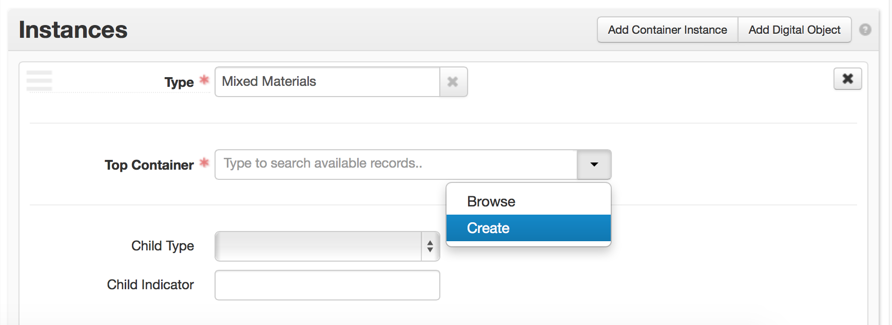 style="width:6.5in;height:2.375in"
> alt="Screen Shot 2015-02-27 at 10.02.17 AM.png" />
>
> You’re then taken to a screen where you can enter information about a
> particular container.
>
> 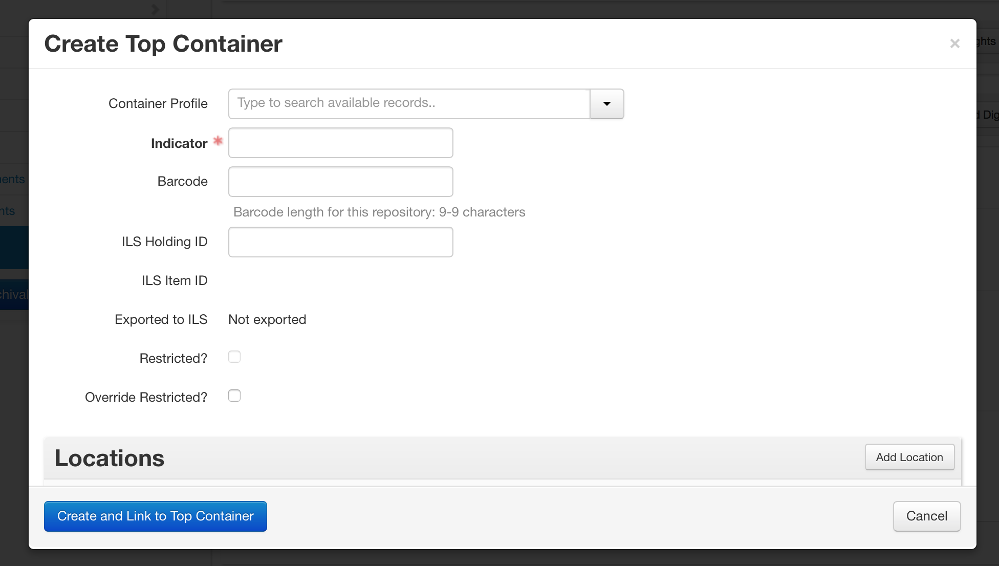 style="width:6.27083in;height:3.59375in"
> alt="Screen Shot 2015-02-27 at 10.14.05 AM.png" />

- **Indicator**: This field is required. It represents the number that
  you assign to a box.

- **Barcode**: This field is optional. It can be entered in this screen
  or as part of rapid barcode entry later, in the “Manage Top
  Containers” view.

- **ILS Holding ID**: This field is optional and is built to help
  synchronize ArchivesSpace containers and ILS item records. It can be
  entered in this screen or as part of bulk operations later, in the
  “Manage Top Containers” view.

- **ILS Item ID** and **Exported to ILS**: These fields cannot be edited
  as part of the application and have the potential to be managed by an
  external program to synchronize ILS item records and ArchivesSpace
  containers.

- **Container Profile:** A container profile is information about the
  physical box itself. You can start typing to choose a container
  profile that already exists, or click the triangle and the “Create”
  button to create one if it doesn’t already exist.

> 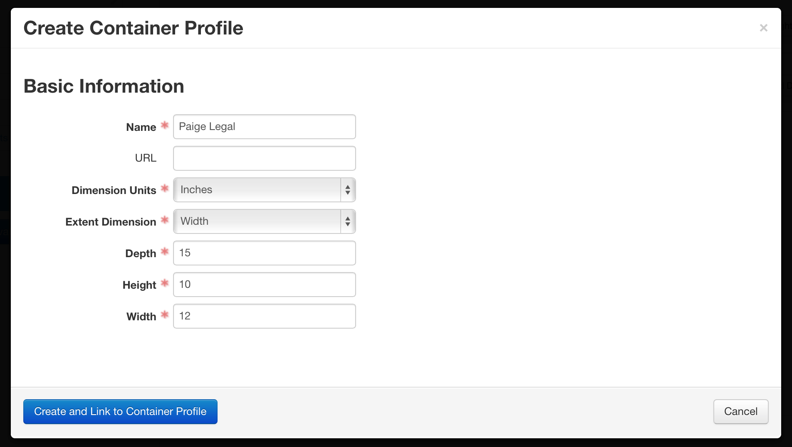 style="width:6.5in;height:3.66667in"
> alt="Screen Shot 2015-02-27 at 10.20.06 AM.png" />
>
> It will be very unusual to create new container profiles unless your
> repository starts using new container types. Usually, in the course of
> your work, you will link to an already-existing container profile.
>
> In this example, you’re describing a Paige miracle box.

- **Name:** You may give a container profile whatever name is most
  > appropriate for your use in your repository, Keep in mind that
  > container profiles are scoped across Yale -- in this case, any
  > repository using a Paige legal box will link to this container
  > profile. Make sure that the nickname gives enough information so
  > that the next user knows what the container type is, but don’t
  > record dimensions in this field -- they belong in other fields.

- **URL:** Do not use at this time. In the future, the data in the rest
  > of this record may be stored as linked data, and the URL will be the
  > only data element needed to populate this record.

- **Dimension Units**: Indicate the unit for how other dimensions are
  > measured. The convention at Yale is to measure in
  > inches.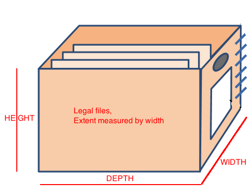 style="width:3.92989in;height:3.00521in" />

- **Extent Dimension**: This indicates how the records in a container
  > are filed, for the purpose of calculating extent. For instance, if
  > you have a normal Paige miracle box filled with legal-sized
  > documents, and the box is shelved with the smallest side facing out,
  > that extent calculation will be measured by width. In other words,
  > this is a way of measuring how many records are in a container -- if
  > records are filed letter in a Paige box, there will be more records
  > than if filed legal.

> At Manuscripts and Archives and the Beinecke, the consensus decision
> has been to measure extent by shelf space occupied. This means that
> the extent dimension will always be width.

- **Depth**: This is a measurement that is relative to shelving, rather
  > than inherent to the container itself. Measure how deep into the
  > shelf the box will measure.

- **Height**: This measures the distance from the bottom of the box to
  > the top of the box.

- **Width:** This is another measurement relative to shelving, and
  > should measure the width of the face of the container as you would
  > see it on a shelf.

When entering the dimensions for Depth, Height, and Width, you may use
no more than two decimal places. If dimension is less than 1, enter 0
followed the rest of the dimension. (Examples: 0.25, 0.5, 0.75, etc.).

To link an existing container profile record, simply start typing
information about that container profile and choose from a list.
Alternately, go to the “Browse” option (under “Create”), and choose the
container profile you want to associate with your top container.

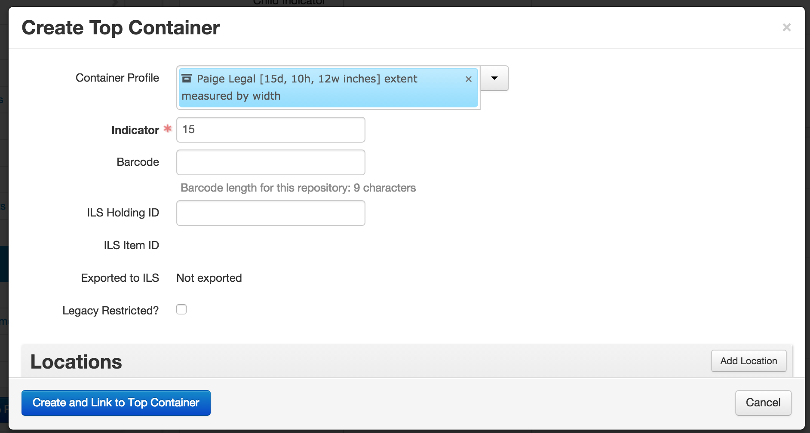

Some repositories file collection material from different collections in
the same container. If you’re adding a new component to a box of
materials that already exists as part of *another* collection, click on
the triangle at the end of the Top Container data field and choose
“Browse.”

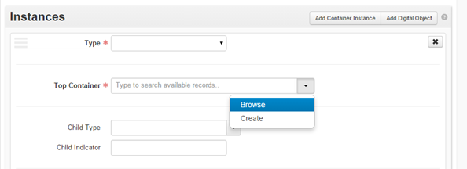

From the Browse Top Container screen search for the resource that
contains the container you want to link to. Select the container from
the results list and click Link to Top Container.

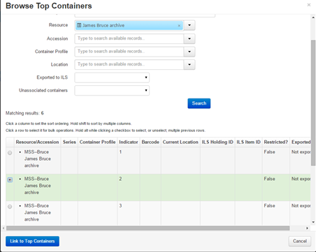

#### Associating Instances with Location records

Once the container information is added, it can be linked to a
**Location** record. To do so:

1.  Scroll down to the bottom half of the Top Container record.

2.  Click on the “Add Location” button.

  
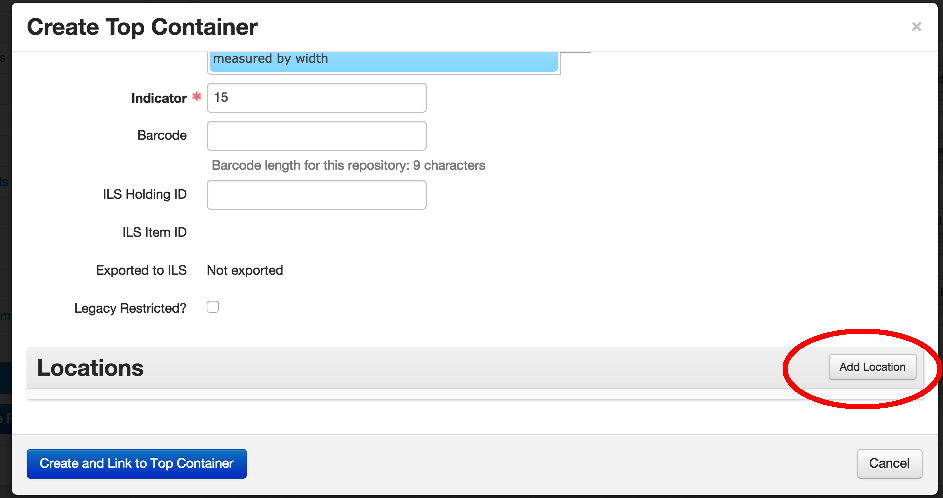

3.  Enter:

1.  Status (required): In almost all cases, the status should be
    “Current”

2.  Start Date (required): The date that this container went to that
    location

3.  End Date: This field is optional. It indicates the date that a
    container is no longer at that location.

> 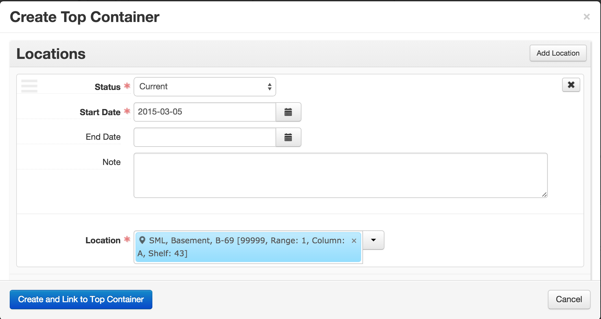 style="width:6.5in;height:3.45833in"
> alt="Screen Shot 2015-03-05 at 11.25.05 AM.png" />

4.  Save the record.

#### Using the Rapid Data Entry (RDE) tool

The **Rapid Data Entry (RDE)** tool supports repeated entry of Resource
component records at the same level, thus requiring fewer mouse clicks
than when adding individual resource component records and then adding
instance records. Through the use of “sticky values” and other
mechanisms, the RDE tool provides a more efficient interface for
entering series or folder lists, where multiple components of the same
level and same basic content are entered one after another. The RDE tool
also includes in one data row fields from the Resource component record,
the Dates sub-record, the Notes sub-record, and the Instance sub-record.

To create Resource component records using the RDE:

1.  Select **Rapid Data Entry** at the top of the multi-level
    description.

2.  Enter desired data. The **Level of Description** element and either
    **Title** or one of the **Dates** sub-record elements is required.

3.  **Instance Type** and at least one **Container Type** and
    **Container Indicator** are necessary if locations are to be linked
    to the Resource component record.

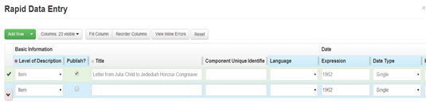

4.  Select **Add Row** to add another row, or use **Shift + Return** to
    add another row using all the data in the previous row.

5.  Select **Validate Rows** to check that all rows are properly
    encoded.

6.  Select **Save Rows** to save the row(s) to the Resource record.

You can do the following to the RDE tool during a given session:

- Remove columns from view using the **Columns: \### visible** display
  configuration option.

- Turn sticky values on and off by clicking on the label for a data
  column.

- Reorder the left-to-right sequence of the data columns using the
  **Reorder Columns** option.

- Designate a value to fill all occurrences within a data column using
  the **Fill Column** option.

## Digital Object Records

### Functional overview

The Digital Object record is the place for technical and administrative
metadata about digital objects.  
  
The Digital Object record can either be single- or multi-level; that is,
it can have sub-components just like a Resource record. Moreover, the
record can represent the structural relationship between the metadata
and associated digital files--whether as simple relationships (e.g., a
metadata record associated with a scanned image, and its derivatives) or
complex relationships (e.g., a metadata record for a multi-paged item;
and additionally, a metadata record for each scanned page, and its
derivatives).  
  
One or more file versions can be referenced from the Digital Object
metadata record.  
  
The Digital Object record can be created from within a Resource record,
or created independently and then either linked or not to a Resource,
Archival Object, or Accession record. Digital Object records are often
created via external processes (e.g. via the Preservica synchronization,
which currently only syncs to Archival Object records). Please note that
editing an ArchivesSpace digital object record created by Preservica
will result in changes to Preservica after a re-synchronization is
performed on the data.

### Creating and managing digital object records

ArchivesSpace requires two elements in a Digital Object record, Title
and Identifier, though you will also need to add a File URI subrecord if
you want an actionable link:

- **Title**

- **Identifier**

**Creating a Digital Object record**

1.  On the main toolbar, click **Create** and select **Digital Object**.

2.  Enter the following information:

> **Title:** The record title the Digital Object is linked to. Note that
> Preservica uses the SIP deliverable unit folder title, and local
> practice may dictate adding something in front of the title (e.g.
> \[Preservica\])
>
> **Identifier:** The identifier from whatever the referenced system
> uses (e.g. for this FindIt example
> \[http://findit.library.yale.edu/catalog/digcoll:845272\] the
> identifier would be digcoll:845272). Note that Preservica-generated
> identifiers are just strings of letters/numbers. For material in
> FindIt, users should use the object identifier (OID) from Ladybird,
> since that identifier will always exist, and the PID from FindIt may
> not.

3.  Click **Save Digital Object**. If any required element is missing,
    you will be prompted to add the information, which you must do in
    order to save the record.

#### Adding further information to a Digital Object record

After the minimum information about a digital object has been entered,
you can continue to describe the digital object using the sub-records
available in the left navigation bar.

When you add a sub-record, depending on the type of record, specific
fields may be required. If any required information is missing, you will
be prompted to add the required information.

Below is a summary of selected additional, optional key data fields
often used in the creation of digital object records. In all cases,
follow your repository’s guidelines and supervisor’s instructions when
creating digital object records.

#### Basic Information

- Title: See above

- Identifier: See above

- Publish?: Indicate whether you would like for the digital object to be
  published in the ArchivesSpace PUI

- VRA Core Level: Do not use

- Type: Do not use. Note that it may be synced automatically from the
  Ladybird “Type of resource” field

- Language: Do not use

- Restrictions?: Do not use. Note that this is not used for archival
  objects at Yale, so YAMS recommends not using it here, either, for
  consistency.

#### File Versions

- Make representative: Do not use. Note that if ArchivesSpace develops
  this feature further, we may wish to reconsider using it at Yale.

- File URI: Required if you wish to have a link out to another system.
  If you wish to have thumbnails or links, you need to indicate the file
  URI here. Note that this is repeatable, but until the "make
  representative" feature works, users should not add multiple file URIs
  aside from when they’re adding a link + thumbnail pair of file URIs.

- Publish?: Indicate whether you’d like the file version and URI
  information published in the ArchivesSpace PUI

- Use Statement: Optionally use to indicate use of the file version,
  e.g., Digital Preservation Staff System (used for Preservica)

- XLink Actuate Attribute: Do not use

- XLink Show Attribute: Select “embed” if you wish to embed a thumbnail
  in the ArchivesSpace PUI

- File Format Name: Do not use

- File Format Version: Do not use

- File Size (Bytes): Do not use

- Checksum: Do not use

- Checksum Method: Do not use

- Caption: Optionally use to indicate a caption. Caption will start
  displaying in version 2.2.3. Note: There is no hover definition.

#### Dates

- Do not use

- Users may notice that Preservica occasionally creates a date
  sub-record for date of Preservica processes

#### Extents

- Do not use

#### Agent Links

- Do not use

#### Subjects

- Do not use

#### Notes

- Optionally use to record a different access restrict note from the
  associated archive object

#### External Documents

- Do not use

#### Rights Statements

- Do not use

#### Collection Management

- Do not use

#### User Defined

- Do not use

## Agent and Subject Records: Authorities Basics

*For guidance on creating agent and subject records, please see the  
[<u>Agent and Subject Records: Best
Practices</u>](https://drive.google.com/open?id=1-x447VQkhPyborBnGkoa1lvxmre7V2K7a1wi10EnHkY)
cheat sheet*

### Authorities overview

According to DACS, “An archival authority record identifies and
describes a personal, family, or corporate body associated with a body
of archival materials; documents relationships between records creators,
the records created by them, and/or other resources about them; and may
control the creation and use of access points in archival descriptions.”

ArchivesSpace automates the management of such authority information by
providing a method to manage authority records -- specifically in the
form of Agent and Subject records -- to one or more Accession, Resource,
Resource component, Digital Object, or Digital Object component records.

For each new finding aid in ArchivesSpace, open (or create) a
corresponding collection-level record in Voyager and verify (or add)
these pieces of information:

- **In Voyager** (035 ‡9 field): the **ArchivesSpace EAD ID**, in this
  format: **(YUL)ead.\[repository id\].\[ead id\]**  
  Examples: 035 ‡9 (YUL)ead.beinecke.livingston or 035 ‡9
  (YUL)ead.divinity.196

- **In ArchivesSpace** (Basic Information section): the **Voyager Bib
  ID**

For all 1xx, 6xx, and 7xx fields in each collection-level catalog
record, either verify that an authorized agent or subject record already
exists in ArchivesSpace, or create a new record in conformance with the
guidelines below.

### Authorities workflows

Changing an authority record changes the record for everyone at Yale
using ArchivesSpace. For this reason, be extremely careful about editing
authority records.

Generally, there are three ways a repository can use the authorities
modules in ArchivesSpace to provide additional description about
accessions, archival resources, and digital objects:

- **Link to a pre-existing authority record:** If an authority already
  exists in the ArchivesSpace application, it can be linked to from new
  or existing Accession, Resource, and Digital Object records.
  (Individual authority records can be linked to zero, one, or many
  records). The editing screens for records provide a linking option --
  and, in the case of Agent records, to specify the role in which the
  authority is linked (for example, as the creator, subject, or source
  of the archival materials).

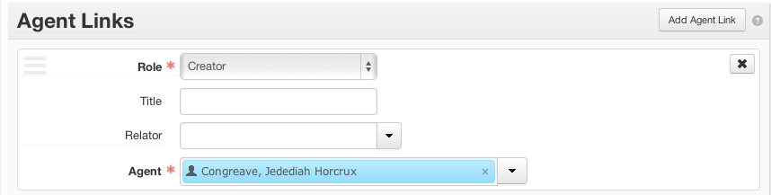

- **Establish a new authority:** If an authority does not exist in the
  database, it can be created, then linked automatically, from within
  the context of a specific Accession, Resource, or Digital Object
  record. You can also use the **Create** menu on the homepage to
  establish a new authority.

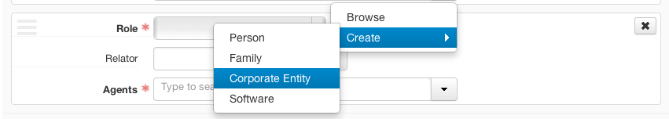

- **Import external authority:** ArchivesSpace includes a plug-in
  application to enable importing of authorities maintained within the
  Library of Congress Name Authorities (LCNAF) file. After name files
  have been imported, they can be linked to Accession, Resource, and
  Digital Object records.

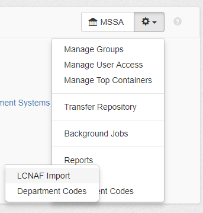

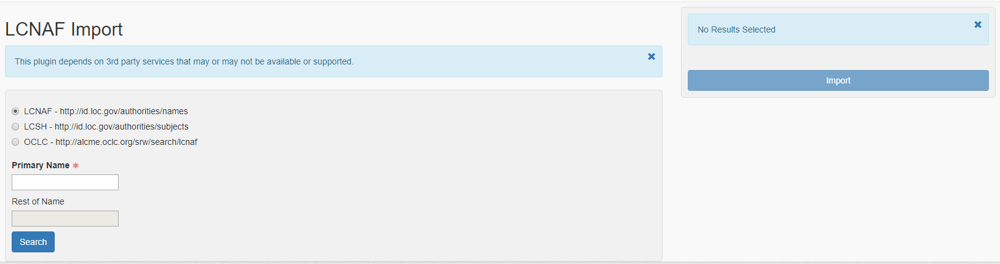

## Agent Records

### Functional overview

Agent records identify persons, families, corporate entities, or
software that have a specified relationship (such as source, creator,
topic, rights owner) to archival materials or to an event. The Agent
record is also used for managing relationships among agents.

Agents are established and controlled separately from accessions and
resource descriptions in ArchivesSpace and are associated with material
descriptions by linking.

Agent records can be associated with Accessions, Resources, and Digital
Objects through one of three primary relational modes:

- **Creator:** Designates the primary responsibility for the origin,
  accumulation, or maintenance of the material being described. Creator
  can encompass, at varying levels in a multi-level description, the
  person, family, or corporate entity responsible for the archival
  provenance of the material being described, or for the intellectual
  content of that same material.

- **Source**: Designates the immediate source of acquisition for the
  materials being described.

- **Subject**: Indicates that the materials being described are
  topically about the named person, family, or corporate entity in some
  respect.

Agent records can be one of four types in ArchivesSpace:

- Person

- Family

- Corporate Entity

- Software

Agent records in ArchivesSpace are designed to conform with the
*International Council on Archives’ International Standard Archival
Authority Record for Corporate Bodies, Persons, and Families*, 2nd
edition (ISAAR(CPF)). They are also designed to support output in the
Encoded Archival Context--Corporate Bodies, Persons, and Families
(EAC-CPF) data structure and interchange standard. If an authority
record cannot be located and copied from an authorities database, agent
records also accommodate the creation of names according to data content
rules established in standards such as Resource Description and Access
(RDA) and DACS. ArchivesSpace users are encouraged to use the DACS rules
for forming names when creating Agent records in ArchivesSpace.

Note: Agent and Subject records linked to collection-level Resource
records are exported to MARCXML. The first one listed exports as main
entry (MARC 1XX); subsequent agents export as added entries (MARC 7XX).
Agent and Subject records linked to Accession records, Resource
component records, and Digital Object component records will not be
exported to MARCXML records.

### Creating and managing Agent records

Changing the content of an Agent record changes it for every link to
that record in every ArchivesSpace repository at Yale. Be extremely
careful when updating Agent records, particularly when attempting to
disambiguate agents with similar names.

The following fields are required for the four types of Agent records:

> **Person**

- **Primary Part of Name** (DACS references 9.8, 11.5, 12.1-12.11)

- **Source** (DACS reference 11.26) or **Rules** (DACS reference 11.20)

- **Sort Name** (automated if selected)

- **Name Order** (default value of “indirect” provided; you may change
  > to “direct”)

> **  
> Family**

- **Family Name** (DACS references 9.8, 11.5, 12.29)

- **Source** (DACS reference 11.26) or **Rules** (DACS reference 11.20)

- **Sort Name** (automated if selected)

> **Corporate Entity**

- **Primary Part of Name** (DACS references 9.8, 11.5, 14)

- **Source** (DACS reference 11.26) or **Rules** (DACS reference 11.20)

- **Sort Name** (automated if selected)

> **Software**

- **Software Name**

- **Source** (DACS reference 11.26) or **Rules** (DACS reference 11.20)

- **Sort Name** (automated if selected)

**Names**

For personal names, the **Primary Part of Name** field serves to
separate the principal sorting element (e.g. the last name or surname)
of the name from the remainder of the name, the latter of which is
generally input into the **Rest of Name** field. Guidance on when to use
the additional fields that are available for an Agent record should come
from the subfields in an authority record for the name found in a
national database such as the LC/NACO Authority File or from a content
standard such as DACS or RDA.

For Family names, the **Family Name** field serves to hold the family
name. Subfields in an existing authority record or rules in a content
standard should guide you in inputting information into the Agent
record's available fields.

For corporate entities, the **Primary Part of Name** field holds the
principal name by which the corporate entity is known. Your content
standard of choice, or the subfields in the authority record for names
already found in an authority file, will provide guidance to help you
determine how and when to enter a corporate name subordinately using the
**Subordinate Name** fields in the Agent record.

For software, the **Software Name** field serves to hold the name of the
software.

**Source**

**Source** is the data field used to indicate that a name has been found
in a standard authority file. Five default values are provided in a
drop-down menu:

- **Local sources (e.g. Local - Arts)**: Designates an authority file
  created and maintained at your repository.

- **LC/NACO Authority File**[2]

- **Union List of Artist Names**[3]

- **Unspecified ingested source**: If names are imported in Accession or
  Resource records, the **Source** field will contain this value to flag
  the record for review to assure it is the authoritative form of the
  name.

This list may be customized and additional values added by the
repository, or in the process of importing legacy data.

**Rules**

**Rules** is the data field used to indicate the data content standard
used to formulate the name entry. You should only use the Rules field
when you have not found the name in an existing authority file, in which
case you should use the Source field instead.

Four default values are provided in a drop-down menu:

- **Resource Description and Access**

- **Anglo-American Cataloging Rules**[4]

- **Describing Archives: a Content Standard**

- **Local rules**: Designates a data content standard created and
  maintained by your repository

This list may be customized and additional values added by the
repository, or in the process of importing legacy data.

**Sort Name**

Sort Name is the data field that contains the complete, concatenated
version of the name containing all individual elements. This is the form
of the name that will be shown within ArchivesSpace displays and is
exported in reports and standardized outputs such as MARCXML and EAD.

#### Creating Agent records

The directions here are for constructing an **Agent** record for a
**Person**. Follow these same basic instructions for **Family** and
**Corporate Entity** records--any variants specific to those types will
appear below. Before you begin, search in [<u>LC Linked Data
Service</u>](http://id.loc.gov/) or [<u>Union List of Artist
Names</u>](http://www.getty.edu/research/tools/vocabularies/ulan/index.html)
to see if your Person/Family/Corporate Entity has an authorized record,
and use that data to populate the subfields in the record you create. If
there is no authorized record, construct an agent record using [<u>RDA
rules</u>](https://access.rdatoolkit.org/).

The fields in ArchivesSpace agent records map to Library of Congress
Name Authority MARC fields referred to in the directions below. Do not
enter punctuation or parentheses at the end of subfields; all
punctuation will be supplied by ArchivesSpace. Be sure you do not leave
any blank spaces at the end of the subfields.

To begin, click “Create” and choose the record types from the two
dropdown menus:

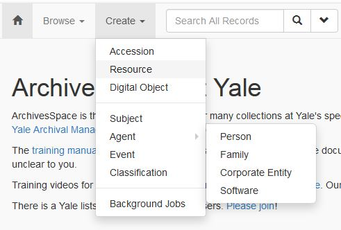

The “New Person” screen will appear with the following fields:

> **Basic Information**
>
> Leave defaults shown.
>
> **Dates of Existence**
>
> Optional; use primarily if an authorized name lacks life dates. To
> add, click the **Add Date** box on right and a form will appear. For
> **Type** choose **Range**
>
> 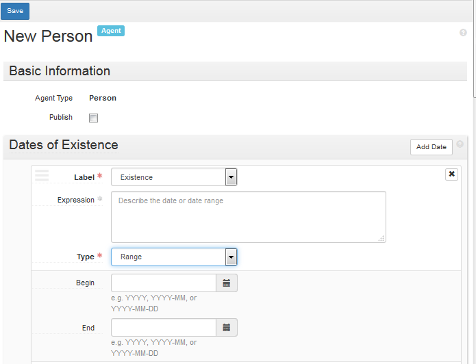 style="width:3.47619in;height:2.66146in" />
>
> and enter dates (LCNAF 046 ‡f ‡g for personal names, or LCNAF 046 ‡s
> ‡t for family and corporate names) in fields **Begin** and/or **End**.
>
> **Name Forms**
>
> Required.
>
> **Authority ID**: required, if available from [<u>LC Linked Data
> Service</u>](http://id.loc.gov/); URI is found near the top of the
> entry
>
> 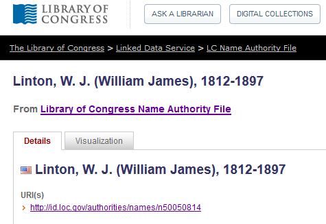 style="width:3.46354in;height:2.38438in" />
>
> To find the URI for a
> [<u>ULAN</u>](http://www.getty.edu/research/tools/vocabularies/ulan/index.html)
> record, click **Semantic View** on the left above the name
>
> 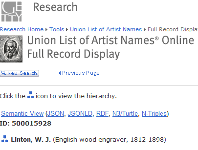 style="width:3.47396in;height:2.63335in" />
>
> which opens another screen with the URI up at the top
>
> 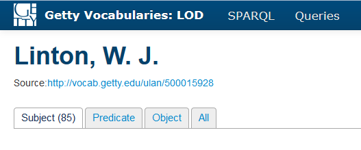 style="width:3.44666in;height:1.43229in" />
>
> **Source**: required; choose **Library of Congress Name Authority
> File**, **Union List of Artist Names**, or appropriate **local library
> code** if not in either authorized source.
>
> **Rules**: choose **Resource Description and Access** if Source is a
> local library code; otherwise leave blank.
>
> **Name Order**: required; choose **Indirect** for Person unless the
> person has a single name (then choose **Direct**).
>
> **Primary part of name**: required. Use LCNAF 100 ‡a **for family
> (surname) only**
>
> **Rest of Name:** Use LCNAF 100 ‡a **for forename or initials only**
>
> Required when applicable:

- **Title**: LCNAF 100 ‡c

- **Fuller Form**: LCNAF 100 ‡q

- **Number**: LCNAF 100 ‡b

- **Dates**: LCNAF 100 ‡d

> All other Name Forms elements: leave blank.
>
> Check **Automatically generate** at end of field.

*Example of Person with Library of Congress authorized record:*

> 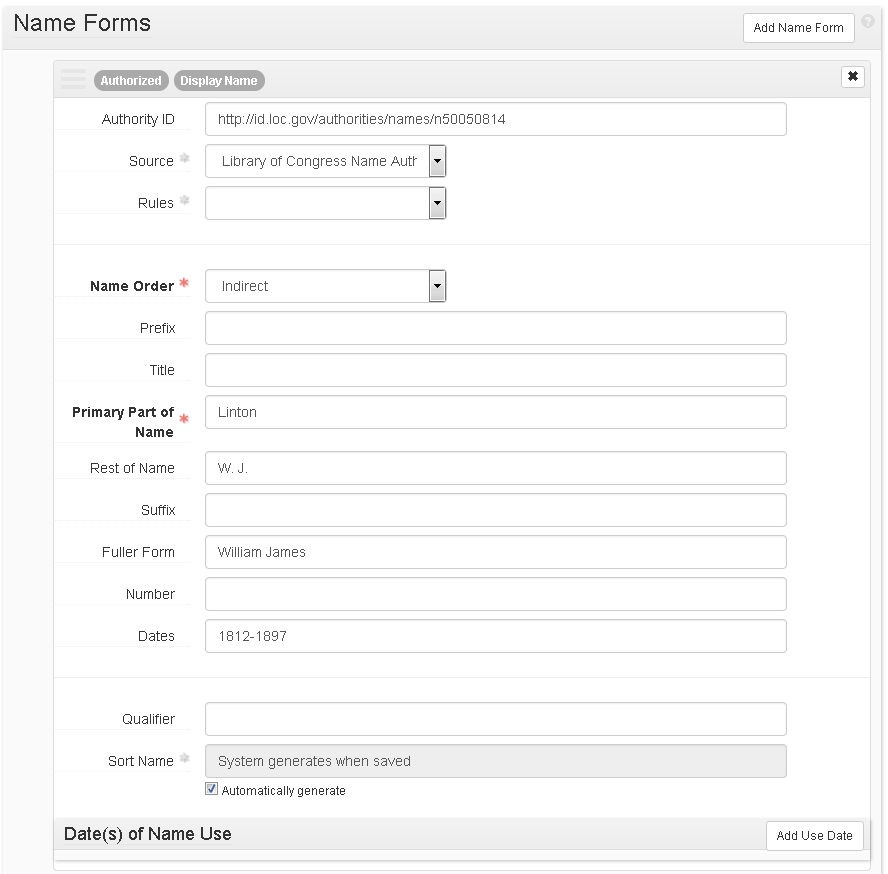 style="width:3.97927in;height:3.92188in" />
>
> **Contact Details**
>
> Optional; to add click **Add Contact** button at right, and enter
> fields manually, per local practice.
>
> 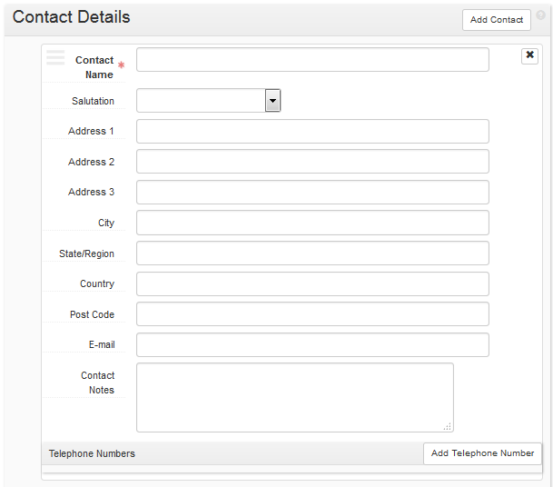 style="width:3.48438in;height:3.07498in" />
>
> **Notes - Biographical/Historical**
>
> Optional, except when creating an Agent record for a Yale staff member
> or student worker who will be adding or editing ArchivesSpace records.
>
> **Biography/Historical** note with the person’s YUL affiliation,
> including dates of service if known, followed by a semicolon and the
> person’s NetID. Do not check **Publish.**

*Example of YUL Staff Person:*

> 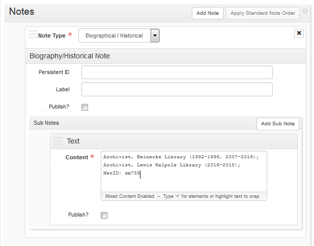 style="width:3.51142in;height:2.77604in" />
>
> **Other fields**
>
> Generally, do not use.

For **Family** agent records:

> **Name Forms**
>
> 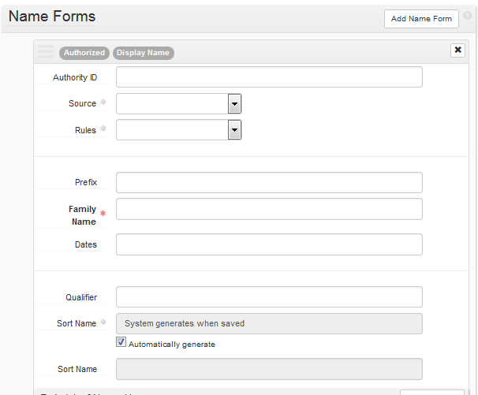 style="width:3.48148in;height:2.89063in" />
>
> Required name element: **Family Name**: LCNAF 100 ‡a
>
> Required when applicable:

- **Dates**: LCNAF 100 ‡d

- **Qualifier**: LCNAF 100 ‡c, ‡g

For **Corporate Entity** agent records:

> **Name Forms**
>
> 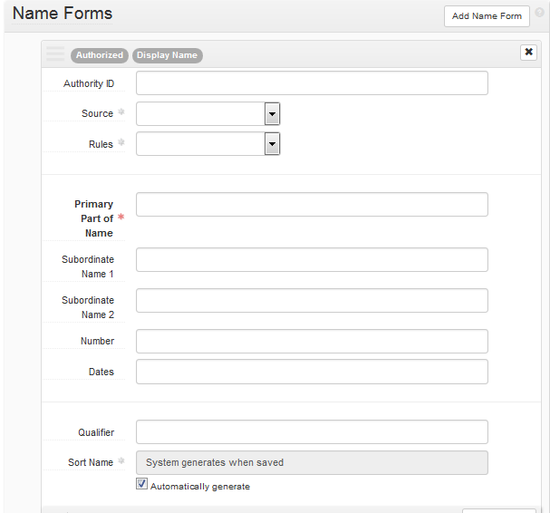 style="width:3.45181in;height:3.23438in" />
>
> Required name element: **Primary Part of Name**: LCNAF 110 ‡a
>
> Required when applicable: **Subordinate Name** 1 and 2: LCNAF 110 ‡b
>
> All other name elements: blank

For **Corporate Entity (conference)** agent records:

> **Name forms**
>
> Required name elements: **Primary Part of Name**: LCNAF 111 ‡a
>
> Required when applicable:

- **Subordinate Name** 1 and 2: LCNAF 111 ‡e

- **Number**: LCNAF 111 ‡n

- **Dates**: LCNAF 111 ‡d

- **Qualifier**: LCNAF 111 ‡c

> All other name elements: blank

For **YUL repository** agent records:

> **Name forms**
>
> Required name element: **Primary Part of Name**: LCNAF 110 ‡a
>
> Required when applicable: **Subordinate Name** 1 and 2: LCNAF 110 ‡b
>
> All other name elements: blank
>
> **Contact Details**
>
> Fill out form with address, email address, and telephone number from
> the library’s website.
>
> Save the Agent record by pressing the **Save Person | Family |
> Corporate Entity | Software** command button at the bottom of the
> record. If entering more than one Agent record, save the record by
> pressing the **+1** command button. This will save the current record
> and open a new Agent record screen so a subsequent record can be
> entered.

If you are already working in an Accession or Resource record:

1.  On the left navigation bar, click **Agent Links** and then click
    **Add Agent Link**.

2.  Next to **Role**, click the drop-down list button, and select the
    role of the agent in relation to the accession or resource you are
    linking it to: Creator, Source, or Subject.

3.  Add a value for **Relator**, if you want for Creator or Source. Do
    not add a value for **Relator** for subjects

4.  Next to Agent, either start typing to see if the desired agent
    already exists, or click on the drop-down list and select Browse to
    browse existing Agent records.

5.  If you know there is no record for your agent, or you cannot find
    one when you type or browse, click on **Create**, and select Person,
    Family, Corporate Entity, or Software, depending on what type of
    Agent record you wish to create. Follow instructions for Creating
    Agent records.

> **Note**: When working within Accession, Resource, Resource component,
> Digital Object, and Digital Object component records you can link to
> an existing name record or create a new name record that you wish to
> associate with that material, without having to exit the Accession,
> Resource, Digital Object, etc. record.

##  Subject Records

### Functional overview

Subject records are used to control information about topics, geographic
names, genre and form terms, occupations, functions, and uniform titles
that serve as important access points to facilitate discovery of the
materials being described. These records are established and controlled
separately from resource descriptions in ArchivesSpace and are
associated with accession, resource, and digital object descriptions by
linking.

The terms that serve as access points for collection materials function
most effectively when derived from broadly shared standard thesauri or
controlled vocabularies such as the *Library of Congress Subject
Headings* (LCSH)[5] or the Art and Architecture Thesaurus (AAT).[6] The
output formats (e.g., EAD, MARCXML) that you generate from your resource
descriptions in ArchivesSpace will be much more effective if you utilize
standard thesauri or controlled vocabularies to select terms. Document
your usage locally so that you can apply common terms, as appropriate,
in a consistent manner across all of your resource descriptions.

Subjects can be one of 10 types in ArchivesSpace:

- Cultural context

- Function

- Genre/form

- Geographic

- Occupation

- Style/period

- Technique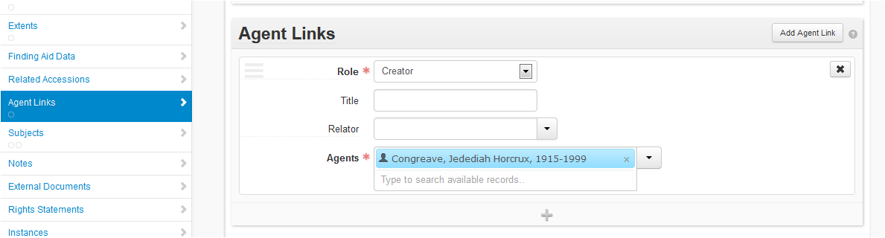

- Temporal

- Topical

- Uniform title

Personal, family, and corporate names that are used as subjects are
managed as Agent records in ArchivesSpace; therefore a name type is not
an option within Subject records.

Subject records can be linked to Accession records, Resource records,
Resource component records, Digital Object records, and Digital Object
component records in order to provide subject and other types of
controlled vocabulary access to those materials at all appropriate
levels of granularity and at whatever points in local repository
workflows this type of description is done.

Note: as with Agent records, Subject records linked to Accession
records, Resource component records, and Digital Object component
records will not be exported to MARCXML records.

You or someone at your repository should be familiar with the rules for
using the specific thesaurus, authority file, or controlled vocabulary
(data value standards) from which you derive subject and controlled
vocabulary records. Appendix B in DACS, provides a helpful list of the
primary data value standards used by archivists doing archival
description in the U.S.

### Creating and managing Subject records

Subjects are shared across Yale repositories using ArchivesSpace. This
means that updating a subject heading in your repository will affect
everyone else referencing that subject -- please be extremely careful
when creating and editing subjects.

ArchivesSpace requires three elements in a Subject or other controlled
vocabulary record:

- **Subject Source**: Choose from a drop-down list. This list indicates
  the thesaurus or controlled vocabulary from which the subject term was
  selected.

- **Term:** Open text field. Use this field to indicate the subject
  heading or controlled vocabulary term or phrase describing the
  content, coverage, or resource type of the materials.

- **Subject Type:** Choose from a drop-down list. This indicates the
  type of term being recorded (e.g., function, genre/form, geographic
  name, occupation, topic, uniform title).

#### Creating a Subject record

The directions here are for constructing a **Subject** record for a
**Topical** subject**.** Follow these same basic instructions for
**Occupation**, **Geographic**, **Preferred Title**, and **Genre**
records--any variants specific to those types will appear below. Before
you begin, search in [<u>LC Linked Data Service</u>](http://id.loc.gov/)
or [<u>Art & Architecture
Thesaurus</u>](http://www.getty.edu/research/tools/vocabularies/aat/index.html)
to see if your subject or genre has an authorized record, and use that
data to populate the subfields in the record you create. If there is no
authorized record, construct a subject record using local rules.

The fields in ArchivesSpace Subject records map to Library of Congress
Subject Heading MARC fields referred to in the directions below. Do not
enter punctuation or parentheses at the end of subfields; all
punctuation will be supplied by ArchivesSpace. Do not leave any blank
spaces at the end of the subfields.

1.  If you are already working in an Accession or Resource record: on
    the left navigation bar, click **Subjects**, and then click **Add
    Subject**. Click the drop-down list button, and then click
    **Create**.

> If you are starting from ArchivesSpace home: on the main toolbar,
> click **Create** and select **Subject**.

2.  **Authority ID:** optional. If available, use a URI from [<u>LC
    Linked Data Service</u>](http://id.loc.gov/) or [<u>Art &
    Architecture
    Thesaurus</u>](http://www.getty.edu/research/tools/vocabularies/aat/index.html)**.**

3.  **Source**: required. Choose **Library of Congress Subject
    Headings**, another thesaurus code, or appropriate Yale Library
    local code (at the end of the list) from the drop-down menu.

*Note: For LCSH subjects with free-floating subdivisions:*

1.  *Code as local, using the appropriate local code*

2.  *For LCSH subjects with subdivisions, record an Authority ID only if
    the entire heading, with subdivisions, has been established*

> *(example: [<u>Carrots ‡x Diseases and
> Pests</u>](http://id.loc.gov/authorities/subjects/sh85020482.html)).*

3.  *Also create a second **New Subject** without free-floating
    subdivisions*

<!-- -->

4.  Enter the required **Term** and **Subject Type** information. For
    the required **Term** information, use LCSH 150 ‡a, or local term.
    For the required **Type** information**,** use the default,
    **Topical**

5.  If the Subject record includes a term subdivision, click **Add
    Term/Subdivision** and enter information for the **Term** and
    **Subject Type** for the subdivision. You can add additional
    subdivisions as needed.

    1.  The **Add Term/Subdivision** is optional and repeatable

        1.  **Term**: LCSH 150 ‡x, ‡z, ‡y, ‡v, or local term

        2.  **Type**: use one of the following:

            1.  LCSH 150 ‡x: Topical

            2.  LCSH 150 ‡z: Geographic

            3.  LCSH 150 ‡y: Chronological

            4.  LCSH 150 ‡v: Genre

6.  Click **Save Subject**. If any required element is missing, you will
    be prompted to add the information.

**Create new subject: Occupation**

> **Terms and Subdivisions**
>
> **Term**: required: LCSH 150 ‡a, or local term
>
> **Type**: required: choose **Occupation**
>
> **Add Term/Subdivision**: optional and repeatable
>
> **Term**: LCSH 150 ‡y, ‡z, or local term
>
> **Type**: choose **Geographic** or **Chronological**

**Create new subject: Geographic**

> **Terms and Subdivisions**
>
> **Term**: required: LCSH 151 ‡a, or local term
>
> **Type**: required: choose **Geographic**
>
> **Add Term/Subdivision**: optional and repeatable
>
> **Term**: LCSH 151 ‡v, ‡x, ‡y, ‡z, or local term
>
> **Type**: choose **Genre, Topical**, **Geographic**,or
> **Chronological**

**Create new subject: Preferred title**

> **Terms and Subdivisions**
>
> **Term**: required: LCSH 130 ‡a through ‡t, or local term
>
> **Type**: required: choose **Preferred title**
>
> **Add Term/Subdivision**: optional and repeatable
>
> **Term**: LCSH 130 ‡v through ‡z, or local term
>
> **Type**: choose **Genre, Topical**, **Geographic**,or
> **Chronological**

**Create new subject: Genre**

> **Terms and subdivisions**
>
> **Term**: required: choose term from
> [<u>AAT</u>](http://vocab.getty.edu/) or other thesaurus, or local
> term
>
> **Type**: required: choose **Genre**
>
> **Add Term/Subdivision**: optional and repeatable
>
> **Term**: local term
>
> **Type**: choose appropriate term

**External Documents sub-records**

Generally, do not use **External Documents**.

This sub-record allows links to external documentation that discusses
how a particular **Subject** record is to be used.

- **Title**: Open text field. The title of an external document. The
  document may be of any form or content such as a web accessible file,
  a network accessible file, or a file on the same computer as the
  application.

- **Location**: Open text field. The location of the file, ideally a
  resolvable URI. Example:
  http://www.archivesspace.org/membershipfile:///c:/path/to/the%20file.txt

- **Publish**: Select or clear the check box. A selected check box
  indicates that this External Document should be published to the
  Public User Interface.

## Assessment Records

### Functional overview

Assessment records contain information about the quantitative and
qualitative condition of surveyed material, its readiness for
reformatting, housing, physical arrangement, intellectual access, and
research value. This allows users to rank the material’s needs relative
to the needs of other surveyed materials. Assessment can occur at
various points in the life cycle of an archival collection and for many
reasons.

Assessment records can be linked to Accession, Resource, Resource
Component, and Digital Object records. Assessment records can be linked
to a single record or to multiple records.

The possible linkages are as follows:

- Assessment to Accessions (one to many)

- Assessment to Resources (one to many)

- Assessment to Archival Objects (one to many)

- Assessment to Digital Objects (one to many)

**Required elements**

Assessment records must contain a link to an Accession, Resource, or
Resource Component, or Digital Object record, and must record who the
material was surveyed by and the date the survey began. All other fields
and ratings are optional.

### Creating a Minimal Assessment Record

There are two ways to create an assessment record: from within the
Assessment module and from within the record of something being
surveyed.

**To create an assessment record from within the Assessment module**

1.  On the main toolbar, click Create and select Assessment.

**To create an assessment from within the record of something being
surveyed**

1.  Select the More button and choose Create Assessment:

> 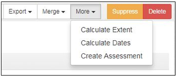 style="width:3.78125in;height:1.65625in" />

2.  ArchivesSpace requires three elements for an ArchivesSpace valid
    assessment record: a link to the records being assessed, a link to
    the Agent who did the surveying, and the date the survey began.
    These document only that the assessment occurred; you will likely
    wish to enter other elements as needed.

    - **Link to other records** (required): A link to the resource(s),
      accession(s), resource component(s), or digital object(s) that are
      the subjects of the assessment.

    - **Surveyed By** (required): Name(s) of the person(s) who performed
      the assessment. This field is restricted to those with user
      records in ArchivesSpace

    - **Survey Begin Date** (required): The date the survey began, in
      yyyy-mm-dd format.

3.  Click **Save Assessment**. If any required element is missing, you
    will be prompted to add the information.

#### Adding Additional Information to an Assessment Record

After the required information about an assessment has been entered, you
can continue to record information about the assessment using the
additional fields listed below. Which fields you use and how you enter
the data is subject to the policies and procedures of your individual
repository.

**Existing description**

This section consists of check boxes you can use to record the existing
types of description present for the materials being surveyed. The
existing description notes field is free text and allows you to enter
any further information on existing description for the materials.

**Survey Information**

This section consists of information about the survey itself.

- **Surveyed By** (required): Name(s) of the person(s) who performed the
  assessment. This field is restricted to those with user records in
  ArchivesSpace

- **Survey Begin Date** (required): The date the survey began, in
  yyyy-mm-dd format.

- **Survey Completed Date** (recommended): The date the survey ended, in
  yyyy-mm-dd format.

- **Time it took to Complete Survey**: The time it took to complete the
  survey, measured in hour increments.

- **Extent Surveyed**: The extent of the materials that were surveyed,
  which may or may not be the same as the extent of individual
  accession, resource, or object.

- **Review Required**: Indicates if review is required for the
  collection because of its format, subject matter, or circumstances.

- **Who Needs to Review**: Indicates who needs to perform the review.
  This field is restricted to those with user records in ArchivesSpace.

- **Review Note**: Explanation of the outcome of any special review.

- **Purpose of Assessment**: Indicates the reason the assessment was
  undertaken. Examples: conservation priorities; processing priorities;
  appraisal; etc.

- **Scope of Assessment**: Indicates the scope of the assessment.
  Examples: 10% sampling; entirety; a particular format or genre within
  or across collections; or other constraints or conditions on materials
  actively reviewed during an assessment.

- **Sensitive Material?**: Indicates whether sensitive materials are
  present.

- **Inactive**: Indicates if the Assessment record is no longer
  considered “active” and thus should not be included in searches or
  reports.

**Assessment Information**

All ratings are accompanied by an optional note field that can be used
to record further information. Definitions for all rating values are
available by clicking the question mark icon next to the field title.
The definition of the fields in the rollover tooltips is configurable by
repository to accommodate local practice (see
[<u>https://github.com/archivesspace/archivesspace/blob/5e1ca66f1f04f142f2695024efb7200825046325/common/locales/LOCALES_README.md</u>](https://github.com/archivesspace/archivesspace/blob/5e1ca66f1f04f142f2695024efb7200825046325/common/locales/LOCALES_README.md)).
An additional ten ratings may be defined by an administrator using the
Manage Assessment Attributes function. See the Lyrasis ASpace manual for
more details: [<u>Manage Assessment
Attributes</u>](https://docs.archivesspace.org/Content/AssessManage.htm)

**Documentation Quality**: A rating from 1 to 5 that applies to the
richness and depth of documentation available in a collection.
Interest + Documentation Quality create the "Research Value" score.

1.  1: Slight

2.  2: Incidentally valuable

3.  3: Moderately rich

4.  4: Rich

5.  5: Very rich

**Housing Quality**: A rating from 1 to 5 intended to describe the
overall quality of housing of the materials in a collection; items or
groups of materials within a collection may be in better or poorer
housing than what the overall rating indicates.

1.  Collection housed in non‐archival boxes, might have items loose on
    the shelf. Majority of material is not in folders and/or boxes are
    too full or not full enough. For bound volumes, binding is in poor
    condition, lacking boards or otherwise compromising the text block.

2.  Collection housed in non‐archival boxes and folders. Significant
    number of boxes and folders might have unreasonable amount of
    material in them or are not the correct size and type for the
    materials they house. For bound volumes, binding is in fair
    condition (boards might be detached).

3.  Collection housed in non‐archival boxes and folders but they are in
    good condition. Most boxes and folders have reasonable amount of
    material in them. Most boxes and folders are correct size and type
    for the materials they house. For bound volumes, binding is in good
    condition (somewhat the worse for wear yet intact).

4.  Collection housed partially in acid‐free boxes and folders in good
    condition. Most boxes and folders have reasonable amount of material
    in them. Most boxes and folders are correct size and type for the
    materials they house. For bound volumes, binding is in very good
    condition (expected wear).

5.  Collection housed completely in acid‐free boxes and folders in good
    condition. Boxes and folders have reasonable amount of material in
    them. Boxes and folders are correct size and type for the materials
    they house. For bound volumes, binding is in excellent condition.

**Intellectual Access** (description): A rating from 1 to 5 that applies
to a collection's intellectual description and the accessibility of that
description to users.

1.  Researcher has no access to collection: Internal documentation such
    as a donor/control file or brief or inaccessible accession record
    serves as the only description of the collection. While such
    internal documentation may vary in quantity and quality, by its
    nature it is inaccessible to researchers.

2.  Researcher has poor access to collection: Collection has no finding
    aid or a substandard finding aid. The collection has printed catalog
    cards or another type of offline collection‐level description, but
    no collection‐level MARC record in the OPAC or a national
    bibliographic utility. The collection has a MARC record in the OPAC
    or national bibliographic utility, but that record does not provide
    sufficient access because the collection is large or complex. In
    either case, the collection may be described in other online or
    offline sources available to researchers, but because of the
    complexity of the collection or the inadequacy of the sources, this
    provides insufficient access.

3.  Researcher has fair access to collection: The finding aid is
    substandard or there is no finding aid. There is a collection‐level
    MARC record for the collection in the institution’s OPAC and/or in a
    national bibliographic utility such as OCLC. In the absence of a
    full MARC record, there is another type of online collection‐level
    description. The collection‐level description in online or offline
    sources available to researchers provides sufficient access because
    it is a small or straightforward collection.

4.  Researcher has good access to collection: There is a good finding
    aid, but it is not available online. There is a collection‐level
    MARC record for the collection in the institution’s OPAC and/or in a
    national bibliographic utility such as OCLC. There is a good finding
    aid, online or offline, but there is no collection‐level MARC record
    for the collection in the institution’s OPAC and/or in a national
    bibliographic utility such as OCLC. Given the quality of the finding
    aid, the finding aid alone provides good access. In both cases, the
    collection may also be described in other online or offline sources
    that are available to researchers.

5.  Researcher has excellent access to collection: There is a good
    online finding aid (EAD, HTML, PDF, or other format). There is a
    collection‐level MARC record for the collection in the institution’s
    OPAC and/or in a national bibliographic utility such as OCLC. The
    collection may also be described in other online or offline sources
    that are available to researchers (such as a printed or online guide
    to collections).

**Interest**: A rating from 1 to 5 that indicates researcher, donor, or
local interest in the materials. Interest + Documentation Quality create
the "Research Value" score.

1.  Negligible

2.  Slight

3.  Moderate

4.  High

5.  Very high

**Physical Access** (arrangement): A rating from 1 to 5 that applies to
a collection’s physical arrangement, taking into account the complexity
and size of collection. For example, a small, relatively homogenous
collection in rough order is generally more physically accessible than a
large, heterogeneous collection in rough order, and the ratings will
reflect that fact. (Note that arrangement to the item level may not be
desirable for many collections; a rating of 4 may be the top rating that
is desirable for a collection.)

1.  Totally unarranged; many, sometimes most, documents not yet removed
    from envelopes, unfolded, and flattened. Completely inaccessible to
    researcher.

2.  Partial or superficial arrangement and/or non‐standard housing and
    labeling discourage use except with special staff assistance.

3.  Rough arrangement by date, document type, function, source, or other
    characteristic; papers not thoroughly screened, but have been
    unfolded and flattened; series not fully established; files not
    fully established; researchers often must work through voluminous
    extraneous material to locate pertinent items. Single volumes might
    have had more than one use, or have items pasted in or otherwise be
    somewhat disorganized.

4.  Arrangement in series to file level. There is generally good order
    within the files. Single volumes are orderly (i.e. an account book
    in alphabetical order or a neat scrapbook in thematic order).

5.  Full arrangement to item level in series and, as appropriate,
    subseries. Single volumes are orderly and indexed (i.e.
    chronological accounts with a name index).

**Physical Condition**: A rating from 1 to 5 intended to describe the
overall condition of the materials in a collection; items or groups of
materials of particular concern will be indicated in the conservation
note.

1.  Poor: Significant damage/deterioration that makes collection
    difficult to use.

2.  Fair: Somewhat worse than expected deterioration with some further
    deterioration possible.

3.  Good: Expected deterioration with some further deterioration
    possible.

4.  Very good: Little damage with some further deterioration possible,
    due to the mixed quality of the material.

5.  Excellent: Little damage with very slow or minimal further
    deterioration expected, based on the high quality of the material.

**Reformatting Readiness**: A rating from 1 to 5 that indicates how
easily materials can be reformatted.

1.  Materials would be extremely difficult to reformat. They might have
    serious conservation issues, be in an obsolete format with no
    available technology to recover the file or information, or have
    intellectual property concerns that restrict reformatting. Metadata
    might be missing or incomplete.

2.  Materials would be difficult to reformat. They might have
    conservation issues, be in an obsolete format with no readily
    available technology to recover the file or information, although
    the technology still exists, or have some intellectual property
    concerns. Metadata might be missing or incomplete.

3.  Materials would be moderately easy to reformat. They may have some
    conservation issues, be in an obsolete format with readily available
    technology to recover the file, or have minimal intellectual
    property concerns. Metadata is present or could be created easily.

4.  Materials would be relatively easy to reformat. Conservation issues
    are minor, formats are not completely obsolete and are easily
    migrated to current formats with readily available technology, or
    there are minimal intellectual property concerns. Metadata is
    present.

5.  Materials could be reformatted with no difficulty. There are no
    conservation issues, formats are recent or current, and technology
    is readily available to recover or convert files, or there are no
    intellectual property concerns. Metadata is present and complete.

**Research Value**: Research value is automatically calculated by adding
the Documentation Quality + Interest scores. Because this field is
automatically calculated and cannot be edited, it does not appear on the
edit assessment form. It will appear on the view assessment page
whenever the Documentation Quality and/or Interest scores have been
entered.

**List of Material Types / Formats**

In addition to the fifteen available specific formats and the ‘other’
option in the format checkboxes, an additional twenty formats may be
defined by an administrator using the Manage Assessment Attributes
function.

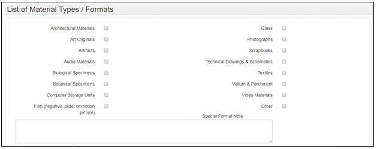

**Special Format Note**: Additional or explanatory information about the
special formats present.

**Exhibition Value Note**: Indicates whether the collection itself or
individual items found in the collection might be especially appropriate
for exhibition. For example, this field might note a unique artifact or
a letter or photograph of historical significance.

**Monetary Value**: Appraised or estimated market value of the assessed
materials (numerical value).

**Monetary Value Note**: Indicates who provided the monetary value, date
of appraisal, and any other relevant information.

**Conservation Issues**

In addition to the nine available conservation issue checkboxes, an
additional twenty conservation issues may be defined by an administrator
using the Manage Assessment Attributes function.

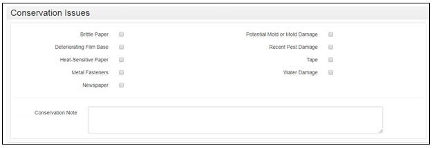

**Conservation Note**: Indicates areas of particular concern with regard
to the physical condition of the collection.

#### Viewing an Assessment Record

There are two ways to view an assessment record: from the main menu and
from within the record of something that has been surveyed.

**From the main menu**

On the main toolbar, click **Browse** and select Assessments. Search,
sort, and/or filter to find and select the assessment you wish to view.
Click the **View** button to see the record.

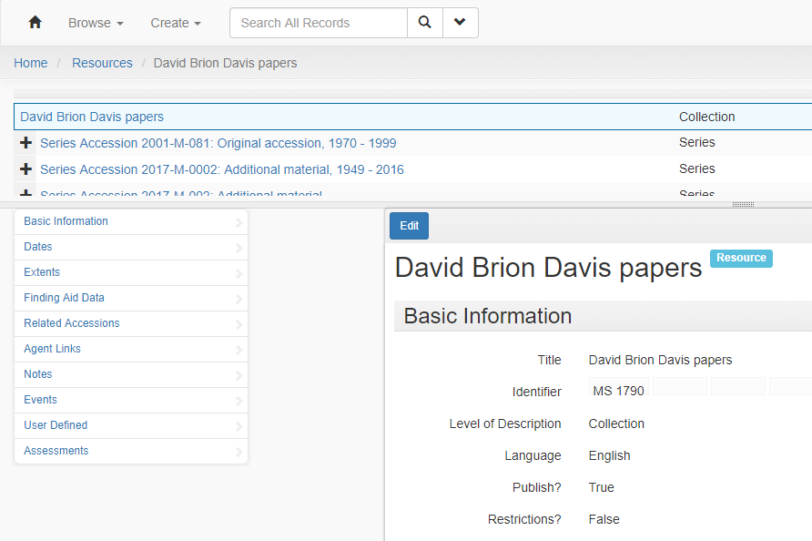

**Viewing an assessment record from within an accession, resource,
archival object, or digital object record**

From within a record, click **Assessments** in the left-hand
navigational column. This will bring you to a list of all linked
assessments. Clicking **View** will take up a the assessment record.

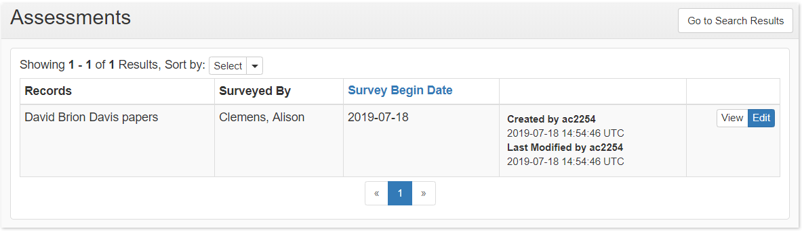

This will bring up a list of all linked assessments. Clicking **View**
will take you to the assessment record.

#### Deleting an Assessment Record

Find the assessment record(s) you want to delete. You can browse or
search.

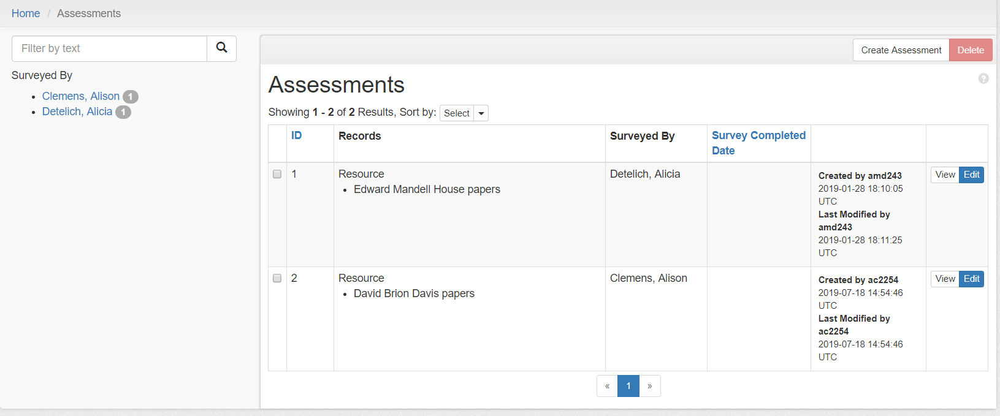

From the results screen, you may delete an assessment in two ways.

1.  Click the checkbox next to the assessment(s) you wish to delete. A
    checkmark will appear in the box for the assessments selected.

2.  Click the **Delete** button in the upper right corner.

3.  You will be asked confirm your intention to delete the assessment
    record(s). Click **Delete Records** to delete the record(s) and
    **Cancel** to return to the list without deleting.

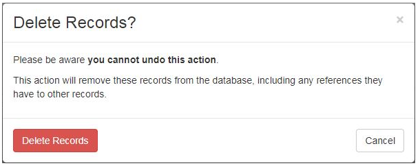

or

1.  Click the **View** or **Edit** button for the assessment you wish to
    delete.

2.  From the Assessments Toolbar, click **Delete**.

> 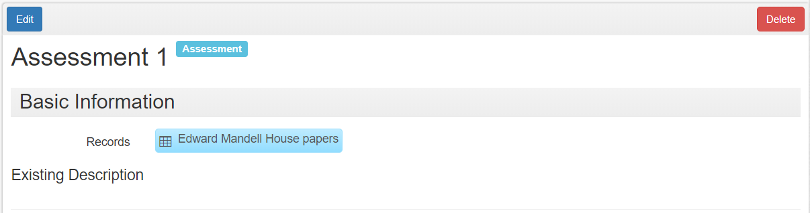 style="width:6.5in;height:1.70833in" />

3.  You will be asked confirm your intention to delete the resource
    record. Click **Delete** to delete the record and **Cancel** to
    return to the list without deleting.

#### Transferring an Assessment Record

If an assessment's only linked record is transferred to another
repository, the assessment is also moved to the target repository.

If an assessment has more than one linked record, and not all of the
linked records are transferred to another repository, the assessment is
duplicated in the target repository.

In either case, if additional Assessment Attributes (ratings, material
types/formats, or conservation issues) are present in an assessment in
one repository, the exact same rating, material type/format, or
conservation issue must also be present in the new target repository for
the field to transfer.

#### Managing Assessment Attributes

To add additional ratings, formats, or conservation issues, you must be
logged in as a System Administrator. System administrators may also
choose to grant permissions to create/update/delete repository
assessment attributes definitions to other user groups using the Manage
Groups function.

1.  Use the Select Repository option to select the repository for which
    you want to manage assessment attributes.

2.  Click on the **Settings** button next to the repository name and
    then choose the Manage Assessment Attributes option.

3.  Within the Manage Assessment Attributes page, you can add up to ten
    additional Ratings, twenty additional Material types/formats, and
    twenty additional Conservation Issues. Navigate to the Repository
    section at the bottom of each list and click the green **+** button
    to add additional fields. You can also delete additional fields by
    clicking the red **X** button.

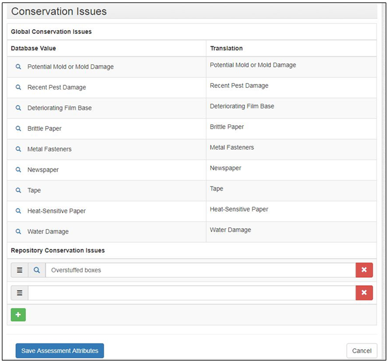

4.  Click **Save Assessment Attributes**.

**Viewing associated records from the Manage Attribute Assessments
page**

You can view any records associated with a particular rating, material
format/type, or conservation issue by clicking on the magnifying glass
icon to the right of the field name.

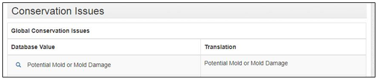

#### Assessment Reports

There are two types of reports associated with Assessments module, the
Assessment Rating Report and the Assessment Record List. **Note that
“inactive” records do not appear in reports.**

The Assessment Rating Report allows you to choose a date range (if
desired), a rating type, a rating range, and a report format (JSON, CSV,
HTML, PDF). Only global repository ratings values are available in this
report.

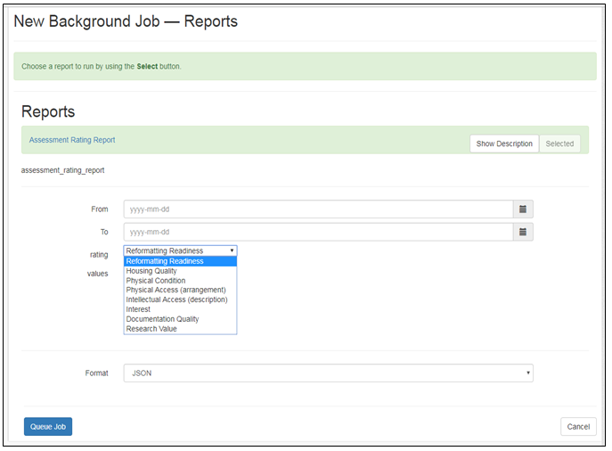

Once you have selected a rating type, you can select values for the
ratings you wish to report on.

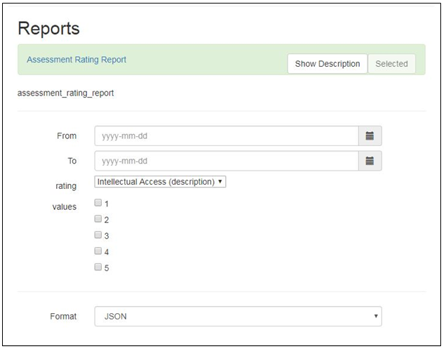

The Assessment Record List allows you to choose a date range (if
desired), and a report format (JSON, CSV, HTML, PDF). This report
returns all fields in all assessment records, except those marked
“inactive”.

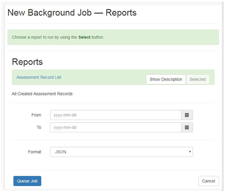

#### Importing Assessment Records Using a CSV Template

The CSV template for importing assessment records into ArchivesSpace is
available at
[<u>https://github.com/hudmol/archivesspace/tree/assessment-module/backend/app/exporters/examples/assessment</u>](https://github.com/hudmol/archivesspace/tree/assessment-module/backend/app/exporters/examples/assessment).

**Basic information**

**Record link**: This field will create the link to the collection. In
order for the link to work, the entry must be in the format of the
ArchivesSpace id. You can find this at the top of the browser bar.

Example: For MSSA MS 1790, the ArchivesSpace id is resource_3532

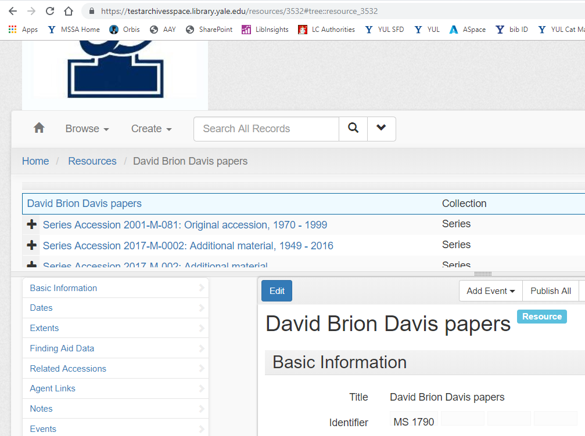

**Accession link**: This field will create the link to an accession. In
order for the link to work, the entry must be in the format of the
ArchivesSpace id. You can find this at the top of the browser bar.

Example: For MSSA accession 2017-M-0002, the ArchivesSpace id is
accessions/22314

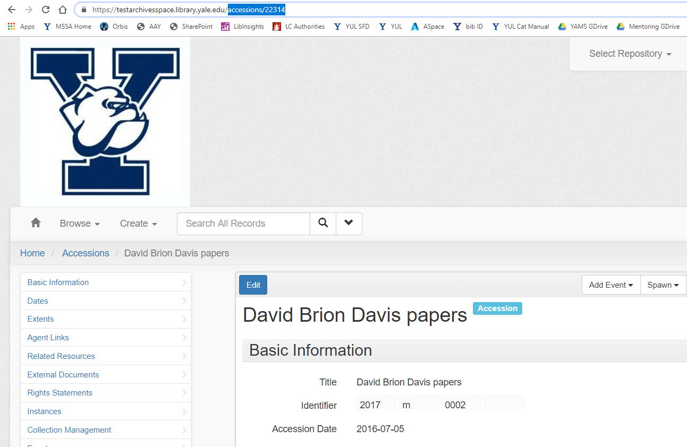

Other fields can be filled out according to the guidelines on the
[<u>ArchivesSpace Assessment CSV Import
Template</u>](https://github.com/archivesspace/archivesspace/blob/master/backend/app/exporters/examples/assessment/README.md).
Aside from the link to an Accession, Resource, or Object record, the
Surveyed by, and the Date the survey began fields, no fields are
required; anything without data may be left blank. If you have created
additional Assessment Attributes, those may be added to the csv import.
Remember to add the relevant header information (basic, rating, format,
conservation) as well as the field title.

## Linking Records

### Functional overview

Linking records adds to the description and assists in the management of
archival materials. For example, linking Agent and Subject records to a
Resource record helps reveal the context and content of the archival
materials. These linked headings also provide access headings to data
format exports such as EAD, MARCXML, and METS records.

In addition, linking Top Container and Location records to the Resource
record facilitates retrieving and reshelving the archival material
without having to rely on another tool external to ArchivesSpace.
Linking one or more Accession records to a Resource record helps to
document the acquisition and processing of the resource, while linking
one or more Digital Object records to an Accession or Resource record
indicates the relationship of the digital object content to a larger
aggregate of materials.

Linking records also makes data management easier. For example, one
Agent or one Subject record can be linked numerous times to a Resource
record or to numerous Resource records. Modifying the linked Agent
record or Subject record means the changes will appear in all places in
the ArchivesSpace implementation where the record is linked. This
technique also reduces the chance of errors and variations being
introduced into the data due to multiple re-keying of the same data. The
linked Agent or Subject record also provides a collocation point in the
ArchivesSpace Public User Interface; it allows users to browse by name
or subject.

Linkable records may be recorded and linked as part of the process of
constructing an Accession, Resource, or Digital Object record. Removing
a link to a linked record simply removes its relationship to a given
Accession, Resource, or Digital Object record. The linked record’s other
links, or relationships, will remain intact. In contrast, deleting a
linked record--an Agent or Subject record, for example--will delete
relationships it has to all other records.

<table>
<colgroup>
<col style="width: 62%" />
<col style="width: 37%" />
</colgroup>
<tbody>
<tr class="odd">
<td><strong>Context Record</strong></td>
<td><strong>Can Link to Record Type</strong></td>
</tr>
<tr class="even">
<td>Accession, Resource, Resource Component, Digital Object, Digital
Object Component</td>
<td>
Agent

Subject
</td>
</tr>
<tr class="odd">
<td>Accession, Resource, Resource Component</td>
<td>Digital object</td>
</tr>
<tr class="even">
<td>Accession, Resource, Resource Component</td>
<td>Top Container</td>
</tr>
<tr class="odd">
<td>Accession</td>
<td>Resource</td>
</tr>
<tr class="even">
<td>Agent</td>
<td>Agent</td>
</tr>
</tbody>
</table>

### Creating and managing links

**Linking to Agent records**

To link Agent records to Accession, Resource, Resource component,
Digital Object, and Digital Object component records:

1.  In the context record, click on the **Agent Links** option in the
    record navigation pane or scroll to the Agent Links part of the
    record.

2.  Click on the **Add Agent Link** option which will open a new link
    template at the bottom of the list of linked agents.

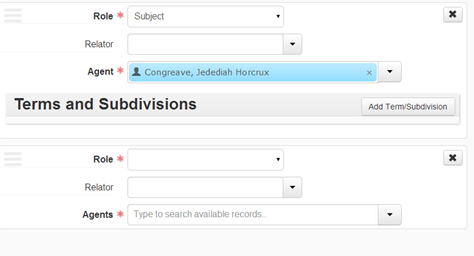

3.  In the **Role** field (required), indicate if the agent is linked to
    the materials as Creator, Source, or Subject.

4.  In the **Relator** field, select any term that better specifies the
    nature of the role the agent has to the materials.

5.  In the **Agents** field, indicate the Agent record that is to be
    linked to:

- You can begin to type the agent name in the **Agent** field and then
  select a match.  
    
  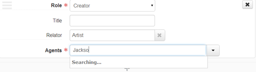

- Or Browse the list of available Agent records to find a match. Select
  the matching record and then click on **Link to Agents** to link the
  Agent record to the context record.

- Or create a new Agent record if the one you require is not in the
  list. (Refer to the section on **Agent records** for instructions on
  creating a new Agent record).  
    
  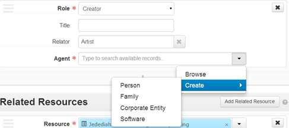

6.  If desired, add **Terms and Subdivisions** for Agents linked as
    Subjects.

7.  Click on **Save** to save the context record with the new link to an
    Agent record.

**Editing or updating a link to an Agent record**

1.  In the context record, find the agent link that is to be updated.

2.  Change values for the **Role**, **Title,** or **Relator** fields.

3.  Click on **Save** to save the context record with the updated agent
    link.

**Removing a link to an Agent record**

1.  In the context record, find the agent link that is to be deleted.

2.  Click on the **X** in the upper right corner of the Agent record
    link.

3.  Click on the **Confirm Removal** option to remove the link, or on
    the **Cancel** option to retain the link.  
      
    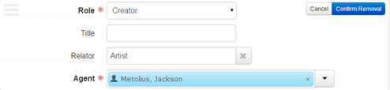

4.  Click on **Save** to save the context record with the agent link
    removed

**Linking to Subject records**

To link Subject records to Accession, Resource, Resource component,
Digital Object, and Digital Object component records:

1.  In the context record, click on the **Subjects** option in the
    record navigation pane or scroll to the Subjects part of the record.

2.  Click on the **Add Subject** option which will open a new link
    template at the bottom of the list of linked subjects.  
      
    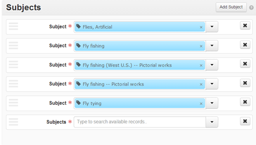

3.  In the **Subjects** field, indicate the Subject record that is to be
    linked to:

- You can begin to type the subject term in the **Subject** field box
  and then select a match.

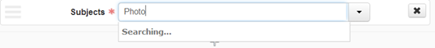

- Or browse the list of available Subject records to find a match.
  Select the matching record and then click on **Link to Subjects** to
  link the Subject record to the context record.

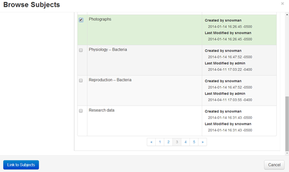

- Or create a new Subject record if the one you require is not in the
  list. (Refer to the section on **Subject records** for instructions on
  creating a new Subject record).  
    
  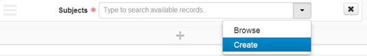

4.  Click on **Save** to save the context record with the new link to a
    Subject record.

**Removing a link to a Subject record**

1.  In the context record, find the subject link that is to be deleted.

2.  Click on the **X** in the upper right corner of the Subject record
    link.

3.  Click on the **Confirm Removal** option to remove the link, or on
    the Cancel option to retain the link.

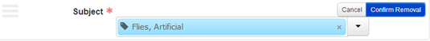

4.  Click on **Save** to save the context record with the subject link
    removed.

**Linking to Digital Object records**

The Yale Archival Management Systems Committee is working on guidelines
for digital objects module of ArchivesSpace (as of spring 2018). Please
contact your ArchivesSpace liaison with questions.

To link Digital Object records to Accession, Resource, or Resource
Component records:

1.  Click on the **Instances** option in the record navigation pane or
    scroll to the Instances part of the record.

2.  Click on the **Add Digital Object** option which will open a new
    link template at the bottom of the list of linked instances.  
      
    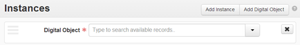

3.  In the **Digital Object** field, indicate the Digital Object record
    that is to be linked to:

- You can begin to type the digital object title in the Digital Object
  field and then select a match.  
    
  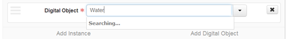

- Or browse the list of available Digital Object records to find a
  match. Select the matching record and then click on **Link to Digital
  Objects** to link the Digital Object record to the context record.  
    
  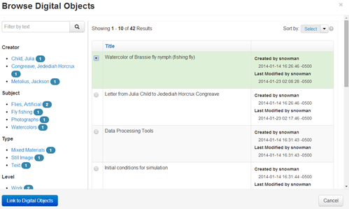

- Or create a new Digital Object record if the one you require is not in
  the list.

4.  Click on **Save** to save the context record with the new link to a
    Digital Object record.

**Removing a link to a Digital Object record**

1.  In the context record, find the Digital Object record link that is
    to be deleted.

2.  Click on the **X** in the upper right corner of the Digital Object
    record link.

3.  Click on the **Confirm Removal** option to remove the link or on the
    **Cancel** option to retain the link.  
      
    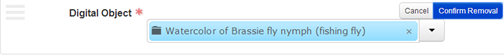

4.  Click on **Save** to save the context record with the digital object
    link removed.

**Linking to Location records**

You can link Top Containers associated with Accessions and Resource
components to locations individually or in bulk.

To link Top Containers to Locations in individually or in bulk see
Update Locations in the Managing Top Containers section. It is generally
advisable to link to locations via the Manage Top Container plug-in as
this is the more efficient method.

To link Top Containers individually from within an Accession or Resource
component records:

1.  Click on the **Instances** option in the record navigation pane or
    scroll to the Instances part of the record.

2.  Click on the container to which a Location record is to be linked.
    This will display a **View** button. Click on the **View** button.

> 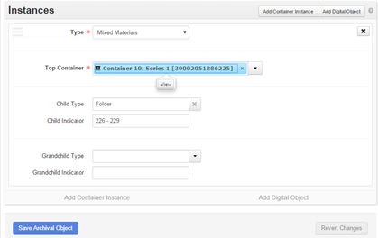 style="width:5.23438in;height:3.29803in" />

3.  This will take you to the Top Container record. Click the **Edit**
    button in the upper left of the window.  
    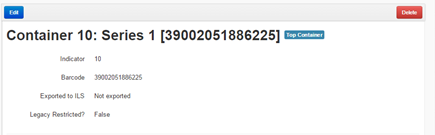

4.  Click on the option to **Add Location** in the container record
    template, which will open a location link template.  
      
    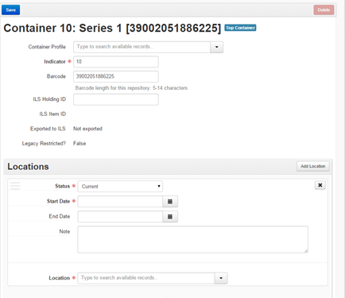

5.  In the **Status** field, indicate if the location is the current
    location for the material described or a previous location.
    “Current” is the default value.

6.  In the **Start Date** field, indicate when the materials were
    shelved at the location.

7.  In the **End Date** field, indicate when the materials stopped being
    at the location, if warranted. This field will typically be used to
    indicate the end of temporary locations.

8.  In the **Note** field, add a note appropriate to the location for
    the described materials, for instance, that the materials were
    relocated to their permanent location.

9.  In the **Location** field, indicate the Location record that is to
    be linked to:

- You can begin to type the location in the **Location** field and then
  select a match.  
    
  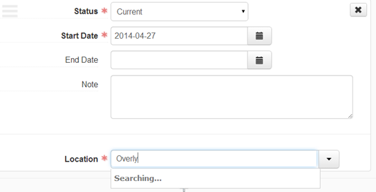

- Or browse the list of available Location records to find a match.
  Select the matching record and then click on **Link to Locations** to
  link the location to the context record.  
    
  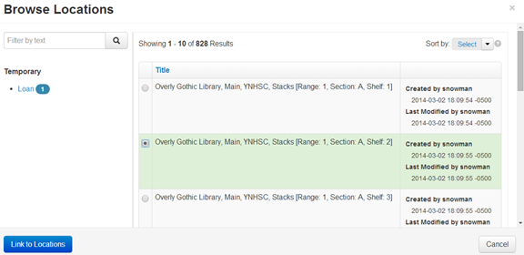

- Or create a new Location record if the one you require is not in the
  list. (Refer to the section on **Location records** for instructions
  on creating a new Location record).  
    
  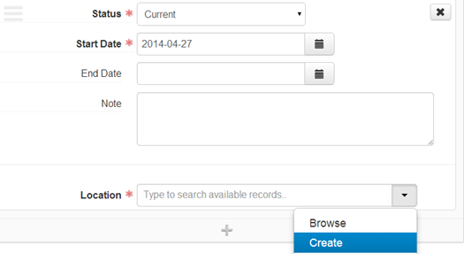

10. Click on **Save Top Container** to save the record with the new link
    to a Location record.

**Removing a link to a Location record**

1.  In the context record, find the Location record link that is to be
    deleted.

2.  Click on the **X** in the upper right corner of the Location
    template.

3.  Click on the **Confirm Removal** option to remove the link, or on
    the **Cancel** option to retain the link.  
      
    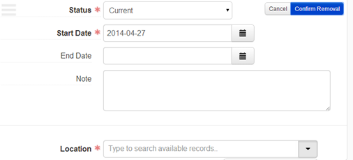

4.  Click on **Save** to save the context record with the location link
    removed.

**Linking Accession and Resource records**

An Accession record can be linked to one or more Resource records, and,
reciprocally, a Resource record can be linked to one or more Accession
records.

To link an Accession record to a Resource record:

- Click on the **Related Resources** option in the record navigation
  pane of an Accession record or scroll to the Related Resources part of
  the record.

- Click on the **Add Related Resource** option which will open a new
  link template at the bottom of the list of linked Resource records.  
    
  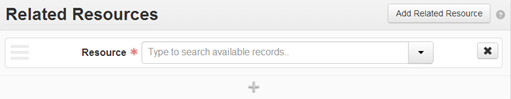

- In the **Resource** field, indicate the related Resource record that
  is to be linked to:

<!-- -->

- You can begin to type the resource title in the **Resource** field and
  then select a match.  
    
  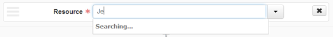

- Or browse the list of available Resource records to find a match.
  Select the matching record and then click on **Link to Resources** to
  link the Resource record to the Accession record.  
    
  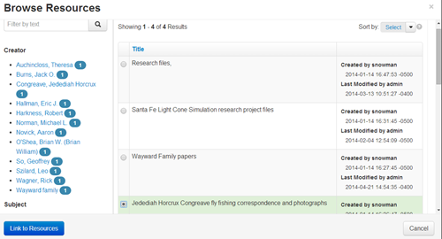

- It is not permitted to create a new Resource record at this point. But
  you can exit the Accession record and create a new Resource record and
  then return to the Accession record to link the Resource record. Or
  you can spawn a new Resource record from the Accession record, to
  which the Resource record will be automatically linked.

<!-- -->

- Click on **Save** to save the Accession record with the new link to a
  Resource record.

**Removing a link to a Resource record**

1.  In the Accession record, find the Resource record link that is to be
    deleted.

2.  Click on the **X** in the upper right corner of the Related
    Resources template.

3.  Click on the **Confirm Removal** option to remove the link, or on
    the **Cancel** option to retain the link.  
      
    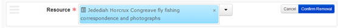

4.  Click on **Save** to save the Accession record with the related
    resource link removed.

**  
To link a Resource record to an Accession record:**

1.  Click on the **Related Accessions** option in the record navigation
    pane or of a Resource record or scroll to the Related Accessions
    part of the record.

2.  Click on the **Add Related Accession** option, which will open a new
    link template at the bottom of the list of linked Accession
    records.  
      
    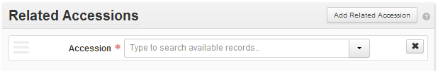

3.  In the **Accession** field, indicate the related Accession record
    that is to be linked to:

- You can begin to type the accession title in the **Accession** field
  > and then select a match.  
  >   
  > 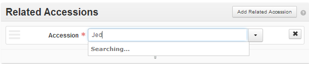 style="width:5.48958in;height:1.14815in" />

- Or you can browse the list of available Accession records to find a
  > match. Select the matching record and then click on **Link to
  > Accession** to link the Accession record to the Resource record.

- You cannot create a new accession record at this point. But you can
  > exit the Resource record and create a new Accession record and then
  > return to the Resource record to establish a link between it and the
  > Accession record. (Or you can link the new Accession record to the
  > Resource record.)

4.  Click on **Save** to save the Resource record with the new link an
    Accession record.

**Removing a Link in a Resource to an Accession record**

1.  In the Resource record, find the link to the Accession record that
    is to be deleted.

2.  Click on the **X** in the upper right corner of the Related
    Accessions template.

3.  Click on the **Confirm Renewal** option to remove the link, or on
    the **Cancel** option to retain the link.  
      
    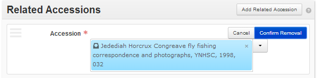

4.  Click on **Save** to save the Resource record with the related
    accession link removed.

> \*\*Do not remove the link by deleting the Accession record. That will
> remove the accession record from the database and all links to it will
> be deleted.

**An Accession record can be linked to one or more Accession records.**

To link an Accession record to another Accession record:

- Click on the **Related Accessions** option in the record navigation
  pane of an Accession record or scroll to the Related Accessions part
  of the record.

> Click on the **Add Related Accessions** option which will open a new
> link template at the bottom of the list of linked Resource records.  
> 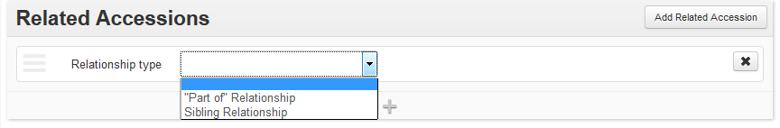 style="width:5.6138in;height:0.92664in" />

- **Relationship type:** Choose from drop-down list. The options are
  > “Part of” relationship and Sibling relationship. Once the type is
  > selected three required fields will be displayed.

> 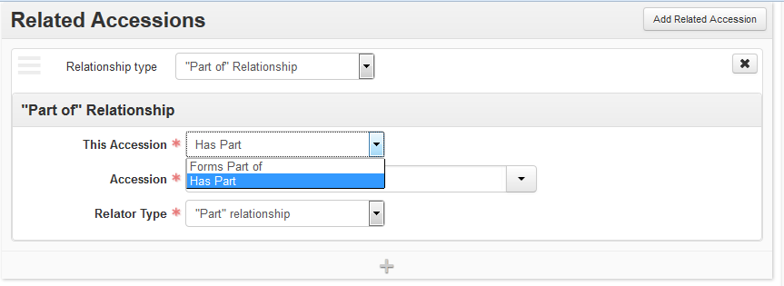 style="width:5.53337in;height:2.01617in" />
>
> 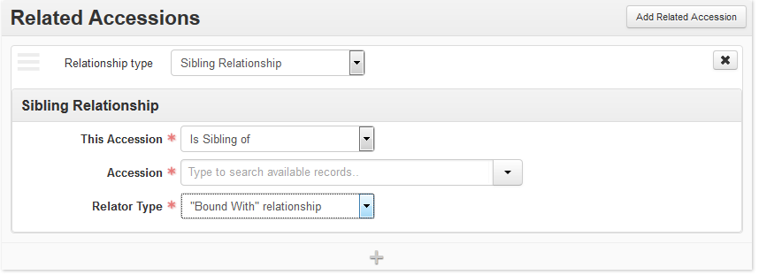 style="width:5.50723in;height:1.99461in" />

- **This Accession:** Choose from drop-down list. Select the appropriate
  > term to describe the relationship type. The “Part of” relationship
  > type provides two options for This Accession, either “Forms Part of”
  > and “Has Part”; Sibling Relationship provides one option, “Is
  > Sibling of”.

- **Accession:** Choose from drop-down list. Select an accession related
  > to the material described in the record. Accession may be searched
  > using auto-complete, using a browse function, or may be created on
  > demand.

- **Relator Type:** Choose from drop-down list. Select the appropriate
  > term to describe the relationship. Each type relator currently has
  > only one option.

Removing a link to a Related Accession record:

> 1\. Find in the context record, the accession link that is to be
> deleted.
>
> 2\. Click on the **X** in the upper right corner of the **Related
> Accessions** record link.
>
> 3\. Click on the **Confirm Removal** option to remove the link, or on
> the Cancel option to retain the link.
>
> 4\. Click on **Save Accession** to save the record with the link
> removed

## Including EAD elements (i.e. adding “Mixed Content”)

\*\*\*\*\*\*\*\*\*\*\*\*\*\*\*\*\*\*\*\*\*\*\*\*\*\*\*\*\*\*\*\*\*\*\*\*\*\*\*\*\*\*\*\*\*\*\*\*\*\*\*\*\*\*\*\*\*\*\*\*\*\*\*\*\*\*\*\*\*\*\*\*\*\*\*\*\*\*\*\*\*\*\*\*\*\*\*\*\*\*\*

You must consult the EAD Tag Library,
[<u>https://www.loc.gov/ead/tglib/index.html</u>](https://www.loc.gov/ead/tglib/index.html),
before including any inline EAD elements, whether as part of a component
title or part of a note.

\*\*\*\*\*\*\*\*\*\*\*\*\*\*\*\*\*\*\*\*\*\*\*\*\*\*\*\*\*\*\*\*\*\*\*\*\*\*\*\*\*\*\*\*\*\*\*\*\*\*\*\*\*\*\*\*\*\*\*\*\*\*\*\*\*\*\*\*\*\*\*\*\*\*\*\*\*\*\*\*\*\*\*\*\*\*\*\*\*\*\*

### Resource / Component Unit Title

If you need to add EAD elements to a unit title, you will have to
hand-encode those elements in ArchivesSpace currently.

To indicate a preferred title (e.g. the equivalent of putting the text
in a red font in the Excel template), you have to include the EAD title
element like so:

\<title\>Preferred Title\</title\> and a bit more information in the
component title

If you only need to format text for whatever reason, then you have to
use the emph element along with an extra attribute to explicitly
indicate that it should be in italics, bold, underline, etc. Here’s an
example:

\<emph render=”italic”\>italicized text\</emph\>

It is crucial that these fields be typed in correctly, so please consult
with someone if you have any questions whatsoever about how to format
EAD correctly.

### Notes

When adding EAD elements in a note, you can use ArchivesSpace’s
wrap-in-tag feature or you can type “\<” to show the available EAD tags
(e.g. persname, title, etc.).

To see the available attributes for each specific element, you will need
to include a space after the element name once that has been added. When
adding an attribute, ArchivesSpace will \*not\* currently provide you
with valid values (e.g. “italic | bold | underline | bolditalic | etc.”,
so you must consult the EAD Tag Library,
[<u>https://www.loc.gov/ead/tglib/index.html</u>](https://www.loc.gov/ead/tglib/index.html)
to ensure adherence to the EAD standard.

#### A Special Note on adding links within Notes:

If you want to create an **external** hyperlink, rather than using HTML
to do that, you will also need to do that with EAD. In this case, the
“ref” element is what you’ll want to employ. Here’s a template:

\<ref href="PUT LINK HERE"\>LINK TEXT GOES HERE\</ref\>

If you want to create an **internal** link within a finding aid (i.e.
point from one note to an archival object elsewhere in the finding aid),
then you should also use the “ref” element, but in this case you will
use the “target” attribute instead of an “href” attribute. In this case,
you will also need to get the ArchivesSpace Ref ID of the archival
object to which you want to provide an internal link (please note that
internal linking in ASpace is only supported for archival objects, not
for notes, or other sections of the finding aid). You will put that
value into the target attribute (since that is the intended target of
the internal link), similarly to how you would include the full link in
an href attribute for an external hyperlink. Here’s an example:

If you like this material, just wait until you check out this \<ref
target=”320c03888ebec23f359a5b0eaa65748c”\>other file\</ref\> of
information!

Usually the ArchivesSpace Ref IDs will be a long string of characters
(e.g. 320c03888ebec23f359a5b0eaa65748c), but for finding aids migrated
from Archivists’ Toolkit, might have values like “ref1” instead. In that
case, you still use the ArchivesSpace Ref ID (e.g. ref1) and add that to
the “target” attribute, as illustrated above.

## Exporting Records

ArchivesSpace enables the production of several export options for Agent
and Resource records:

<table>
<colgroup>
<col style="width: 30%" />
<col style="width: 69%" />
</colgroup>
<tbody>
<tr class="odd">
<td>Type of Data</td>
<td>File Types</td>
</tr>
<tr class="even">
<td>Agent records</td>
<td><ul>
<li>
Encoded Archival Context – Corporate bodies, Persons, Families
(EAC-CPF) XML
</li>
</ul></td>
</tr>
<tr class="odd">
<td>Resource records</td>
<td><ul>
<li>
Encoded Archival Description (EAD) XML
</li>
<li>
Machine-Readable Cataloging XML (MARCXML)
</li>
</ul></td>
</tr>
</tbody>
</table>

Exports are XML documents produced compliant with community standards
and are usable in information systems such as ILSs or EAD databases. All
the exports produced by ArchivesSpace are intended to foster access to
the described materials. The [**<u>ArchivesSpace
website</u>**](http://www.archivesspace.org/importexport) (ArchivesSpace
Application \> Technical Documentation \> Data Import and Export Maps)
provides a summary of export mappings for Resource records into EAD and
MARCXML.

EAC-CPF files are XML-encoded documents compliant with the EAC-CPF
schema. These can be utilized within the context of or contributed to
EAC-CPF name authority systems.

EAD files are XML-encoded documents compliant with the EAD 2002 schema.
These may be uploaded to an EAD database for indexing and made publicly
searchable with EAD files from the same repository and/or other
repositories. Exports reflect the parent-level Resource record, plus any
associated child-level component records. You can also opt to exclude
notes and sub-notes that are not intended for publication.

MARCXML files are XML-encoded documents compliant with the MARCXML
schema. These may be uploaded to an ILS to be searched amongst other
MARC records. Exports reflect the parent-level Resource record only.

ArchivesSpace currently supports exporting of individual Resource
records; support for batch exporting of multiple records will be
available in forthcoming releases.

**Exporting EAC-CPF, EAD, and MARCXML files**

1.  Find the Agent or Resource record you want to export. You can browse
    or search.

    - To browse, on the main toolbar, click **Browse** and select Agents
      (for EAC-CPF exports) or Resources (for EAD and MARCXML exports).
      A listing of all the records in the repository will display.

    - To search, type your search query into the Search box on the main
      toolbar.

2.  Next to the record you want to export, click **View**.

3.  Click the **Download EAC-CPF** button (for Agent record exports) or
    **Export** button (for Resource record exports). In the case of the
    latter, choose an export option:

- **Download EAD (include unpublished)**: select this option for EAD
  > exports to include all notes and subnotes (even if they have been
  > marked as not intended for publication).

- **Download EAD (include \<dao\> tags)**: select this option for EAD
  > exports to include digital object instances.

- **Download EAD (print to PDF):** select this option to print a PDF
  > from ArchivesSpace’s default exporter.

  - Note: This PDF will not adhere to Yale style guidelines. To create a
    PDF adherent to Yale style guidelines, select Download EAD in
    ArchivesSpace. Then, run the ASpace-to-YaleEADbpg transformation.
    Once that transformation is complete, run the YaleEADbpg-to-PDF
    transformation; a PDF finding aid file should automatically open. If
    you do not have these oXygen transformations installed, see the Yale
    Archival Management Systems Committee LibGuide to download the
    project file:
    [<u>https://guides.library.yale.edu/c.php?g=296249&p=4694565</u>](https://guides.library.yale.edu/c.php?g=296249&p=4694565)

- **Download MARCXML**: select this option for MARCXML exports.

4.  The data will download into a file. Depending on your browser’s
    settings, the file will be saved to your Downloads folder or you may
    be prompted to choose a location for saving the file.

## Importing Records

Instructions for importing legacy data are included below. Please
contact your Yale Archival Management Systems Committee liaison for help
importing legacy records.

In ArchivesSpace, you can import data from standardized records as well
as comma-separated value data from spreadsheets. The following file
types can be imported:

<table>
<colgroup>
<col style="width: 63%" />
<col style="width: 36%" />
</colgroup>
<tbody>
<tr class="odd">
<td>File Type</td>
<td>Type of Data</td>
</tr>
<tr class="even">
<td>Encoded Archival Context – Corporate bodies, Persons, Families
(EAC-CPF) XML</td>
<td>Agent records</td>
</tr>
<tr class="odd">
<td>Encoded Archival Description (EAD) XML</td>
<td>Resource records</td>
</tr>
<tr class="even">
<td>Machine-Readable Cataloging XML (MARCXML)</td>
<td>
Resource records

Accession Records

Names and Subjects
</td>
</tr>
<tr class="odd">
<td>Comma-separated value (CSV) files</td>
<td>
Accession records

Digital object records
</td>
</tr>
</tbody>
</table>

By importing legacy data, you can centralize the management of
information about your collections within one application.

The [**<u>ArchivesSpace
website</u>**](http://www.archivesspace.org/importexport) (ArchivesSpace
Application \> Technical Documentation \> Data Import and Export Maps)
provides a summary of import mappings from EAD and MARCXML files to the
ArchivesSpace database scheme. It also provides a summary of export
mappings for Resource records to EAD and MARCXML. Last, it includes CSV
import mappings and templates to facilitate importing of accession and
Digital Object records.

You may create an import job through two different routes. You can
select Import Jobs from the Create drop-down menu on the main toolbar or
you can select Import Jobs from the Repository drop-down and then select
the Create Import Job button on the upper right corner of the resulting
screen

> 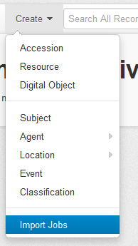 style="width:1.49136in;height:2.65216in" />
>
> 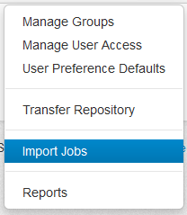 style="width:2.16667in;height:2.48958in" />

### Importing EAC-CPF and EAD files

1.  On the main toolbar, click on the Create drop-down and select
    **Import Jobs**.

2.  Select the type of file: EAC or EAD. Files must be valid XML and
    compliant with referenced schemas or DTDs.

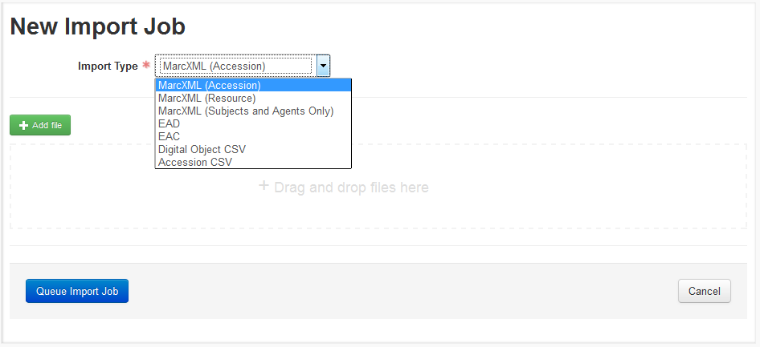

3.  Click **Add File** and select the file(s) to import; note that you
    can select multiple files. Alternatively, drag-and-drop the file(s)
    into the designated area of your browser window.

4.  Click **Queue Import Job**.

5.  When import is complete the page will indicate an import summary,
    including a report with any errors.

6.  The imported data will subsequently be available as new records:

- Imported EAC files will be available as new Agent records.

- Imported EAD files will be available as new Resource records.

### Importing MARCXML files 

ArchivesSpace supports two options for importing MARCXML files:

- You can either import a MARCXML file, resulting in the creation of a
  new Resource record.

- In some cases, the detailed description of a resource may be in EAD
  format, but the controlled access headings are in the MARC record. It
  is possible to import only the controlled access headings from the
  MARCXML record and add them to the resource description created from
  importing the EAD file.

Below are steps for importing MARCXML files:

1.  On the main toolbar, click on the Create drop-down and select
    **Import Jobs**.

2.  Select the type of file: MARCXML (Accession), MARCXML (Resource) or
    MARCXML (Subjects and Agents Only). Files must be valid XML and
    compliant with referenced schemas or DTDs.

3.  Click **Add File** and select the file(s) to import; note that you
    can select multiple files. Or alternatively, drag-and-drop the
    file(s) into the designated area of your browser window.

4.  Click **Queue Import Job**.

5.  When import is complete the page will indicate an import summary,
    including a report with any errors.

6.  The imported data will subsequently be available as new records:

- If MARCXML (Resource) was selected as the file type, the imported data
  > will be available as new Resource records.

- If MARCXML (Accession) was selected as the file type, the imported
  > data will be available as new Accession records.

- If MARCXML (Subjects and Agents Only) was selected as the file type,
  > the imported data will be available as new Agent and Subject
  > records.

### Importing accessions data or digital object data from a CSV file 

Accession and digital object data should be formatted and normalized
according to ArchivesSpace CSV import mapping specifications. See the
[**<u>ArchivesSpace
website</u>**](http://www.archivesspace.org/importexport) (ArchivesSpace
Application \> Technical Documentation \> Data Import and Export Maps)
for CSV import mappings -- and in particular, for a template that can be
used to format accession data.

Below are steps for importing CSV data:

1.  On the main toolbar, click on the Create drop-down and select
    **Import Jobs**.

2.  Select the type of file: Accession CSV or Digital Object CSV

3.  Click **Add File** and select the file(s) to import; note that you
    can select multiple files. Alternatively, drag-and-drop the file(s)
    into the designated area of your browser window.

4.  Click **Queue Import Job**.

5.  When import is complete the page will indicate an import summary,
    including a report with any errors.

6.  The imported data will subsequently be available as new Accession or
    Digital Object records.

### Import summary 

Every import job includes a summary report of the process:

- **Job Status:** indicates if records were successfully imported or
  not, and the date/time of import job.

- **Basic Information:** summarizes information about the file that was
  imported, the target repository, and the user that initiated the job.

- **Log:** if records were not successfully imported, the log summarizes
  problems with the source file (e.g., XML validation issues).

## Customizing the Application

### User interfaces

The staff and the Public User Interface that are provided by
ArchivesSpace can be customized for local use. Repository Managers can
provide simple customizations of the staff interface using tools
available in the staff interface. More extensive customizations to both
the public and staff interface can be made by defining ‘local’ files in
the plugs-ins folder of the application.

### Staff interface

Certain preferences can be configured in the application at the global
(instance) level, repository level, or individual user level. Changes to
preferences at the global level affect all users of the instance.
Changes to preferences at the repository level override preferences at
the global level and affect only users registered to that repository.
Changes to preference at the user level override preferences at the
repository or global level and apply only to the designated user.

The following instructions are for changing preferences at the user
level. With the exception of where the process starts, the options and
instructions for changing preferences is the same for all three levels.

To begin the process, log on as a user assigned to the repository and
then select **User Preference Defaults**.

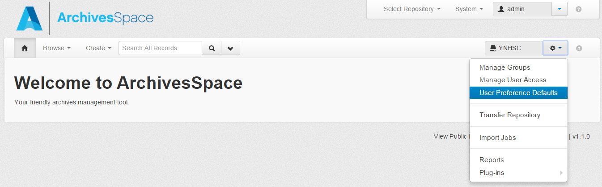

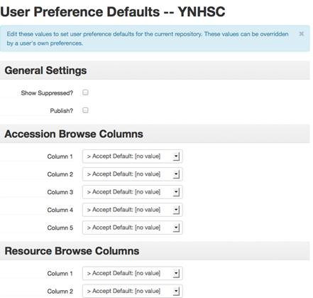

### User-defined fields

User-defined fields are “semantically neutral” data fields available in
the accession, resource, and digital object records. Below is a list of
User Defined fields and their Yale translations. Fields marked
“(accessions only)” should only be used in Accession records. Fields
marked “(not used)” are currently unassigned and should NOT be used.

- boolean_1: Authorization Received (accessions only)

- boolean_2: Record Reviewed (accessions only)

- boolean_3: Boolean 3 (not used)

- integer_1: Integer 1 (not used)

- integer_2: Integer 2 (not used)

- integer_3: Integer 3 (not used)

- real_1: OCLC Number

- real_2: Real 2 (not used)

- real_3: Real 3 (not used)

- string_1: BRBL ACQ Number (ACC) (accessions only)

- string_2: Voyager Bib ID

- string_3: Place of Publication (accessions only)

- string_4: ISBN or ISSN (accessions only)

- text_1: Call Number (accessions only)

- text_2: Title Main Entry (accessions only)

- text_3: Monographic Series (accessions only)

- text_4: Plating Information (accessions only)

- text_5: Bibliographic Citation (accessions only)

- date_1: Restriction Review Date (accessions only)

- date_2: Accession Completed Date (accessions only)

- date_3: Date 3 (not used)

- enum_1: Order Type (accessions only)

- enum_2: BRBL Owner (accessions only)

- enum_3: Controlled Value 3 (not used)

- enum_4: Controlled Value 4 (not used)

## Setting Default Values for Fields

### Functional overview

Repository managers and system administrators can set default values
throughout the application. Default values are typically set when the
value of a field is very frequently the same across records (e.g., the
same notes are often repeated for new records created within a
repository). Setting default values for repetitive data values is a good
way for repositories to streamline data input.

Default values may be edited in a record that they have been applied to,
and default values may be changed in settings at any time. Changing
default values in settings will have no impact on applications of the
prior default value; previous default values will be retained in the
records in which they were applied. Users should note that default
values are not applied in spawning an Accession or Resource record from
a source Accession record.

Repository-wide default values apply across the repository unless they
are in conflict with individual user settings. Individual users may
choose whether or not default values are applied in their User
Preferences. Individual user settings override repository-wide settings,
as described in the [<u>Applying</u> <u>default values as a user
section</u>](##applying-default-values-as-a-user).

Default values can also be set by the system administrator using
controlled value lists. More information is in the [<u>Setting a Default
Value in a Controlled Value List section of Managing Controlled Value
Lists</u>](https://archivesspace.atlassian.net/wiki/spaces/ArchivesSpaceUserManual/pages/894566578/Setting+a+Default+Value+in+a+Controlled+Value+List)
(requires Lyrasis account log-in).

### Setting default values as a system administrator or repository manager

System administrators or repository managers may set default values by
doing the following:

1.  Click on the option for **Repository Preferences**

> 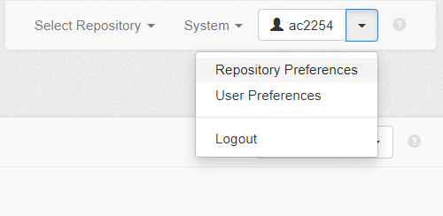 style="width:5.20833in;height:2.54167in" />

2.  Activate the option to **Pre-populate Records**.

> 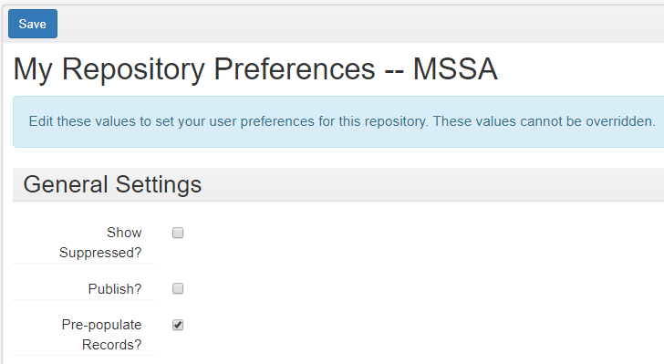 style="width:6.5in;height:3.56944in" />

3.  Click on **Save** to save your new preferences.

4.  Open the browse list for the record type you want to set default
    values for and click on the option to **Edit Default Values** at the
    top of the list.

> 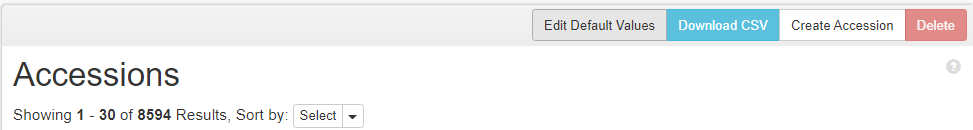 style="width:6.5in;height:0.875in" />

5.  In the case of Resources and Digital Objects, you will need to
    select between setting default values for the parent record or the
    component record:

> 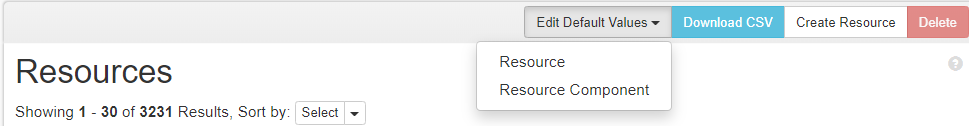 style="width:6.5in;height:0.84722in" />

6.  Clicking on **Edit Default Values** will open a blank record of the
    type you set default values for; you may enter the value defaults
    into the appropriate fields:

> 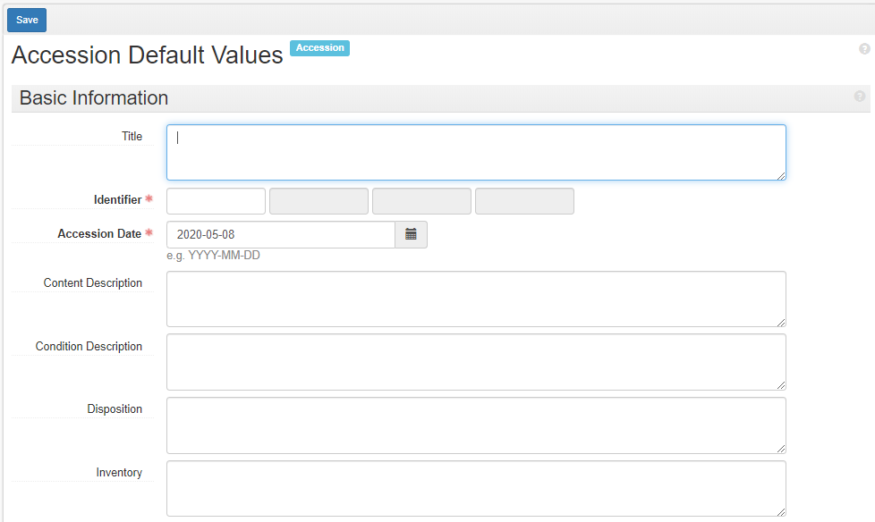 style="width:6.5in;height:3.875in" />

7.  Click on **Save** to save the default values to the template.

When creating a new record, the default values should populate the
fields to which they are assigned for users across the repository.

If you want to stop default values from pre-populating, you may
deactivate the option to pre-populate records in the **Repository
Settings** menu (shown in step 2, above). This will result in an empty
template when you start a new record.

The **Repository Preferences** menu also allows repository managers to
set repository defaults on whether to display suppressed records;
whether new records are published by default; which columns display in
browsing Accession records, Resource records, and Digital Object
records; and default note order and material types settings. These
repository-wide settings apply across the repository unless they are in
conflict with individual user settings. Individual user settings
override repository-wide settings, as described below in the
[<u>Applying</u> <u>default values as a user
section</u>](##applying-default-values-as-a-user).

### Applying default values as a user

Individual user preferences may be viewed and edited in the **User
Preferences** menu:

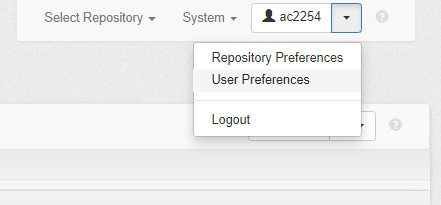

Opening the **User Preferences** menu will allow you to change your
settings on whether to display suppressed records in your repository;
your publication status settings; your settings on whether records are
pre-populated; your settings on which columns display in browsing
accession records, resource records, and digital object records; and
your note order and material types settings.

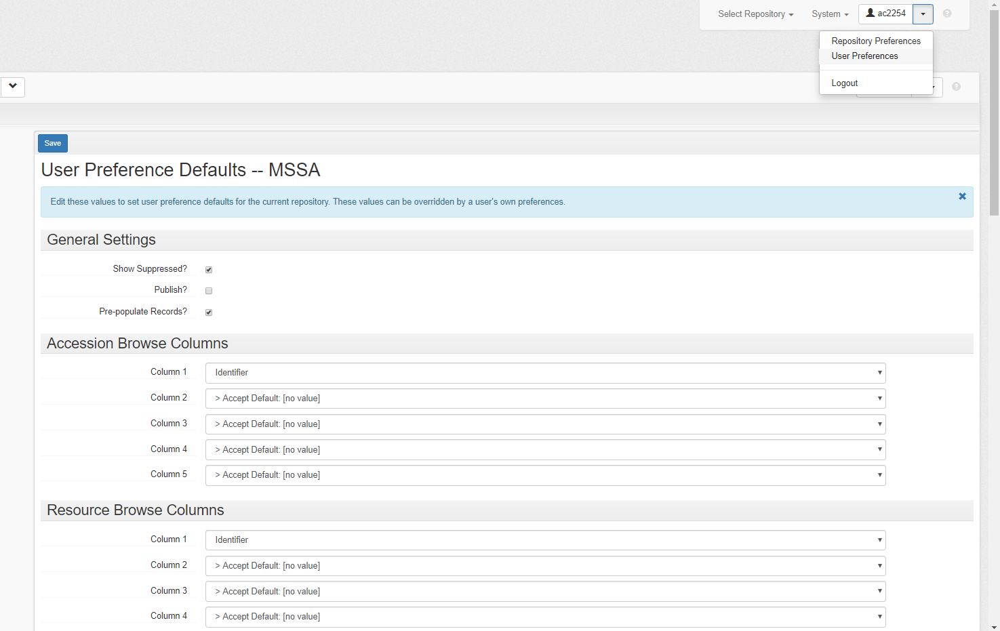

If an individual user checks the **Pre-populate Records?** checkbox,
their newly-created Accession, Resource, and Resource component records
will be pre-populated with the default values assigned by their
repository manager, as outlined in the [<u>Setting default values as a
system administrator or repository manager
section</u>](##setting-default-values-as-a-system-administrator-or-repository-manager).
If users do not check the **Pre-populate Records?** checkbox, their
newly-created records will not be created with the repository default
values.

Individual user settings override repository-wide settings. If an
individual user wishes to use their repository-wide settings, they
should ensure that their individual user settings are blank.

[1] Note that ArchivesSpace does not provide native support for storing
and managing files referenced from Digital Object records. The
assumption is that the files will be stored and managed in an external
digital asset management system or network- or web-accessible location.

[2] Name Authority Cooperative Program. Additional information is
available online at
[<u>https://www.loc.gov/aba/pcc/naco/index.html</u>](https://www.loc.gov/aba/pcc/naco/index.html)
.

[3] Additional information about this resource is available online at
[<u>http://www.getty.edu/research/tools/vocabularies/ulan/index.html</u>](http://www.getty.edu/research/tools/vocabularies/ulan/index.html)
.

[4] Additional information about this resource is available online at
[<u>http://www.aacr2.org/</u>](http://www.aacr2.org/) .

[5] Additional information about this resource is available online at
[<u>http://authorities.loc.gov/</u>](http://authorities.loc.gov/).

[6] Additional information about this resource is available online [at
<u>http://www.getty.edu/research/tools/vocabularies/aat/index.html</u>](http://www.getty.edu/research/tools/vocabularies/aat/index.html).
