# Submitting a ServiceNow Request to SCMS

This document provides an overview of submitting a metadata request to SCMS via the ServiceNow ticketing system.

## Submitting a Request Via the ServiceNow Form (Preferred)

### Where to Find the Submission Form

You can initiate a ServiceNow request by navigating to the [SCMS SharePoint](https://yaleedu.sharepoint.com/sites/YaleSpecialCollections/SCTS/SitePages/Special-Collections-Metadata-Services-Unit.aspx) page and clicking on the 'SCMS ServiceNow' button on the right hand side of the page

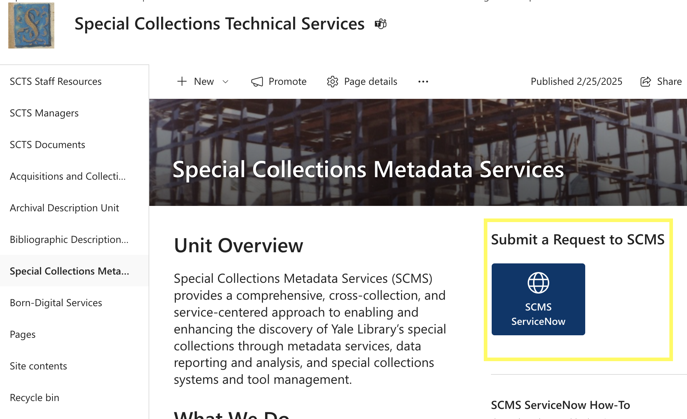

### Guide to the Submission Form

Below is an overview of the fields in the ServiceNow submission form and best practices for completing them.

#### Title/short description

A brief description of your request.

#### Request type

Select the type of request from the drop-down. The form includes a table with descriptions/examples of each request type. These request types are generally scoped to the services that SCMS provides. See [SCMS Metadata Services](../README.md##scms-metadata-services) for more information.

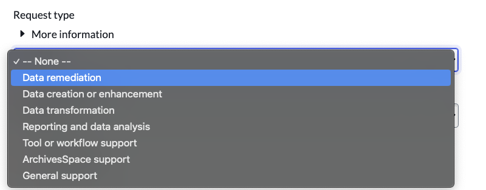

#### Request origin

Select your department/unit from the drop-down. If you do not see your department/unit, select 'Other' and a free-text field will appear where you can enter your department/unit name

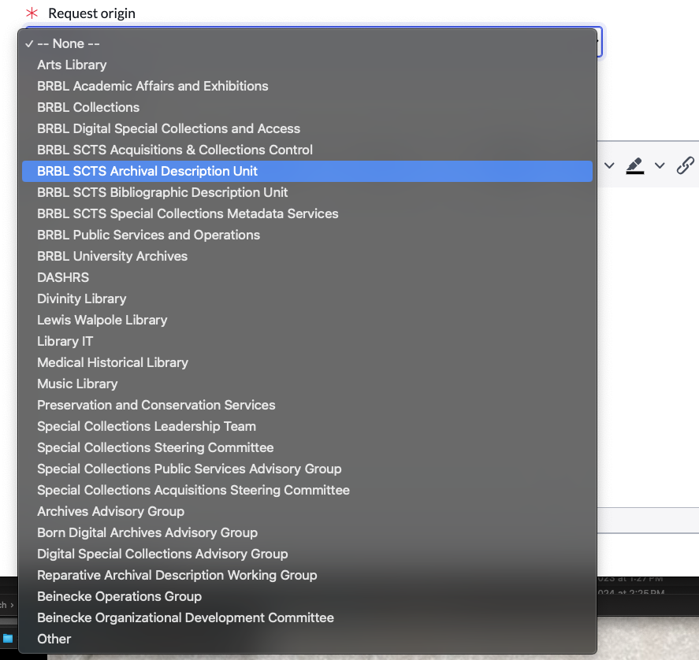

#### Long description

Describe your request in as much detail as possible.

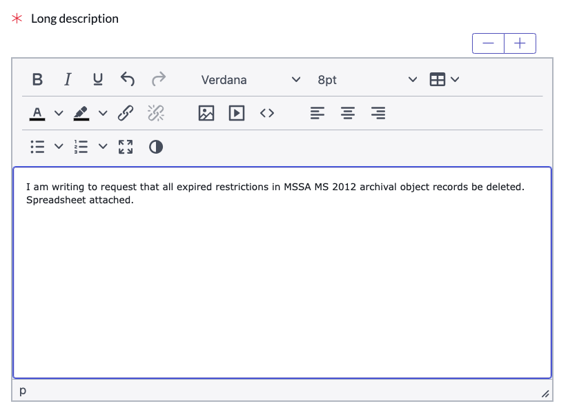

#### Attachments

Attach any relevant files, e.g. project plans/proposals, spreadsheets.

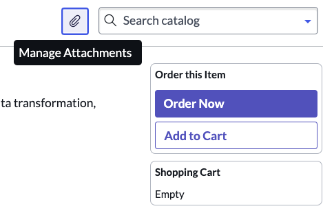

#### Desired completion date

Please allow at least two weeks for completion of your request. We will communicate on timeline once your request is received and traiged.

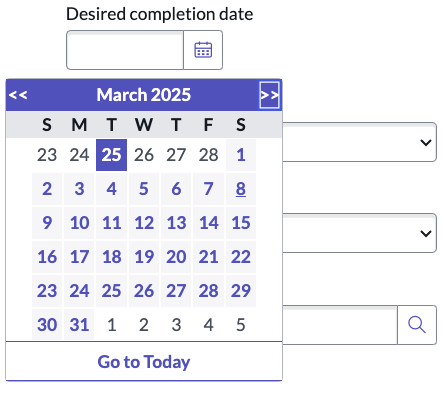

#### Estimated priority

This is technically an internal field, but there wasn't any way to suppress it from the public form while retaining it on the backend. It is not required, but feel free to include it as it can be helpful for us to know your priorities. However, be aware that SCMS may update it based on our current priorities and capacity.

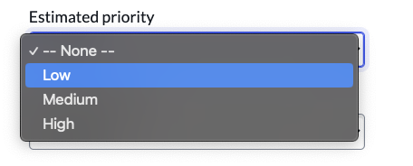

#### Estimated effort

This is also an internal field and not required. However you may complete it if you desire, with the understanding that SCMS may update it based on our evaluation of the work.

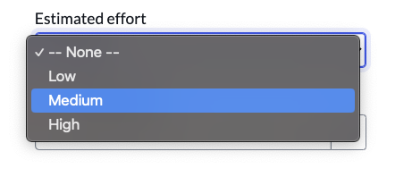

#### Contact name

Enter your netID in this field and your name will populate.

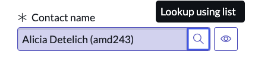

#### Submit request

Click the 'Order Now' button to submit your request

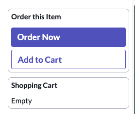

## Submitting a Request Via Email

Requests can be submitted via [scms.request@yale.edu](mailto:scms.request@yale.edu). Sending an email to this address will open a ticket in ServiceNow.

## Viewing your open tickets

Navigate to [Yale ServiceNow: My Items](https://yale.service-now.com/it?id=my_items) to view open tickets, communicate with SCMS staff, and add attachments to your tickets. You can also add colleagues (e.g. supervisor, collaborator) to your ticket's watch list.

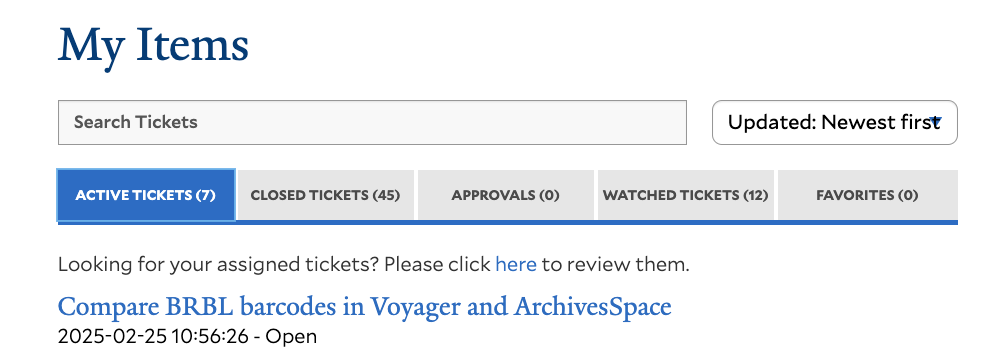
