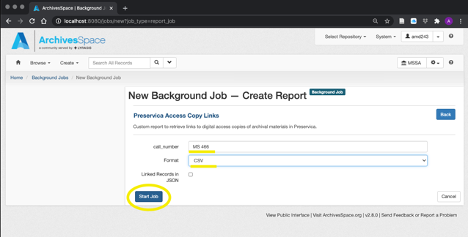
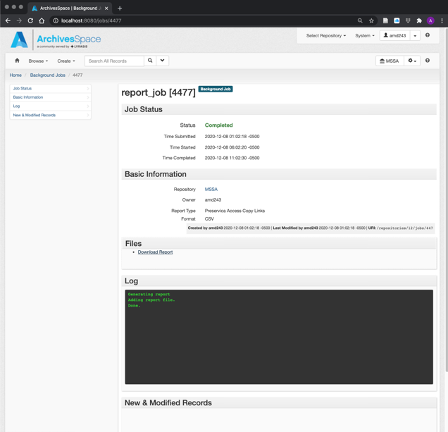
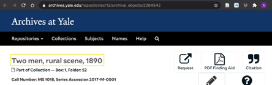

# Copy Order Fulfillment

This document outlines the process for fulfilling patron requests for already-digitized materials (not including born-digital or MADID materials). 

The bulk of the document provides instructions on how to run a report in the ArchivesSpace staff interface which retrieves data about all digitally-available material in a given collection(s). The report will be used to identify requested materials that have already been digitized, and to facilitate the automated fulfillment of patron requests for those materials.

This document also provides guidance on sending files to patrons once the automated portion of the fulfillment process is complete.

## Initiating a copy order for existing files

1. Ensure that the patron is registered in Aeon and has signed the user agreement
2. Create an order in Quickbooks and generate an order number
3. Add the patron’s name (Last, First), Aeon username, request date, invoice number, and institutional affiliation to a new row in the [Patron Reprographics](https://docs.google.com/spreadsheets/d/1ZovIjgmJdrMIFLGVqF0PONpwd0kdZcQgW9L22TCI9Cc) spreadsheet

## Running the ArchivesSpace report

4. Open the ArchivesSpace staff interface. Click on the gear icon and select ‘Reports’ from the drop-down menu

    

5. Select the ‘Copy Order Fulfillment’ report from the menu

    

6. Enter the call number, select ‘CSV’ from the format drop-down menu, and click ‘Start Job’. If the patron requests materials from multiple collections, enter each call number separated by a comma and a space (i.e MS 466, MS 56)

    

7. The report will start running. Depending on the size of the collection and the number of digitally-available items this may take a moment.

    

8. When the job is finished, click ‘Refresh Page’

    

9. Click on the ‘Download Report’ link under the ‘Files’ section to download the report

    

	[Sample report output](https://drive.google.com/file/d/1BqtJeSIS8pVBoXwFIplEbVRj2I-bPBfm/view)

	The report will be downloaded as a .CSV file to your browser’s default download location (usually the ‘Downloads’ folder).

## Using the report to select digitized files for download

10. Open the report

	Navigate to your Downloads folder and open the report. The filename will be something like `job_9999_digital_object_preservica_links_2021-02-19.csv`. The report can be opened by any spreadsheet software (Excel, Google Sheets, etc.).

11. Select files to download

	The report should contain sufficient information (i.e. Archives at Yale URL in column B, title of archival object in column E, physical container information in column F) to identify a digitized record that has been requested by a patron.

	If there are many digitized records on the report, it may be difficult to visually identify the relevant files. If this is the case, hit `CTRL-F` within your spreadsheet software to launch the search bar (in Excel this will appear on the top right-hand side of the window).

	There are a few different search methods for finding relevant files in the report. To search for files, you can copy and paste one of the following from your browser into the spreadsheet search bar:

	- The URL

	

	- 	The component title

	

	- 	The digital object title(s) from the staff interface

	 

	Once the relevant files have been identified, mark an `X` in column A of the rows that contain the files to be downloaded. The automated download process will use the values in this column to select files for download.

	_Note on AV files_: Some AV files won’t appear on the report because a presentation manifestation (access file) doesn’t exist in preservica, rather just a preservation manifestation (a lossless, large file, such a .wav). If you find this is the case, please contact the manager of public services.

12. Save the report

	Save the edited report as a new file using the ‘Save As…’ function in the ‘File’ menu of your spreadsheet software, with the naming convention `customerlastnameCustomerfirstname-ordernumber.csv` (i.e. `doeJohn-2787.csv`). The order number is the Quickbooks order number assigned to the patron.

	The file should automatically save as a CSV, but if Excel attempts to save it as an XLSX file you can select Comma Separated Values (CSV) from the File Format dropdown in the ‘Save As’ prompt.

	The report should be saved to the following network drive location: `\\wcsfs00.its.yale.internal\libraryit-807001-ics\MSSA\mssaArrangementAndDescription\Copy_Orders_From_Preservica\orders\_new_`

## Sending Download Links to Patrons

13. Locate the output of the Yale Box upload process

	Every Thursday morning at 9:15am, a process will run which will download the selected files in each spreadsheet from Preservica, package them into zip files (with the same naming convention as the report - i.e. `doeJohn-2787.zip`), and upload these zip files to Yale Box. The upload process will create a public Box link that expires after 10 days.

	This process will create two outputs to facilitate sending emails from the Aeon client notifying patrons that their order is complete and providing them with the Box link so they may download their files.

	The first output is a file, entitled `orders_to_send_2021-04-08` (with the date being the date that the report was generated), that is stored in the following location: `\\wcsfs00.its.yale.internal\libraryit-807001-ics\MSSA\mssaArrangementAndDescription\Copy_Orders_From_Preservica\orders`

	This report contains relevant patron information taken from the Patron Reprographics Spreadsheet, plus the Box links that were created during the upload process.

	The second output is a text file containing a template for the email that will be sent to the patron manually in Aeon. The files follow the same naming convention as other files created during this process (doeJohn-2787.txt). The template files are stored in `\\wcsfs00.its.yale.internal\libraryit-807001-ics\MSSA\mssaArrangementAndDescription\Copy_Orders_From_Preservica\emails\to_send`

14. Send the files

	To send the Box link to the patron, open the Aeon client. Using the shared link report, enter the patron’s Aeon username. This will open up their profile in the Aeon client. Click on the Email tab, then select `MSSA-SendingFilesViaEFT` from the New Email drop-down. 

	To complete the template, either copy/paste the text from the email template text file, or enter the relevant information (order number, Box link, your name) directly into the template.

	Be sure to update the subject line with the patron’s order number before sending the email.

15. Update the Patron Reprographic spreadsheet

	After sending the emails, check the box in column J of the [Patron Reprographics](https://docs.google.com/spreadsheets/d/1ZovIjgmJdrMIFLGVqF0PONpwd0kdZcQgW9L22TCI9Cc) spreadsheet to indicate that the order is complete.

	A script will periodically clean up the files in the `Copy_Orders_From_Preservica` directory, so there is no need for staff members to manually delete or move any files.