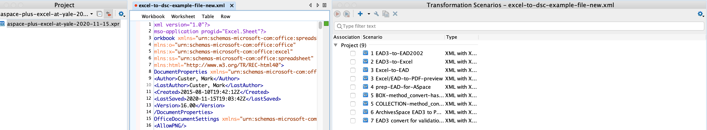
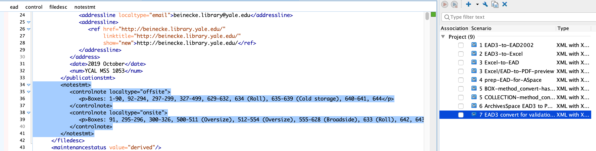
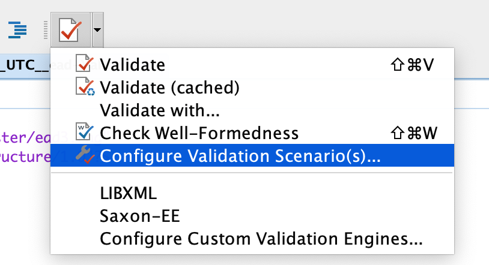

# oXygen Project Overview

## Getting started with a Project file in oXygen XML Editor

First things first.  If you don't have the oXygen project file yet, download it by going to this [link](https://drive.google.com/file/d/19Ncbx58_atwDcRV-kaH2l1GXrcOis8VL/view?usp=sharing) and then click on the Download icon in the upper-right hand corner of your web browser.

Next, move this file somewhere where you won't delete it later.  I like to keep my project files in a directory named "Documents/oXygen-projects", for instance.  

Once you've moved your file outside of your Downloads directory, open it in oXygen by double-clicking the file.

You should now have the project file open and ready to go!  But, you might not see any of your transformation scenarios yet.  You won't see those until after you open an XML file in oXygen.  Once you've done that, your screen in oXygen should look something like this:

If you run into any issues, just contact YAMS.

## oXygen Project File Overview

Okay, so you've got the new `aspace-plus-excel-at-yale-2021-03-30.xpr` file installed.  Let's discuss the different transformation and validation scenarios that are packaged with this project. 

First, we will cover the transformation scenarios.  Please note, though, that the numbers in front of the transformation scenarios names do NOT indicate any type of order the the files are meant to be run.  Instead, they are only intended to indicate a general type of grouping of functions (e.g. the two scenarios that start with a 3 are related, as are the two scenarios that start with a 5).

### Transformation Scenarios

#### EAD3-to-EAD2002

You won't need to use this very often, if at all.  But you can use it to convert an EAD3 file that's been exported from ArchivesSpace into an EAD2002 file.  Why use this?  Well, if you already exported an EAD3 from ArchivesSpace but need to use a process outside of ArchivesSpace that relies on EAD2002, you can use this transformation scenario.  Alternatively, you can also just export an EAD2002 file from ArchivesSpace by selecting the Export EAD option, and then de-selecting the "EAD3 Schema" checkbox.

#### EAD3-to-Excel

You can use this transformation on an EAD3 file that's been exported from ArchivesSpace if you want to convert that into an Excel file.  Please see the [YAMS LibGuide](https://guides.library.yale.edu/c.php?g=296249&p=4694565#s-lg-box-20726894) for more information.  

A new option that is now available with this process is to convert an EAD3 file to Excel so that you can use the Excel file for an input file when writing an ArchivesSpace API script.  In this case, you can now use the ArchivesSpace URI fragments for each archival object that are present in the last column of the spreadsheet -- column BD, or "System ID".  Using the API like this is far preferable to re-importing an entire container list into ArchivesSpace via the EAD import process.  If you have any questions about using the API, please reach out YAMS!

Last, please note that if you do want to re-covert this Excel file back into an EAD file, then you will either need to change the name of the original EAD file that's located on the "Original-EAD" tab of the Excel file to match what's listed there (this will ensure that the collection-level information in the EAD file is retained once converting back to EAD), or you can just delete that "Original-EAD" tab altogether if you are just working on the container list.  

#### Excel-to-EAD

Okay, so this is one of our most-used transformations.  This transformation can be used to transform an Excel spreadsheet into an EAD container list that can be imported into ArchivesSpace.  Please review the documentation about this workflow [here](https://guides.library.yale.edu/c.php?g=296249&p=4694565#s-lg-box-8371614). This documentation also covers the next two transformation scenarios, as well.

#### Excel/EAD-to-PDF-preview

This transformation can be utilized immediately after the above transformation to create a PDF preview before prepping, validating, and importing an Excel file into ArchivesSpace. Please note that this process was updated with oXygen Project version 2021-03-30 to use the current EAD3 PDF format, and also to no longer point to any files on the old "FACC" website, which has been decommissioned.

#### prep-EAD-for-ASpace

After you have run the "3 Excel-to-EAD" transformation, you *must* run this transformation file on your newly-created EAD file before you import it into ArchivesSpace.  

#### BOX-method_convert-hashes-to-foldernumbers

This is an optional transformation scenario that can be used to auto-number folders, starting at "1" with each Box.  For directions on how to do this, see this [document](https://guides.library.yale.edu/c.php?g=296249&p=4694565#s-lg-box-13824802)

#### COLLECTION-method_convert-hashes-to-foldernumbers

What if you need distinct folder numbers throughout an entire collection, rather than within each box?  If that's the case, you can use this transformation scenarios to ensure that the collection has just one folder 1, for instance. Similar directions, found at the same [place](https://guides.library.yale.edu/c.php?g=296249&p=4694565#s-lg-box-13824802)

#### ArchivesSpace EAD3 to PDF (preview unpublished)

You can use this transformation scenario to create a PDF preview directly from an EAD3 file exported from ArchivesSpace

Please note that this PDF preview process is just a three-step process:

1. Export EAD3 file from ArchivesSpace
2. Open that file in oXygen XML Editor
3. Run the "6 ArchivesSpace EAD3 to PDF (preview unpublished)" transformation

As the name of the scenario suggests, this process will include unpublished components and notes in the resulting PDF file.  By default, those unpublished elements will be wrapped in red boxes.  If you'd prefer not to have those unpublished components highlighted in red, you can do a Find and Replace in oXygen, between steps 2 and 3, searching for audience="internal" and replacing that phrase with audience="external"

#### EAD3 convert for validation purposes

Last, if you need to troubleshoot why a file is not getting it's official PDF file updated in Archives at Yale, the problem is likely due to the resulting EAD3 being invalid. To test the validity of the document, you can run this transformation scenario first to convert the ArchivesSpace EAD3 file to Yale's updated version of EAD3. After that, you will still need to run another strict validation process, but that will be covered under the Validation Scenarios section, listed next.

Additionally, you can run this transformation to get an overview of the top container ranges that are listed on- versus off-site. After you run this transformation scenario, you will get a note added to the administrative section of the EAD3 file that includes this information. Here is an example of where to find that:

### Validation Scenarios

In addition to general validation (e.g. do you get a green square, for valid, or a red square, for invalid, in the upper right-hand corner of the view of your XML file?), our oXygen project file has two different validation scenarios that can be used.  You can access and utilize those by clicking on the dropdown icon next to the Validation checkbox, and selecting the Configure Validation Scenario(s) option.  Here's what that looks like in oXygen:

Now that you know how to access the validation scenarios, here's a description of the two that we have available currently:

#### ArchivesSpace-PreIngest-validation

You should always use this validation step before importing an EAD file into ArchivesSpace.  If the fie is invalid, don't import it until those issues have been fixed.  If you have any questions about a particular EAD file, please contact YAMS.

#### EAD3-strict-validation-test

This new validation scenario can be used for troubleshooting, and is not a required step for normal workflows. It should only be used after exporting an EAD3 file from ArchivesSpace, and then converting that file with the "7 EAD3 Convert for Validation Purposes" transformation scenario.  

