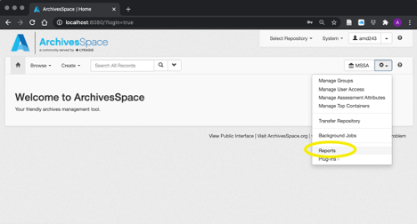

# Running Reports in the ArchivesSpace Staff Interface

This document explains how to generate a report from the ArchivesSpace staff interface. 

1. To access the ArchivesSpace reports module, click on the gear icon and select ‘Reports’ from the drop-down menu, or enter [https://archivesspace.library.yale.edu/jobs/new?job_type=report_job](https://archivesspace.library.yale.edu/jobs/new?job_type=report_job) into your browser

    

2. Select the desired report from the menu

    

3. A new screen will open, where you can enter your parameters. For instance, some reports can be limited by call number. For these reports, enter the call number, select ‘CSV’ from the format drop-down menu, and click ‘Start Job’. If you want to retrieve data for multiple call numbers, enter each call number separated by a comma and a space (i.e MS 466, MS 56)

    

4. The report will start running. Depending on the number of results this may take a moment.

    

5. When the job is finished, click ‘Refresh Page’

    

6. Click on the ‘Download Report’ link under the ‘Files’ section to download the report

    

   The report will be downloaded as a .CSV file to your browser’s default download location (usually the ‘Downloads’ folder).

## Using the report to select files for Preservica download

7. Open the report

	Navigate to your Downloads folder and open the report. The filename will be something like `job_9999_digital_object_preservica_links_2021-02-19.csv`. The report can be opened by any spreadsheet software (Excel, Google Sheets, etc.).

8. Select files to download

	The report should contain sufficient information (i.e. Archives at Yale URL in column B, title of archival object in column E, physical container information in column F) to identify a digitized record that has been requested by a patron.

	If there are many digitized records on the report, it may be difficult to visually identify the relevant files. If this is the case, hit `CTRL-F` within your spreadsheet software to launch the search bar (in Excel this will appear on the top right-hand side of the window).

	There are a few different search methods for finding relevant files in the report. To search for files, you can copy and paste one of the following from your browser into the spreadsheet search bar:

	- The URL

	

	- 	The component title

	

	- 	The digital object title(s) from the staff interface

	 

	Once the relevant files have been identified, mark an `X` in column A of the rows that contain the files to be downloaded. The automated download process will use the values in this column to select files for download.